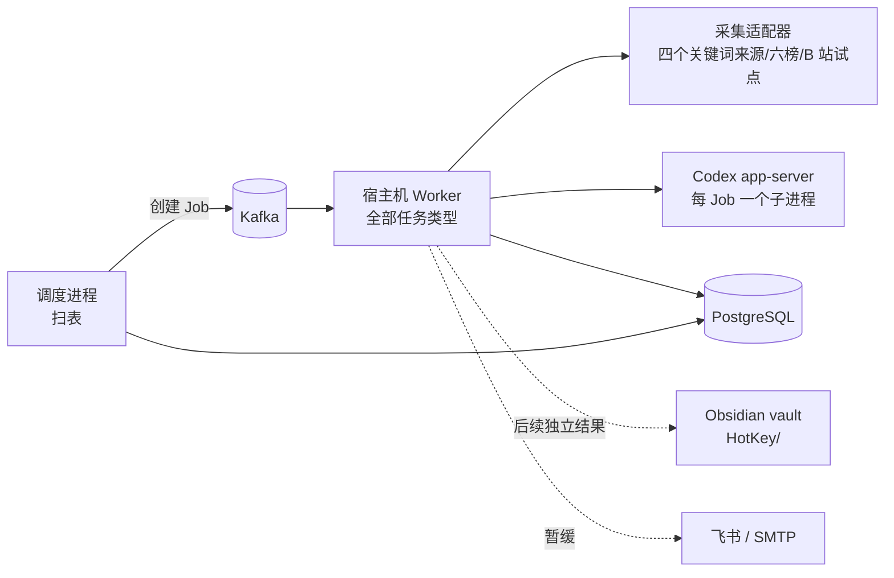
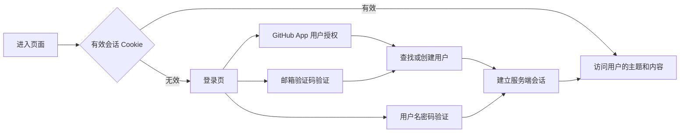

# 热点舆情监控平台总设计

日期：2026-10-01。v4.3 按用户最新决定保留用户名密码与无感登录，增加 GitHub App、邮箱验证码，并将账户改为 ToC 多用户；移除部署初始化限制与旧品牌方案。Design 002—007 各为能力 Epic，PRD 保持 001—007，逐 Issue Plan 见[文档索引](../README.md)。新登录与多用户改造尚未实现，既有用户名密码与会话代码保留。

## 1. 结论

当前交付目标以 PRD001 §1 的核心链路 POC 边界为准：先按 Plan058 在一个主题、HN 与一榜上跑通 M1 最小演示，再以同样的配置、采集、持久化、分析状态、阅读、覆盖与恢复证据扩至四来源六榜；随后按条件推进本人账号和事件切片。最小演示不代表完整 M1。日报、周报、Obsidian、知识库检索/问答与渠道投递属于后续独立能力，不纳入本轮核心 POC，也不作为 M1—M3 的技术前置。复用下述已有架构；72 小时、正式时效与质量抽检留给产品验证。

- **信息获取是当前核心**：按主题从逐一验收的来源持续获取帖子、评论与热榜，保留来源、时间、覆盖缺口和失败原因；相关性判断服务于检索和阅读。日报、Obsidian 知识库与推送分别作为后续独立结果验收；飞书推送暂缓，不能卡住信息获取验收。
- **正常用户账户**：保留用户名密码，增加 GitHub App 与邮箱验证码，有效会话自动恢复。GitHub/邮箱首次验证即注册；移除部署密钥、单 owner 限制和独立工作区身份包装，资源按当前会话用户隔离，详见 §9.2/Plan060。
- **保留底座，按能力验收**。会话、资源归属、任务、内容、主题、来源契约和 Web 框架复用；`ai`、`analysis`、`reports`、`notifications`、`knowledge` 已有代码，`events` 已有 Plan014 候选与稳定身份受控切片。代码存在与受控测试通过都不等于真实连续运行或产品验收。
- **不做任务 DAG，用数据库扫表驱动流水线**。独立调度进程分别扫描采集、评论、热榜、分析、报告、推送和导出，用确定性 operation ID 创建 Job；重复扫描由数据库约束幂等。各结果的启用与验收相互独立。
- **P1 只跑一个宿主机 Worker**。Codex 登录态在宿主机，所有任务类型注册在同一个宿主机 Worker；容器 Worker 在 P1 停用，避免错误角色抢消息。
- **知识库用 Obsidian，不用向量数据库**。HotKey 单向导出 Markdown 到现有 vault 的 `HotKey/` 子目录；问答由 HotKey 用 PostgreSQL 检索 + Codex 回答。取消 v2 设计中的 pgvector 与 `knowledge_chunks`。
- **报告先确定性、后润色**。数字、排序、引用由程序生成；模型只写带引用编号的句子；模型不可用时输出模板版。报告生成、知识库写入和推送分别验收，不能因其中一项可用而宣布另一项完成。
- **来源逐项验收**：四个关键词来源、六个公开热榜与本人账号 B 站试点分别证明真实采集、持久化、分析与覆盖；微博等登录平台暂不接入。HN 仍用于评论父链与重放的基础验证。
- **本机服务入口固定**：独立 RSSHub/SearXNG 服务仍由同级 Docker 编排管理；宿主机调用方选择 `127.0.0.1`，Compose 调用方选择 `host.docker.internal`，端口分别固定 1200/8888。主机选择与白名单冻结到来源连接版本，不能由请求输入指定任意地址；既定路由、SearXNG 引擎与禁止重定向边界见 Design002 §3。
- **评论关系保留缺口**：评论作品、根、直接父节点和回复目标为独立的同 owner 内容身份；来源只给出部分关系时以空值或身份占位表示未知，`content_threads.parent_relation_status` 标记父节点观察状态。完整新库 Schema 与来源契约由 Design002 §3.4/Plan038 固定，存量库重建仍走 Plan051。

## 2. 当前能力与证据分层

状态以 2026-09-26 工作树中的 `backend/app`、`backend/database/schema.sql` 和运行记录为准。**代码已合入**指仓库已有实现；**受控测试通过**指单测、集成测试或离线回放；**真实运行通过**记录实际来源或外部依赖的运行范围；**产品验收**须满足对应来源、时间窗及连续性标准。下表真实运行数值来自 Claude 在本机开发库 `hotkey_p1` 的 2026-09-26 执行记录；同日 12:15—16:32 宿主机 Worker、调度和 API 连续运行约 4 小时，之后按用户要求停止。该库可重建，记录仅属开发验证证据；连续 3 天的产品验收尚未通过。概览见 `BACKLOG.md`“当前迭代”，明细以本机 `hotkey_p1` 库为准。

| 能力 | 代码已合入 | 受控测试通过 | 真实运行通过 | 产品验收 |
|---|---|---|---|---|
| 四个来源的 `keyword.search`、调度与持久覆盖窗口 | 是：`worker/app.py`、`worker/scheduler.py`、`content/`、`jobs/` | 有单测及新建库测试记录 | 开发库约 4 小时运行，主题“AI 编程助手”“人工智能”、24 小时回看；入库 `google_news` 365、`news_search` 94、`hackernews` 61、`rss_36kr` 8 | 未通过连续 3 天验收；回看不证明完整覆盖 |
| `source.comments` | 是：`worker/app.py`、`content/`、`jobs/` | 有受控测试记录 | 同日较早一轮 HN 评论 45 个线程真实入库；该库随后因新表重建，不能与当前库统计合并 | 未通过重放及连续运行验收 |
| Codex 调用、`analysis.annotate` 与标注表 | 是：`ai/`、`analysis/`、`content_annotations` | 有受控测试记录 | 开发库真实标注 738 条：相关 707、不相关 28、相关字段为空 3；质量抽检未完成 | 未通过 |
| 六榜 `source.hotlist`、快照/条目、最新榜 API | 是：`rsshub_hotlist.py`、`hotlist*.py`、调度与路由 | 有受控测试记录 | 开发库六榜共 59 份快照；最近 2 小时 23 成功、1 失败；首轮命中主题 12 条入库，Codex 判相关 7 条 | 未通过连续运行及逐榜覆盖验收 |
| B 站 MediaCrawler 搜索及同轮缓存评论 | 是：`mediacrawler.py`、B 站预设与 Worker 装配 | 新建库离线回放 5 条视频、2 条评论的记录 | 修复前两次真实运行失败：综合排序返回旧视频、空简介导致整页回滚；均无验证码。修复后尚未真实运行，开关默认关闭 | 未通过 |
| 日报、Obsidian 导出、飞书通知 | 是：`reports/`、`knowledge/`、`notifications/`；SMTP 未见实现 | 有受控测试记录 | 连续真实送达与 vault 写入未证实 | 各自未通过；推送暂缓 |

本表不以 HTTP 200、RSS 可解析、容器就绪、离线回放或单个成功 Job 推断整条来源链路。`hotkey_p1` 的四来源入库、六榜快照与 Codex 标注证明了上述开发运行范围，不证明 72 小时持续覆盖、评论完整性或来源产品验收。B 站预设与适配器现固定 `mediacrawler-1bd07bc-hotkey-safe`，真实来源恢复与产品验收仍待 [M2 设计](003-本人账号B站试点设计.md) 的后续步骤。

## 3. 架构总览

流水线顺序由调度进程的扫描条件保证，而不是任务之间互相触发：

| 扫描 | 条件 | 创建的 Job | 阶段 |
|---|---|---|---|
| 关键词采集 | `monitor_schedules.next_run_at <= now`，叠加来源节奏 | `keyword.search` | 信息获取，已有代码 |
| 评论 | 到期的高互动已入库帖子；B 站只读同轮缓存 | `source.comments` | 信息获取，已有代码 |
| 热榜 | 已应用热榜来源，独立间隔默认1800秒且可配置；M1窗口冻结实际间隔 | `source.hotlist` | 信息获取，已有代码 |
| 分析 | 有内容版本但缺当前规则/提示词标注，按主题攒批 | `analysis.annotate` | 信息获取，已有代码 |
| 报告 | 报告计划到点，且窗口内分析已完成或到达等待上限 | `report.daily`；`report.weekly` 待实现 | 后续独立验收 |
| 推送 | 已定稿报告缺投递记录 | `notification.send` | 暂缓；不作信息获取门禁 |
| 导出 | 报告等对象在上次导出后有变化 | `knowledge.export` | 后续独立验收 |
| 事件 | Plan014 候选受控扫描；默认关闭，真实来源与模型未验 | `events.cluster` | 候选/身份技术切片，M3 未验收 |

每个 Job 的 operation ID 由扫描对象确定性派生（`uuid5(命名空间, 扫描类型:对象ID:版本)`），重复扫描命中现有唯一约束，不会重复创建。

| 领域 | 状态 | 主责 |
|---|---|---|
| `identity` `monitors` `connections` `jobs` `worker` `content` `sources` `evidence` `backups` `cli` | 已有代码 | 主题、预设、调度、内容与覆盖事实；具体能力看第 2 节 |
| `ai`、`analysis` | 已有代码 | Codex 调用与标注；质量抽检和真实运行另验 |
| `reports`、`notifications`、`knowledge` | 已有代码 | 日报、飞书、Obsidian；SMTP、周报、知识库问答仍待实现或验证 |
| `events` | Plan014 候选与稳定身份技术切片 | 人工修订、热度和页面仍待 Plan015/016/042 |

## 4. 里程碑设计索引

| 里程碑 | 设计 | v3.2 承接章节 | 现行需求/计划 |
|---|---|---|---|
| M1 | [002 信息获取主链路](002-信息获取主链路设计.md) | §4.1—4.4、4.6、5、6/7/8 中信息获取、§21 | PRD 002 / Plan 001—009、031—041、058 |
| M2 | [003 本人账号 B 站试点](003-本人账号B站试点设计.md) | §4.5、§6 截止与 §15 风控 | PRD 003 / Plan 010—013 |
| M3 | [004 事件与热度](004-事件与热度设计.md) | §12、§13 事件任务 | PRD 004 / Plan 014—016、042 |
| M4 | [005 报告与知识库](005-报告与知识库设计.md) | §8 质量、§9、§11 | PRD 005 / Plan 017—023、043、052 |
| M5 | [006 推送](006-推送设计.md) | §10 | PRD 006 / Plan 024—026、044 |
| M6 | [007 扩展能力](007-扩展能力设计.md) | 扩展来源、账号、告警、导出边界；仍待逐项准入 | PRD 007 / Plan 027—030、045—050、053—054 |

共享运行库保留与恢复由Plan051承接；共享底座的已交付证据、维护责任及剩余工作见[Plan索引](../plan/README.md)。本轮执行合同补全仍属v4.0架构下的待实施细则，子Design更新至v1.1；新增表/端点/任务不表示当前已有实现。

| 待实施细则 | 所属设计与执行合同 |
|---|---|
| collection_due_windows、版本化SourceExecutionPolicy、采集周期时钟、覆盖/指标读API；标注首次有效时间、主题状态变更、分析提示词首次启用及调度运行会话分别保留历史事实 | Design002；Plan002/004/006/031—034 |
| events/event_members/event_candidates 已由 Plan014 受控实现；event_revisions/event_heat_snapshots 与人工修订待后续 | Design004；Plan014—016/042；events 域已登记并加架构门禁 |
| monitor_topics既有报告设置字段、两阶段冻结、knowledge_documents/knowledge_answers、vault文件冲突保护 | Design005；Plan018—023/043/052 |
| 不可变收件身份、默认关闭、attempt/resolution审计、SMTP | Design006；Plan024/025/044；飞书026暂缓 |
| 告警/账号、报告及原始导出、逐来源准入 | Design007；Plan027—030/045—050 |

新增Job仍由既有独立调度/单Worker执行：events.cluster（600秒）、events.heat（60秒）、knowledge.index（60秒/100对象）、knowledge.answer（600秒）、report.export/content.export（120秒）；report.weekly沿用600秒，notification.send沿用60秒。account.scan复用获准来源截止；alert.evaluate的评估频率5分钟、发送复用notification.send。工程保护值以所属Plan/Design为准，受控及真实验证前不宣称性能达标。跨领域经服务DTO/同Session事务，单一schema.sql、既有MinIO和数据库恢复门槛保持一致。

## 5. 跨里程碑约束

- **调度/任务**：独立 `python -m worker.scheduler` 扫表，在业务事务中以确定性 operation ID 创建 Job/Outbox；Kafka 是唤醒，PostgreSQL 的状态/租约/预算/覆盖是事实。Worker 处理业务事务后提交连续完成 offset。各来源节奏由版本化预设与主题频率取更保守值；M1、M2 分别详述实际来源。
- **主题采集版本**：`monitor_topic_versions` 固定关键词、来源选择和主题间隔；当前主题/调度行只作投影，旧 Job 依其已固定的主题及连接版本解释。名称、报告与推送偏好独立于采集版本；来源准入和预算由对应领域在恢复前核对。
- **Worker 拓扑**：当前只有一个宿主机 Worker 注册全部任务；容器 Worker 不参与 P1。Worker 父进程拥有 Kafka Consumer/offset，单任务子进程受进程硬截止和有界回收；任务类型默认值及重试时间口径见下节。不得用业务协作式截止代替硬截止。
- **模型接入/隔离**：本机 Codex app-server 每分析 Job 一个进程，适配器按 `initialize` → `thread/start`（ephemeral、read-only、approvalPolicy=never）→ `turn/start`（outputSchema、显式模型）调用。`HOTKEY_AI_MODEL` 显式选模型，批量输出根节点为对象；`Popen` 只传 `PATH`、`HOME`、`CODEX_HOME`、`LANG`，每 Job 独立空工作目录，拒绝审批类工具请求并在结束后清理。输入是非可信文本，结构化输出和引用受校验。`ai_calls` 只记 owner、Job、模型、版本、输入指纹、状态、token、耗时等元数据而非原文；`analysis_attempt` 调用前预留预算，限流延后。模型不可用时报告可模板降级；M1 标注与 M4 质量分别验收。
- **预算**：来源每轮、每日及全局请求/时间上限和模型尝试由持久预算账本约束；来源预算策略按 owner、source、metric、窗口规则保持稳定身份，连接升版不返还窗口已用额度。版本化非秘密执行策略保存于 `source_connection_versions.execution_policy`，只在全新空库的 `schema.sql` 初始化；保留库先走 051 恢复路径。自动重试、限流重排和租约重放只使用剩余额度。旧 Design 037 费用与资源约束已删除，见 Git 历史。付费模型不请求；X 在凭据与月上限明确前零真实请求。
- **HTTP 契约**：路由装饰器/Pydantic 为唯一源；API 边界映射稳定 ErrorView，成功资源/分页/受理 DTO 类型化，运行 OpenAPI 生成前端客户端。046 S03 技术门禁已有真实通过证据（含 AC-046-006 本地上游验证）；旧 Design 046 与 Acceptance 046 已删除，见 Git 历史。现行错误码、请求 ID、脱敏与 422 规则见 PROJECT.md 和 AGENTS.md。
- **安全与数据**：仅公开或本人授权数据；登录平台验证/限流停用并人工恢复。凭据不入库、日志、模型或 Git。来源适配器校验主机白名单与每跳重定向，owner 读写隔离；真实来源状态只凭持久化证据推进。所有里程碑区分代码、受控、真实与产品四层。
- **RSS 身份依据**：M1 的 Google News/36Kr 关键词条目优先使用来源 GUID，缺失时按规范 URL 回退；`content_records.identity_basis` 记 `guid` 或 `url_fallback`，供内容读取核对。Google News 固定查询入口拒绝重定向，RSS 快照不推断历史覆盖。新增可空列遵循下述新库重建门槛。
- **数据库**：`backend/database/schema.sql` 是全新空库唯一 DDL，开发库可在明确可丢弃时重建；连续验收库和正式库保留事实时，先验证备份，再新库原子建表、导入、核对和切换。完整门槛见下节。
- **共享底座责任**：现有身份、公开Web、预算/任务、证据、HTTP契约、CI与通用网页/浏览器实现按[Plan索引共享台账](../plan/README.md#已交付共享底座台账)登记代码、受控证据和维护责任。051演练运行库恢复，055回归证据保留/删除/谱系，056维护OpenAPI→客户端/CI，057冻结通用网页与Browser底座直至目标来源和授权确定；这些技术结果不能冒充平台接入或产品AC。

## 6. 共享任务与恢复

### 6.1 按任务类型的默认硬截止

`core/config.py` 已按任务类型计算进程硬截止；B 站当前仍有来源键特判，待 [M1/M2 设计](002-信息获取主链路设计.md)所述预设节奏迁移。Job 采集预算 `max_seconds` 与进程硬截止分别生效，硬截止须覆盖启动、处理、终止与持久化余量。

| 任务类型 | 默认硬截止 |
|---|---|
| `keyword.search` / `source.comments` | 90 秒 |
| B 站 `keyword.search` / `source.comments` | 240 秒进程硬截止；搜索 Job 最多 220 秒 |
| `source.hotlist` | 60 秒进程硬截止；请求预算 45 秒 |
| `webpage.collect` | 沿用现有计算 |
| `analysis.annotate` | 600 秒 |
| `report.daily` / `report.weekly` | 600 秒 |
| `notification.send` | 60 秒 |
| `knowledge.export` | 60 秒 |

### 6.2 首次启动、尝试与采集预算

- `jobs.started_at` 是**同一 Job 首次成功领取执行权的时间**，自动重试、限流后重排和手动重试都不得覆盖，用于首次启动时延与整单历时。`job_attempts.started_at` 是**当前尝试的开始时间**，每次重新领取新增一行，用于本次执行耗时。`jobs.collection_cycle_no/started_at/requests_sent` 分别保存采集预算周期、起点和本周期请求数，`job_attempts.collection_cycle_no` 保留尝试所属周期；计算 `deadline = collection_cycle_started_at + max_seconds`。Job 累计 `requests_sent` 不清零，用作请求尝试与预算预留唯一 ID 的序号；不能隐式复用 `jobs.started_at` 作为所有重试的预算起点。
- 首次领取时三者时间一致。自动重试、限流后重排、租约重放属于**同一采集预算周期**：保留预算起点，只获得剩余时间与请求配额；已结算请求不返还。用户明确发起的手动重试在校验连接和权限后开启**新采集预算周期**，起点取下一次实际领取时间，不把排队等待算入新预算；它只重置该 Job 的时间/请求上限，来源每日与全局预算继续累计。原 Job、`started_at`、operation ID、历史尝试与失败记录保留，必要时新增预算周期序号以隔离同一操作的幂等计量。重复点击手动重试保持幂等，不反复刷新预算。
- 现有代码 `JobExecutionService.acquire` 仅在空值时设置 `jobs.started_at`，`request_retry` 不更新它；关键词和评论执行器用它直接计算截止，故首次启动两分钟后手动重试可能立即耗尽。上述转换尚待 A7b 实现和测试。修复后分别报告**排队等待**（受理/到期至尝试开始）、**单次执行**（尝试开始至结束）、**整单历时**（首次开始至最终结束）及**当前预算已用/剩余**；不得用重置 `started_at` 美化耗时。验收须覆盖首次失败后两分钟手动重试可采、自动重试只用剩余预算、限流重排、重复点击与指标不倒退。

### 6.3 数据库重建门槛

- `backend/database/schema.sql` 是全新空库唯一 DDL。可丢弃的本机开发库可停服务后用它重建，并重新加载受控样本；重建会删除原库事实，不把重建后的测试通过写成旧运行数据已保留。
- 卡 F 的连续运行库和正式运行库需要保留内容、Job、覆盖、预算、报告或审计证据时，先完成备份并实际验证恢复可读，再建全新空库应用完整 `schema.sql`。该文件自身的 `BEGIN`/`COMMIT` 保证DDL原子性，`psql -X --set ON_ERROR_STOP=on`、CI stdin与Compose entrypoint均使用此事务，额外 `--single-transaction` 可选；失败后核对无部分业务表。导入经过校验的数据后，切换前核对各核心表行数、owner/主外键、内容身份、来源连接版本、Job/Outbox/offset、覆盖窗口及预算余额，并抽查原帖与报告引用。核对不通过保持旧库可回退；禁止在旧库上直接执行完整 Schema 或假设存在自动迁移。

## 7. 共享风险

| ID | 风险 | 应对 |
|---|---|---|
| RSK-001-201 | 本人账号平台验证、接口变动、登录态失效 | B 站单来源试点；验证/限流即停、人工恢复；覆盖查询注明缺失 |
| RSK-001-203 | 模型幻觉进入报告 | 数字由程序填写；句子必须带有效引用编号；否则降级为模板 |
| RSK-001-204 | 平台合规与账号风险 | 只采公开或本人获授权数据；MediaCrawler 限个人非商业研究；限频、独立资料、遇风控停止，不破解或自动恢复 |
| RSK-001-206 | Codex 账号限流或模型下线 | 显式模型配置；限流延后；报告可降级；适配器可替换 |
| RSK-001-207 | 提示注入诱导 Codex 读取本机文件并写进输出 | 最小环境变量；空工作目录；尽量关闭 shell 工具；输出只接受结构化字段并校验引用 |
| RSK-001-208 | Obsidian 同步或用户编辑与导出冲突 | 只替换管理区块；原子写；哈希比对；vault 选用非 iCloud 路径 |
| RSK-001-205 | 重建数据库丢失运行证据或正式数据 | 可丢弃开发库可按完整 `schema.sql` 新建；卡 F 连续运行库及正式库一旦要保留数据，先验证可恢复备份，再新建库应用完整 Schema、导入、核对行数/主外键/关键 Job、覆盖与预算，再切换；不对旧库就地执行 Schema |

## 8. 全局决策与去向

下表只保留现行决策。被替代的产品顺序、pgvector、jieba、单账户与品牌提案从 Git 历史查阅；编号不重用，替代关系集中见文档索引。

| ID | 决策与原替代关系 | 主要承接设计 |
|---|---|---|
| DEC-001-109 | 本机 Codex app-server、可替换适配器，不发付费模型请求 | 001 共享；002、005 使用 |
| DEC-001-110 | 飞书和 SMTP 推送目标保留，原 P1 顺序由 DEC-001-212 替代 | 006 |
| DEC-001-111 | Obsidian `HotKey/` 单向导出并保留用户区块 | 005 |
| DEC-001-112 | 本机 Codex + PostgreSQL 检索问答，不引入向量库 | 005 |
| DEC-001-114 | 日报先以重点内容组织，事件验收后增加事件区块 | 004、005 |
| DEC-001-202 | 数字由程序计算，模型只写带引用编号的句子；不通过校验则降级为模板 | 005 |
| DEC-001-203 | 流水线由独立调度进程扫表驱动，确定性 operation ID 保证幂等；不做任务链式触发 | 002/004/005/006 |
| DEC-001-205 | P1 只运行一个宿主机 Worker，注册全部任务类型 | 002/003 |
| DEC-001-206 | 任务硬截止按任务类型配置 | 002/003 |
| DEC-001-207 | Codex 每个分析 Job 启动一次，只传最小环境变量 | 002/004/005 |
| DEC-001-208 | 知识库检索用 PostgreSQL `pg_trgm`，不引入向量库；取代 DEC-001-201（pgvector）与 DEC-001-204（jieba 分词） | 004/005 |
| DEC-001-209 | 沿用任务类型名 `keyword.search` | 002 |
| DEC-001-210 | 推送秘密只从环境变量读取；投递结果不确定时不自动重发 | 006 |
| DEC-001-211 | Obsidian 导出只写 `HotKey/` 子目录的管理区块，原子写，按内容哈希去重 | 005 |
| DEC-001-212 | 信息获取为当前核心；报告、知识库、推送各自独立验收，推送暂缓。替代 PRD 的 DEC-001-101 以报告/知识库为目标及 DEC-001-110 的 P1 推送顺序口径；PRD/Plan 待同步 | 002—007 |
| DEC-001-213 | 来源预设持有节奏与开关，主题频率取更保守值；节奏变更升连接版本并只影响后续 Job。替代原 v3.2 第 5.1 节“主题频率直接决定采集”的口径 | 002/003/007 |
| DEC-001-214 | MediaCrawler 只作本人账号 B 站宿主机子进程试点，固定补丁提交、独立 CDP 资料，遇风控停止并人工恢复。替代旧“B 站、微博同批接入/容器入口”的设计口径 | 003 |
| DEC-001-215 | 六榜按独立 `source.hotlist` 保存快照、排名与主题命中；合法空榜保存零条目观察，失败保留原到期桶与 Job 原因，快照通过原 Job/operation 关联到期事实；命中内容入库并经 Codex 判相关，事件归并后验。替代原 v3.2 第 12 节“热榜条目直接进入事件”的口径 | 002/004 |
| DEC-001-216 | 覆盖查询以 `(owner_id,schedule_key,due_at)` 的持久到期事实为入口，按来源、能力、时间窗显示请求/页、停止原因、入库/去重、分析积压、预算与缺口；无 Job 保留未知，只有固定窗可信尾段证据可确认完整覆盖。替代旧“报告覆盖说明足以代表采集可观测”的口径 | 002/007 |
| DEC-001-217 | `jobs.started_at` 保留首次启动；当前尝试另记，手动重试在下一次领取时开启新采集预算，自动重试沿用剩余预算。替代“所有重试共用首次启动时间计算采集截止”的口径 | 002/003 |
| DEC-001-218 | 可丢弃开发库可按完整 Schema 重建；卡 F 与正式库需先验证备份，再新建、导入与核对后切换。替代“当前库无业务数据即可重建”的旧假设 | 002—007 |
| DEC-001-219 | P1 日报只链接原帖或已存在笔记；P2 在目标笔记成功导出后补双链。替代 DEC-001-211 下“日报先导出帖子笔记”的旧引用时序 | 005 |
| DEC-001-220 | MediaCrawler 证据分别记录上游基线、补丁后提交、实际适配器版本并关联 Job；替代旧预设以单一 `component_version` 混记上游与补丁版本的口径 | 003 |
| DEC-001-226 | ToC 多用户账户；保留用户名密码与无感会话恢复，增加GitHub App/邮箱验证码；删除部署密钥、单 owner 与独立工作区身份接口，按用户隔离资源 | 001 §9.2；Plan060；2026-10-01用户最新补充 |

里程碑新增决策使用本里程碑的 DEC-00N-xxx。DEC-001-226 替代旧单账户与 PRD DEC-001-108 的产品用途限制；来源软件许可和平台授权仍单独核对。

## 9. Web 首页、账户与品牌

公开首页、账户入口与品牌母版是跨里程碑产品底座，保留于总设计，不并入 M1—M6 的业务验收。

### 9.1 Web 公开首页视觉切片（知微见澜 / Ripplesight）

- **范围与信息架构**：公开首页解释“用户用关键词定义品牌、产品或话题的监控主题”，主入口通往现有主题创建流程。AI 是后续整理与分析能力，不是监控对象的限定。首页不展示模拟实时事件、统计值或未验收的数据；事件脉络只作能力说明，沿用 P2 阶段边界。
- **视觉**：采用用户选定的方案 1，沿用 Geist、浅色表面、黑色主操作和柔和青蓝紫粉渐变。首页以标题、简短说明和单个主操作建立层级，减少密集卡片与装饰性边框；装饰波纹不承载语义。
- **组件与目录**：`SiteHeader`（公开首页专属，`frontend/src/app/components/site-header.tsx`）负责品牌和登录入口；`HeroSection`（同目录 `hero-section.tsx`）负责主张、主题创建入口与视觉；`CapabilityOverview`（同目录 `capability-overview.tsx`）负责简短追踪步骤；`HomeContent`（同目录 `home-content.tsx`）组合上述组件。上述页面组件由静态产品文案提供数据，仅在首页使用。`BrandMark` 与 `BrandLockup`（`frontend/src/components/brand/brand-lockup.tsx`）在公开首页、登录页和工作台页稳定复用，只有静态品牌与目标链接，无加载/错误状态。基础按钮沿用现有 shadcn `Button`，在 `frontend/src/components/ui/button.tsx` 增加通用大尺寸。
- **状态与可访问性**：静态首页无加载、空、部分数据、API 错误或权限状态；主题创建和登录由各自现有路由处理认证与错误。窄屏保持单列阅读顺序，链接支持键盘焦点，装饰元素 `aria-hidden`，动效遵循减弱动态效果设置。
- **产品入口**：`EventsWorkspace`（`frontend/src/app/events/components/events-workspace.tsx`）展示当前用户、退出和加载/错误状态；会话读取按 §9.2 收敛。关键词定义的监控主题优先，事件归并明确标为建设中，不显示虚构事件。`TopicList`（`frontend/src/components/monitors/topic-list.tsx`）沿用生成 API 与加载/空/错误/已归档状态，卡片只显示主题名称与运行状态，规则数量和版本留给详情页。
- **品牌元数据**：`frontend/src/app/layout.tsx`、`manifest.ts` 使用“知微见澜 / Ripplesight”；图标母版固定为 §9.3 的 `icon.png`。

### 9.2 用户账户与登录

**范围与状态**：ToC 多用户账户，保留用户名密码登录，增加 GitHub App 与邮箱验证码；有效会话自动恢复为必要能力。首次 GitHub/邮箱验证成功创建账户，密码登录只校验已有账户，统一使用 `/login`，`/register` 重定向到登录入口。不设置部署密钥、单部署账号初始化、owner 角色、组织、租户或独立工作区实体。本节是目标设计，当前新通道与多用户尚未实现，执行合同见 [Plan060](../plan/060-GitHub与邮箱验证码登录执行计划.md)。

#### 账户与数据归属

- `identity_users` 保存 `id`（UUID）、唯一规范 `username`、唯一规范 `email`、可空唯一 `github_user_id`、可空 `password_hash`、`credential_version`、创建/更新时间；会话保留凭据版本快照。只移除 `singleton_key`，GitHub 登录名不是身份主键。现有用户名和密码哈希不删除。
- 用户名沿用3—64字符、小写ASCII字母数字及 `._-`；新GitHub/邮箱用户先分配 `user_` 加UUID十六进制值的唯一用户名，没有密码时哈希为空，不生成假密码。用户可在账户页面设置用户名与密码，已有用户名按唯一约束保留。
- 邮箱去首尾空白并转小写，不合并 `+` 别名或点号。仅邮箱验证码通过或 GitHub 返回的已验证主邮箱可作为账户邮箱。
- GitHub 登录先按稳定 GitHub ID 找账户；首次 GitHub 登录按已验证邮箱找到已有账户时绑定 GitHub ID，否则创建账户。邮箱已绑定另一个 GitHub ID 时拒绝覆盖；数据库唯一约束处理并发，重新读取已有记录，不创建重复用户。GitHub 主邮箱变化不会覆盖已有绑定或静默改写用户邮箱。
- 每个用户读写自己的资源。现有业务字段 `owner_id` 在实现时表示资源所属的 `identity_users.id`，不是一种角色；本片不为术语改名批量重写全部业务表。所有前台查询、预算、CLI/调度、异步任务及恢复路径须消除“取数据库第一个用户”的假设。
- 平台采集账号与报告接收方仍是对应业务对象，不合并成产品登录身份。

#### 登录与无感恢复

- **用户名密码**：保留现有 `pwdlib[argon2]` 哈希校验、升级与不存在用户的等时失败校验；密码12—128字符，不保存明文。未知用户、未设密码或密码错误统一 `invalid_credentials`。密码登录加入账户标识/IP限流；不会按提交的用户名密码自动注册。
- **凭据设置与找回**：首次设密、用户名/密码修改在账户页完成。忘记密码可先经邮箱验证码恢复到对应账户，再申请绑定该用户/邮箱及 `credentials_update` 用途的验证码；`PUT /api/identity/credentials` 同时验证会话、CSRF和新验证码，原子设置用户名/密码、递增凭据版本并撤销全部旧会话。验证码不能跨用途、跨用户使用；完成后重新登录。维护 CLI 密码恢复保留，但必须显式指定用户，不能默认取首账户。

- **GitHub App**：使用用户授权的 Web flow，随机 `state` 与 PKCE S256；回调校验发起浏览器、state、5 分钟有效期和单次消费，再交换 code 并读取用户 ID 与已验证主邮箱。App 只申请 `Email addresses: read`，不申请仓库/组织权限，不走安装令牌、Webhook 或 App 私钥签名。访问令牌只在后端本次请求中使用，不入库、不返前端、不保留刷新令牌。OAuth state/PKCE verifier 暂存 Redis；独立 `HttpOnly`、`SameSite=Lax` 的短期流程 Cookie 绑定 GitHub 顶层回调，业务会话 Cookie 保持 Strict。Redis 不可用或回调校验失败时停止登录。依据：[GitHub App 用户授权](https://docs.github.com/en/apps/creating-github-apps/authenticating-with-a-github-app/generating-a-user-access-token-for-a-github-app)、[邮箱读取权限](https://docs.github.com/en/rest/users/emails)。
- **邮箱验证码**：邮箱输入→发送 6 位随机数字→输入验证码→创建/读取用户并建立会话。有效期 5 分钟、单次使用、每个挑战最多 5 次失败尝试、同邮箱重发冷却 60 秒；同邮箱每小时最多 5 次、同来源 IP 每小时最多 20 次发送，校验另设每 IP 每小时 60 次上限。验证码以服务端专用密钥 HMAC 摘要存 Redis，绑定邮箱和随机挑战 ID；原子校验/计数/消费防止并发重放。重发成功使该邮箱前一挑战失效。请求不区分邮箱是否已注册。
- **邮件发送**：`identity/adapters/email.py` 使用标准库 SMTP，连接/发送总截止 10 秒，显式 TLS 验证；服务端保存 SMTP 凭据。持久用户仅在验证成功后创建。发送失败或结果未知时使新挑战失效、不返回成功、不自动重发，用户在冷却后可再次申请。SMTP 接受与邮箱实际收到分别验证。验证码发送由身份服务直接调用，不创建业务 Job，不依赖报告、推送 Worker 或 Plan025。

#### 会话、接口和配置

- 所有方式共用 `identity_sessions`、随机不透明会话 token 与 SHA-256 摘要，默认固定有效期 12 小时，Cookie `Max-Age` 与数据库过期一致。保留过期、撤销、`HttpOnly`/`SameSite=Strict`、生产 Secure 与会话绑定 CSRF；注销撤销当前会话。保留两表 `credential_version` 并在每次认证比较，密码变化撤销全部旧会话。不引入 JWT、refresh token 或滑动续期。
- **无感登录**：浏览器刷新、再次打开页面或重开浏览器时携带有效Cookie并自动读取会话；`/login` 先展示校验状态，有效则直接进入 `/events`。401才进入登录态；网络/服务错误显示重试，不误清Cookie或把未知状态视为已退出。过期、撤销、主动退出、密码变化后重新验证；不在localStorage或sessionStorage保存密码/令牌，不以客户端用户名缓存判断已登录。
- 当前身份读取使用 `GET /api/identity/session`，返回 `{user:{id,username,email},expires_at}`；删除 `GET /api/identity/workspace` 及仅包装 owner 的 DTO。保留 `POST /api/identity/sessions` 密码登录；认证后的资源归属从会话派生，跨用户资源访问返回 404。
- 新接口为登录方式可用性读取、GitHub 授权开始/回调、邮箱验证码发送/验证；精确路径、operation_id、DTO 和错误见 Plan060。普通响应使用 Pydantic；GitHub 浏览器回调以真实 303/Location 表达，不伪造 JSON 成功体。所有身份响应 `no-store`，日志不记录 code、state、邮箱、验证码、Cookie 或原始 query。
- 配置包含公开站点地址、GitHub App client ID/client secret、SMTP 连接与发件地址、验证码 HMAC 密钥、可信代理网段及原有会话参数；不需要 GitHub App 私钥、安装 ID 或部署者白名单。服务端集成凭据不进入登录表单。未配置通道由登录方式接口返回不可用，前端明确提示；上线真实验收须验证两种通道。
- IP 限流使用“受控部署入口→Next→API”链路：入口覆写单值 `X-Real-IP`，Web/API 不允许绕过入口公开访问；Next 只传该受信地址，API 按原始 TCP peer 和明确代理网段校验。禁止信任浏览器自报转发头或把所有用户算作 Next IP；精确配置、直连和失败规则见 Plan060。GitHub 外部调用共用 10 秒预算、身份整请求 12 秒，低于 Next 15 秒代理截止；原始回调 URL 不进入口或 Uvicorn 访问日志。

#### 页面与实现边界

- `AuthShell`、`CredentialsFields`、同文件的 `PasswordField` 和密码显隐交互保留；`LoginForm` 继续承载用户名密码，并组合登录页专属 `GitHubLoginButton`、`EmailCodeForm`。账户页组件放 `frontend/src/app/account/components/account-form.tsx`，复用凭据字段完成设置/恢复；不建立通用 provider 框架。仅删除旧部署初始化 `RegisterForm`。
- 登录页覆盖通道未配置、发送中/冷却、验证码无效/过期/尝试耗尽、限流、GitHub 取消/失败、网络错误和成功跳转；请求编号可核对。桌面与 390px 单列可操作，遵循既有无边框、键盘标签和 CSP nonce 规则。已登录再次访问 `/login` 进入产品页；重定向目标固定 `/events`，不接收任意 return URL。
- `EventsWorkspace` 与 `TopicForm` 改用会话读取，显示用户名/邮箱并提供账户设置入口，移除 owner/私有工作区描述。登录、账户及主题创建保持按请求渲染、会话校验与 `noindex`。
- 旧业务库不能按用户名或“第一个登录者”自动认领。Plan060 切换前明确旧用户 UUID 与经人工核对的邮箱映射，保留用户名、密码哈希、凭据版本及关联ID；按 Plan051 备份、新库 Schema、导入、双用户归属与回退核对后切换，全部旧会话失效。没有可靠映射时保持旧库可回退。本轮不修改运行库或进行迁移。

### 9.3 选定的 Web 品牌标志

- **选择与修正**：用户选择三款标志中的第 1 款。保留其左侧展开的视窗轮廓、右侧开口和单个观察点；将概念图过暗的黑底深灰表现修正为白底深色高对比版本，适配现有浅色页面。
- **资产与引用**：选定图形的 `frontend/src/app/icon.png` 是唯一品牌图标母版，由 Next.js Metadata 文件路由、`BrandMark` 和 Manifest 引用。`BrandMark` 在公开首页、登录和产品页复用；名称文案沿用“知微见澜 / Ripplesight”。历史 SVG 提案从 Git 查阅，现行文档不重复保留。图标为静态本地资源，文本名称提供可读回退。
