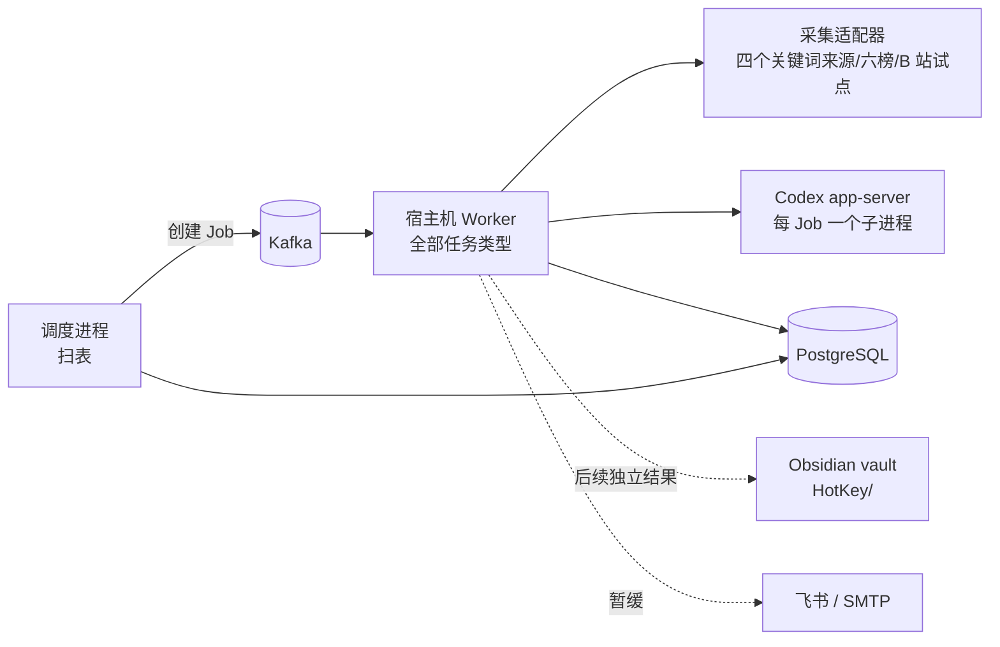

# 热点舆情监控平台总设计

日期：2026-10-02。v4.6 由PRD046与Design048承接AIHOT全量业务，保留Python/FastAPI、Next.js、Kafka、匿名Demo及既有Compose边界；原来源、模型、渠道和持续窗口验收不因代码移植变成通过。历史Plan061技术与页面证据保留于共享验收，ToC账户继续后置且无实现骨架。Design002—007各持有对应能力合同，当前执行入口见[文档索引](../README.md)，未通过项见BACKLOG。

## 1. 结论

2026-10-02 用户已将当前实施范围扩展为 AIHOT 全量业务迁移，并固定保留 Python/Next.js/Kafka；[Design048](048-AIHOT全量迁移架构与兼容设计.md)、PRD046 与 Plan062 是本轮扩展合同。此前按 M1 最小闭环逐步推进的顺序由此扩展，原真实来源、付费模型、渠道与72小时验收条件仍有效。新增模型榜、公告监控、公开分发与运营管理均归明确领域，唯一 Schema/任务/回执/HTTP 契约保持；不采用上游运行时，也不将局部测试替代全量验收。

原 M1 核心链路 POC 仍按 Plan058 在一个主题、HN 与一榜上核对最小演示，再扩至四来源六榜；最小演示不代表完整 M1。该证据边界不限制本轮 PRD046/Design048/Plan062 的全量实现范围。报告、Obsidian、知识库检索/问答与渠道投递分别验收，不作为 M1—M3 的技术前置；原主题周报、问答及真实 vault/渠道核收等未通过条件继续保留。72 小时、正式时效与质量抽检仍需产品验证。

- **信息获取是当前核心**：按主题从逐一验收的来源持续获取帖子、评论与热榜，保留来源、时间、覆盖缺口和失败原因；相关性判断服务于检索和阅读。日报、Obsidian 知识库与推送分别作为后续独立结果验收；飞书推送暂缓，不能卡住信息获取验收。
- **Demo 直接使用业务页面**：删除登录、注册、身份 API、会话与密码依赖。业务历史分区 UUID 仅保持数据关联，不表示账户；规则见 §9.2。未来 ToC 登录延后。
- **保留底座，按能力验收**。任务、内容、主题、来源契约和 Web 框架复用；分析、公开日周月刊、通知、统一公开分发和模型榜均接既有任务与账本；`events` 已接固定成员/事实、人工修订、热度和读取页面。代码存在与受控测试通过都不等于真实连续运行或产品验收。
- **不做任务 DAG，用数据库扫表驱动流水线**。独立调度进程分别扫描采集、评论、热榜、分析、报告、推送和导出，用确定性 operation ID 创建 Job；重复扫描由数据库约束幂等。各结果的启用与验收相互独立。
- **P1 只跑一个宿主机 Worker**。Codex 登录态在宿主机，所有任务类型注册在同一个宿主机 Worker；容器 Worker 在 P1 停用，避免错误角色抢消息。
- **知识库用 Obsidian，不用向量数据库**。HotKey 单向导出 Markdown 到现有 vault 的 `HotKey/` 子目录；问答由 HotKey 用 PostgreSQL 检索 + Codex 回答。取消 v2 设计中的 pgvector 与 `knowledge_chunks`。
- **报告先确定性、后润色**。数字、排序、引用由程序生成；模型只写带引用编号的句子；模型不可用时输出模板版。报告生成、知识库写入和推送分别验收，不能因其中一项可用而宣布另一项完成。
- **来源逐项验收**：四个关键词来源、六个公开热榜与本人账号 B 站试点分别证明真实采集、持久化、分析与覆盖；微博等登录平台暂不接入。HN 仍用于评论父链与重放的基础验证。
- **部署编排分离**：`docker-compose.yml` 只维护 API/Web 与按需 Worker、Browser、出口代理、CLI；`docker-compose-env.yml` 单独维护 PostgreSQL/Redis/Kafka，本地开发不默认启动。`docker-compose-prod.yml` 使用 Compose include 复用应用定义，通过显式 `--env-file .env.prod` 注入生产连接信息与密钥；两套应用的镜像、命令、profile、资源和安全限制一致。应用不声明对外部环境服务的 depends_on，API readiness 继续验证依赖；环境 Schema 只初始化全新空卷，拆分不删除或重建已有卷。
- **本机服务入口固定**：独立 RSSHub/SearXNG 服务仍由同级 Docker 编排管理；宿主机调用方选择 `127.0.0.1`，Compose 调用方选择 `host.docker.internal`，端口分别固定 1200/8888。主机选择与白名单冻结到来源连接版本，不能由请求输入指定任意地址；既定路由、SearXNG 引擎与禁止重定向边界见 Design002 §3。
- **评论关系保留缺口**：评论作品、根、直接父节点和回复目标为独立的同 owner 内容身份；来源只给出部分关系时以空值或身份占位表示未知，`content_threads.parent_relation_status` 标记父节点观察状态。完整新库 Schema 与来源契约由 Design002 §3.4/Plan038 固定，存量库重建遵守 §6.3。

## 2. 当前能力与证据分层

代码存在、受控测试、真实来源运行和产品验收分别判断。真实证据仅适用于当时的代码、Schema、数据库和时间窗；开发运行、离线回放或单项请求不能替代完整用户流程与连续窗口。

当前任务状态只维护在 [BACKLOG](../../BACKLOG.md)，证据与未通过条件见 [Acceptance入口](../README.md)。本设计定义现行架构，不维护旧运行计数、测试结果或部署快照；这些历史原文通过 Git 查阅。

## 3. 架构总览

流水线顺序由调度进程的扫描条件保证，而不是任务之间互相触发：

| 扫描 | 条件 | 创建的 Job | 阶段 |
|---|---|---|---|
| 关键词采集 | `monitor_schedules.next_run_at <= now`，叠加来源节奏 | `keyword.search` | 信息获取，已有代码 |
| 评论 | 到期的高互动已入库帖子；B 站只读同轮缓存 | `source.comments` | 信息获取，已有代码 |
| 热榜 | 已应用热榜来源，独立间隔默认1800秒且可配置；M1窗口冻结实际间隔 | `source.hotlist` | 信息获取，已有代码 |
| 分析 | 有内容版本但缺当前规则/提示词标注，按主题攒批 | `analysis.annotate` | 信息获取，已有代码 |
| 报告 | 原主题日报按冻结窗口与分析等待上限；公开刊期按完整自然日/ISO周/月到期 | `report.daily`、`report.edition`；原主题 `report.weekly` 待实现 | 原主题周报与真实报告质量分别待验 |
| 推送 | 固定可读报告/刊期/精选/公告 subject 缺投递记录且目标启用 | `notification.send` | SMTP/飞书处理器已接；真实渠道另验，不作信息获取门禁 |
| 导出 | 报告等对象在上次导出后有变化 | `knowledge.export` | 后续独立验收 |
| 事件 | 固定材料候选、事实/直接进展、归并/讨论回溯与小时热度；真实请求依开关和预算准入 | `events.cluster`、`events.consolidate`、`events.embed`、`events.signals`、`events.heat` | 任务/读取/人工修订已接，真实三平台与模型质量另验 |

每个 Job 的 operation ID 由扫描对象确定性派生（`uuid5(命名空间, 扫描类型:对象ID:版本)`），重复扫描命中现有唯一约束，不会重复创建。

| 领域 | 状态 | 主责 |
|---|---|---|
| `monitors` `connections` `jobs` `worker` `content` `sources` `evidence` `backups` `cli` | 已有代码 | 主题、预设、调度、内容与覆盖事实；具体能力看 BACKLOG 与对应验收 |
| `ai`、`analysis` | 已有代码 | 主题标注、独立精选/双评分、中文写作/翻译、评测与模型配置；真实质量和收费另验 |
| `reports`、`notifications`、`knowledge` | 已有代码 | 原主题日报、公开日周月刊、SMTP/飞书投递和 Obsidian；原主题周报、问答及真实 vault/渠道核收仍待实现或验证 |
| `events` | 固定成员/事实与修订、原 Job 和读取页面已接 | 人工纠错、跨故事关系、向量回溯及热度；真实三平台质量另验，见 Design004/048 |

## 4. 里程碑设计索引

| 里程碑 | 设计 | v3.2 承接章节 | 现行需求/执行入口 |
|---|---|---|---|
| M1 | [002 信息获取主链路](002-信息获取主链路设计.md) | §4.1—4.4、4.6、5、6/7/8 中信息获取、§21 | PRD 002 / 当前 Plan009/032/038/058 |
| M2 | [003 本人账号 B 站试点](003-本人账号B站试点设计.md) | §4.5、§6 截止与 §15 风控 | PRD 003 / Design003；后置排期时补步骤 |
| M3 | [004 事件与热度](004-事件与热度设计.md) | §12、§13 事件任务 | PRD004 / Design004/048 / Plan062；原 Plan014 证据保留 |
| M4 | [005 报告与知识库](005-报告与知识库设计.md) | §8 质量、§9、§11 | PRD005/046 / Design005/048 / Plan062；原主题周报/问答及真实 vault 另验 |
| M5 | [006 推送](006-推送设计.md) | §10 | PRD006 / Design006/048 / Plan062；真实渠道启用与核收另验 |
| M6 | [007 扩展能力](007-扩展能力设计.md) | 扩展来源、账号、告警、导出边界；仍待逐项准入 | PRD007/046 / Design007/048 / Plan062；公开分发已接，其余独立能力保留原准入与待验条件 |

共享运行库保留与恢复遵守 §6.3；历史 Plan051 的已交付证据见[共享验收](../acceptance/001-共享运行门槛验收.md)，维护责任及剩余工作见 [BACKLOG](../../BACKLOG.md)。下列能力沿用既有架构，已接实现和剩余验收分别核对；新增表/端点/任务不表示产品已通过。

| 能力合同与剩余验证 | 所属设计与当前执行入口 |
|---|---|
| collection_due_windows、版本化SourceExecutionPolicy、采集周期时钟、覆盖/指标读API；标注首次有效时间、主题状态变更、分析提示词首次启用及调度运行会话分别保留历史事实 | Design002；当前入口与排期见 BACKLOG |
| events/event_members/event_candidates、事件修订、事实关系、人工纠错及热度已接；固定成员与全部当前许可仍逐读核验 | Design004/048、Plan062；真实三平台和模型质量另验 |
| 既有主题报告设置、公开日周月刊冻结及 vault 文件冲突保护已接；原主题周报、knowledge_answers 问答和真实 vault 核收继续待验 | Design005/048；原未通过条件保留 |
| 不可变收件身份、默认关闭、attempt/resolution 审计与 SMTP 已接原通知账本 | Design006/048；真实 SMTP 核收、飞书启用和送达另验 |
| 告警/账号、报告及原始导出、逐来源准入 | Design007；后置排期时补步骤 |

新增Job仍由既有独立调度/单Worker执行：events.cluster（至少600秒，随冻结模型超时取更保守值）、events.heat（300秒）、knowledge.index（60秒/100对象）、knowledge.answer（600秒）、report.export/content.export（120秒）；report.weekly沿用600秒，notification.send沿用60秒。account.scan复用获准来源截止；alert.evaluate的评估频率5分钟、发送复用notification.send。工程保护值以所属Design和实际Settings合同为准，后置任务排期时补具体执行步骤，受控及真实验证前不宣称性能达标。跨领域经服务DTO/同Session事务，单一schema.sql、既有MinIO和数据库恢复门槛保持一致。

## 5. 跨里程碑约束

- **调度/任务**：独立 `python -m worker.scheduler` 扫表，在业务事务中以确定性 operation ID 创建 Job/Outbox；Kafka 是唤醒，PostgreSQL 的状态/租约/预算/覆盖是事实。Worker 处理业务事务后提交连续完成 offset。各来源节奏由版本化预设与主题频率取更保守值；M1、M2 分别详述实际来源。
- **主题采集版本**：`monitor_topic_versions` 固定关键词、来源选择和主题间隔；当前主题/调度行只作投影，旧 Job 依其已固定的主题及连接版本解释。名称、报告与推送偏好独立于采集版本；来源准入和预算由对应领域在恢复前核对。
- **Worker 拓扑**：当前只有一个宿主机 Worker 注册全部任务；容器 Worker 不参与 P1。Worker 父进程拥有 Kafka Consumer/offset，单任务子进程受进程硬截止和有界回收；任务类型默认值及重试时间口径见下节。不得用业务协作式截止代替硬截止。
- **模型接入/隔离**：本机 Codex app-server 每分析 Job 一个进程，适配器按 `initialize` → `thread/start`（ephemeral、read-only、approvalPolicy=never）→ `turn/start`（outputSchema、显式模型）调用。`HOTKEY_AI_MODEL` 显式选模型，批量输出根节点为对象；`Popen` 只传 `PATH`、`HOME`、`CODEX_HOME`、`LANG`，每 Job 独立空工作目录，拒绝审批类工具请求并在结束后清理。输入是非可信文本，结构化输出和引用受校验。`ai_calls` 只记 owner、Job、模型、版本、输入指纹、状态、token、耗时等元数据而非原文；`analysis_attempt` 调用前预留预算，限流延后。模型不可用时报告可模板降级；M1 标注与 M4 质量分别验收。
- **预算**：来源每轮、每日及全局请求/时间上限和模型尝试由持久预算账本约束；来源预算策略按 owner、source、metric、窗口规则保持稳定身份，连接升版不返还窗口已用额度。版本化非秘密执行策略保存于 `source_connection_versions.execution_policy`，只在全新空库的 `schema.sql` 初始化；保留库先走 §6.3 恢复路径。自动重试、限流重排和租约重放只使用剩余额度。旧 Design 037 费用与资源约束已删除，见 Git 历史。付费模型不请求；X 在凭据与月上限明确前零真实请求。
- **HTTP 契约**：路由装饰器/Pydantic 为唯一源；API 边界映射稳定 ErrorView，成功资源/分页/受理 DTO 类型化，运行 OpenAPI 生成前端客户端。046 S03 技术门禁已有真实通过证据（含 AC-046-006 本地上游验证）；旧 Design 046 与 Acceptance 046 已删除，见 Git 历史。现行错误码、请求 ID、脱敏与 422 规则见 PROJECT.md 和 AGENTS.md。
- **安全与数据**：仅公开或本人授权数据；来源验证/限流停用并人工恢复。凭据不入库、日志、模型或Git；适配器校验主机白名单与每跳重定向，业务关联保持分区一致性。当前Demo不提供账户权限；真实来源状态只凭持久化证据推进。
- **RSS 身份依据**：M1 的 Google News/36Kr 关键词条目优先使用来源 GUID，缺失时按规范 URL 回退；`content_records.identity_basis` 记 `guid` 或 `url_fallback`，供内容读取核对。Google News 固定查询入口拒绝重定向，RSS 快照不推断历史覆盖。新增可空列遵循下述新库重建门槛。
- **数据库**：`backend/database/schema.sql` 是全新空库唯一 DDL，开发库可在明确可丢弃时重建；连续验收库和正式库保留事实时，先验证备份，再新库原子建表、导入、核对和切换。完整门槛见下节。
- **共享底座责任**：目录与领域职责见 [PROJECT](../../PROJECT.md)，技术与真实证据见 [共享验收](../acceptance/001-共享运行门槛验收.md)。当前 Demo 分区合同见 §9.2，恢复合同见 §6.3；历史卡055/056/057分别记录证据保留/删除、客户端/CI与通用网页/Browser回归边界，未通过项按现行合同与 BACKLOG 排期时补执行步骤；技术结果不能冒充平台接入或产品AC。
- **证据生命周期**：`lifecycle cleanup-once` 先核对合法到期与活跃引用保护，再持久记录删除目标、尝试和结果；对象、保留策略与谱系保持业务分区和版本一致，旧谱系不得被新结果覆盖。删除后保留最小审计与谱系缺口，缺失对象明确不可用；失败或未知结果可重跑对账，不得清空失败记录冒充完成。技术验收仍需隔离真实 PostgreSQL/MinIO 的故障后重跑，以及恢复后的谱系、输入哈希和残余对象核对；CI 通过不能替代这些证据，同桶副本的限制见 §6.3。
- **通用 Browser 冻结边界**：已有 `webpage.collect`、Firecrawl、Browser 运行时与 probe 仅证明各自证据范围；通用 Browser 业务处理器未接 Worker，凭据隔离及换版旧写端到端验证仍未通过。恢复前须由用户确定目标来源与授权、出口主机和逐跳重定向白名单、计量/预算及是否启用处理器，再固定 Job 类型、硬截止与恢复合同；未获准时维持禁用，不默认新增处理器、Schema/API 或真实平台请求。旧连接版本不得写新证据，probe 不算采集验收；验证码、认证失效或访问频繁即停，人工核查后才能恢复。

## 6. 共享任务与恢复

### 6.1 按任务类型的默认硬截止

`core/config.py` 已按任务类型计算进程硬截止；B 站当前仍有来源键特判，待 [M1/M2 设计](002-信息获取主链路设计.md)所述预设节奏迁移。Job 采集预算 `max_seconds` 与进程硬截止分别生效，硬截止须覆盖启动、处理、终止与持久化余量。

| 任务类型 | 默认硬截止 |
|---|---|
| `keyword.search` / `source.comments` | 90 秒 |
| B 站 `keyword.search` / `source.comments` | 240 秒进程硬截止；搜索 Job 最多 220 秒 |
| `source.hotlist` | 60 秒进程硬截止；请求预算 45 秒 |
| `webpage.collect` | 沿用现有计算 |
| `analysis.annotate` | 600 秒 |
| `report.daily` / `report.weekly` | 600 秒 |
| `notification.send` | 60 秒 |
| `knowledge.export` | 60 秒 |

### 6.2 首次启动、尝试与采集预算

- `jobs.started_at` 是**同一 Job 首次成功领取执行权的时间**，自动重试、限流后重排和手动重试都不得覆盖，用于首次启动时延与整单历时。`job_attempts.started_at` 是**当前尝试的开始时间**，每次重新领取新增一行，用于本次执行耗时。`jobs.collection_cycle_no/started_at/requests_sent` 分别保存采集预算周期、起点和本周期请求数，`job_attempts.collection_cycle_no` 保留尝试所属周期；计算 `deadline = collection_cycle_started_at + max_seconds`。Job 累计 `requests_sent` 不清零，用作请求尝试与预算预留唯一 ID 的序号；不能隐式复用 `jobs.started_at` 作为所有重试的预算起点。
- 首次领取时三者时间一致。自动重试、限流后重排、租约重放属于**同一采集预算周期**：保留预算起点，只获得剩余时间与请求配额；已结算请求不返还。用户明确发起的手动重试在校验连接和权限后开启**新采集预算周期**，起点取下一次实际领取时间，不把排队等待算入新预算；它只重置该 Job 的时间/请求上限，来源每日与全局预算继续累计。原 Job、`started_at`、operation ID、历史尝试与失败记录保留，必要时新增预算周期序号以隔离同一操作的幂等计量。重复点击手动重试保持幂等，不反复刷新预算。
- 分别报告**排队等待**（受理/到期至尝试开始）、**单次执行**（尝试开始至结束）、**整单历时**（首次开始至最终结束）及**当前预算已用/剩余**；不得用重置 `started_at` 美化耗时。Plan032 负责首次失败后两分钟手动重试可采、自动重试只用剩余预算、限流重排、重复点击与指标不倒退的验证；技术证据和真实重试缺口分别见 Acceptance002。

### 6.3 数据库重建门槛

- `backend/database/schema.sql` 是全新空库唯一 DDL。可丢弃的本机开发库可停服务后用它重建，并重新加载受控样本；重建会删除原库事实，不把重建后的测试通过写成旧运行数据已保留。
- 卡 F 的连续运行库和正式运行库需要保留内容、Job、覆盖、预算、报告或审计证据时，先完成备份并实际验证恢复可读，再建全新空库应用完整 `schema.sql`。该文件自身的 `BEGIN`/`COMMIT` 保证DDL原子性，`psql -X --set ON_ERROR_STOP=on`、CI stdin与Compose entrypoint均使用此事务，额外 `--single-transaction` 可选；失败后核对无部分业务表。导入经过校验的数据后，切换前核对各核心表行数、owner/主外键、内容身份、来源连接版本、Job/Outbox/offset、覆盖窗口及预算余额，并抽查原帖与报告引用。核对不通过保持旧库可回退；禁止在旧库上直接执行完整 Schema 或假设存在自动迁移。
- 备份前暂停写入并记录最后提交边界；恢复对账包含关键 JSON、对象引用与对象内容哈希，不能只比行数。恢复后的已完成 Job 重放应幂等，待处理 Job 应保持可恢复；读写探针不得改变既有数据和预算。不一致时停止切换并保留旧库回退；代码、Schema 或对象集合变化后重新验证。同桶对象副本不构成独立灾备或 WORM。历史 Plan051 的演练结论见 Acceptance001，不自动适用于当前运行库。

## 7. 共享风险

| ID | 风险 | 应对 |
|---|---|---|
| RSK-001-201 | 本人账号平台验证、接口变动、登录态失效 | B 站单来源试点；验证/限流即停、人工恢复；覆盖查询注明缺失 |
| RSK-001-203 | 模型幻觉进入报告 | 数字由程序填写；句子必须带有效引用编号；否则降级为模板 |
| RSK-001-204 | 平台合规与账号风险 | 只采公开或本人获授权数据；MediaCrawler 限个人非商业研究；限频、独立资料、遇风控停止，不破解或自动恢复 |
| RSK-001-206 | Codex 账号限流或模型下线 | 显式模型配置；限流延后；报告可降级；适配器可替换 |
| RSK-001-207 | 提示注入诱导 Codex 读取本机文件并写进输出 | 最小环境变量；空工作目录；尽量关闭 shell 工具；输出只接受结构化字段并校验引用 |
| RSK-001-208 | Obsidian 同步或用户编辑与导出冲突 | 只替换管理区块；原子写；哈希比对；vault 选用非 iCloud 路径 |
| RSK-001-205 | 重建数据库丢失运行证据或正式数据 | 可丢弃开发库可按完整 `schema.sql` 新建；卡 F 连续运行库及正式库一旦要保留数据，先验证可恢复备份，再新建库应用完整 Schema、导入、核对行数/主外键/关键 Job、覆盖与预算，再切换；不对旧库就地执行 Schema |

## 8. 全局决策与去向

下表只保留现行决策。被替代的产品顺序、pgvector、jieba、单账户与品牌提案从 Git 历史查阅；编号不重用，替代关系集中见文档索引。

| ID | 决策与原替代关系 | 主要承接设计 |
|---|---|---|
| DEC-001-109 | 本机 Codex app-server、可替换适配器，不发付费模型请求 | 001 共享；002、005 使用 |
| DEC-001-110 | 飞书和 SMTP 推送目标保留，原 P1 顺序由 DEC-001-212 替代 | 006 |
| DEC-001-111 | Obsidian `HotKey/` 单向导出并保留用户区块 | 005 |
| DEC-001-112 | 本机 Codex + PostgreSQL 检索问答，不引入向量库 | 005 |
| DEC-001-114 | 日报先以重点内容组织，事件验收后增加事件区块 | 004、005 |
| DEC-001-202 | 数字由程序计算，模型只写带引用编号的句子；不通过校验则降级为模板 | 005 |
| DEC-001-203 | 流水线由独立调度进程扫表驱动，确定性 operation ID 保证幂等；不做任务链式触发 | 002/004/005/006 |
| DEC-001-205 | P1 只运行一个宿主机 Worker，注册全部任务类型 | 002/003 |
| DEC-001-206 | 任务硬截止按任务类型配置 | 002/003 |
| DEC-001-207 | Codex 每个分析 Job 启动一次，只传最小环境变量 | 002/004/005 |
| DEC-001-208 | 知识库检索用 PostgreSQL `pg_trgm`，不引入向量库；取代 DEC-001-201（pgvector）与 DEC-001-204（jieba 分词） | 004/005 |
| DEC-001-209 | 沿用任务类型名 `keyword.search` | 002 |
| DEC-001-210 | 推送秘密只从环境变量读取；投递结果不确定时不自动重发 | 006 |
| DEC-001-211 | Obsidian 导出只写 `HotKey/` 子目录的管理区块，原子写，按内容哈希去重 | 005 |
| DEC-001-212 | 信息获取为当前核心；报告、知识库、推送各自独立验收，推送暂缓。替代 PRD 的 DEC-001-101 以报告/知识库为目标及 DEC-001-110 的 P1 推送顺序口径；现行需求与排期分别见 PRD/BACKLOG | 002—007 |
| DEC-001-213 | 来源预设持有节奏与开关，主题频率取更保守值；节奏变更升连接版本并只影响后续 Job。替代原 v3.2 第 5.1 节“主题频率直接决定采集”的口径 | 002/003/007 |
| DEC-001-214 | MediaCrawler 只作本人账号 B 站宿主机子进程试点，固定补丁提交、独立 CDP 资料，遇风控停止并人工恢复。替代旧“B 站、微博同批接入/容器入口”的设计口径 | 003 |
| DEC-001-215 | 六榜按独立 `source.hotlist` 保存快照、排名与主题命中；合法空榜保存零条目观察，失败保留原到期桶与 Job 原因，快照通过原 Job/operation 关联到期事实；命中内容入库并经 Codex 判相关，事件归并后验。替代原 v3.2 第 12 节“热榜条目直接进入事件”的口径 | 002/004 |
| DEC-001-216 | 覆盖查询以 `(owner_id,schedule_key,due_at)` 的持久到期事实为入口，按来源、能力、时间窗显示请求/页、停止原因、入库/去重、分析积压、预算与缺口；无 Job 保留未知，只有固定窗可信尾段证据可确认完整覆盖。替代旧“报告覆盖说明足以代表采集可观测”的口径 | 002/007 |
| DEC-001-217 | `jobs.started_at` 保留首次启动；当前尝试另记，手动重试在下一次领取时开启新采集预算，自动重试沿用剩余预算。替代“所有重试共用首次启动时间计算采集截止”的口径 | 002/003 |
| DEC-001-218 | 可丢弃开发库可按完整 Schema 重建；卡 F 与正式库需先验证备份，再新建、导入与核对后切换。替代“当前库无业务数据即可重建”的旧假设 | 002—007 |
| DEC-001-219 | P1 日报只链接原帖或已存在笔记；P2 在目标笔记成功导出后补双链。替代 DEC-001-211 下“日报先导出帖子笔记”的旧引用时序 | 005 |
| DEC-001-220 | MediaCrawler 证据分别记录上游基线、补丁后提交、实际适配器版本并关联 Job；替代旧预设以单一 `component_version` 混记上游与补丁版本的口径 | 003 |
| DEC-001-226 | 未来 ToC 账户保留用户名密码、GitHub App、邮箱验证码与无感会话恢复；按用户隔离资源，删除部署密钥与独立工作区身份设计 | PRD001 §2.1、本节 §9.2；后置需求，不适用于当前 Demo |
| DEC-001-227 | 当前 Demo 删除账户、会话、登录注册及业务身份依赖；业务 UUID 仅作历史分区，来源授权、预算与幂等保留 | 001 §9.2；历史 Plan061 已完成 |

里程碑新增决策使用本里程碑的 DEC-00N-xxx。当前 Demo 执行 DEC-001-227；DEC-001-226 保留正式 ToC 需求。来源软件许可和平台授权仍单独核对。

## 9. Web 首页、账户与品牌

公开首页、Demo入口与品牌母版保留于总设计，不并入M1—M6的业务验收。

### 9.1 Web 公开首页视觉切片（知微见澜 / Ripplesight）

- **范围与信息架构**：公开首页解释“用户用关键词定义品牌、产品或话题的监控主题”，主入口通往现有主题创建流程。AI 是后续整理与分析能力，不是监控对象的限定。首页不展示模拟实时事件、统计值或未验收的数据；事件脉络只作能力说明，沿用 P2 阶段边界。
- **视觉**：采用用户于2026-10-01选定的 Vercel 黑白方案 1：近白背景、Geist 轻字重两行标题、黑白胶囊操作、品牌主视觉与充分留白。首页使用“关注你在意的，看见新的变化。”，不使用此前的渐变和波纹，也不增加数据面板、指标卡片或更多营销区块。
- **组件与目录**：直接修改正式 `frontend/src/app/components/` 中的 `SiteHeader`、`HeroSection`、`CapabilityOverview`、`HomeContent`；分别负责导航、主视觉与创建入口、简短指南及示例、页面组合。`BrandMark`/`BrandLockup`继续跨页面复用唯一图标母版；按钮、菜单和说明浮层沿用官方 shadcn/Radix 组件。首页内容均为静态文案，不复制独立原型的内存主题管理；“创建关注”进入 `/monitors/new`，“我的关注”进入 `/topics`，配置和保存沿用现有生成客户端与真实来源能力。
- **状态与可访问性**：静态首页无API状态；业务路由处理加载、空、错误与重试，无登录检查。窄屏单列，链接支持键盘焦点，装饰`aria-hidden`，遵循减弱动态效果。
- **产品入口**：`/topics` 由 `TopicsWorkspace` 和 `TopicList` 提供关注配置列表，沿用生成 API 及加载/空/错误/分页/归档状态；主题名和运行状态在列表显示，规则及版本在详情页。`/events` 由 `EventList`、`EventHotList` 及事件详情页提供真实事件、固定成员和热度读取，不作为关注配置入口。各业务页复用导航，不要求产品登录；运营页面的独立令牌与退出操作不属于 ToC 账户体系。
- **品牌元数据**：`frontend/src/app/layout.tsx`、`manifest.ts` 使用“知微见澜 / Ripplesight”；图标母版固定为 §9.3 的 `icon.png`。

### 9.2 当前 Demo 的访问与数据分区

**现行合同**：当前 Demo 无账户、会话、注册或登录页；首页业务入口为 `/events`。不保留身份模块、身份路由、初始化/重置 CLI、密码库、bootstrap/session 配置与身份 Cookie，也不保留登录注册页、身份组件、登录跳转和身份先行请求。来源平台授权与凭据、内容原生身份和任务预算继续有效。技术与浏览器证据见 [共享验收](../acceptance/001-共享运行门槛验收.md)；历史执行过程从 Git 查询。

- `db/demo.py`从已注册业务表汇总owner_id，不导入业务ORM。新Schema空库固定`00000000-0000-4000-8000-000000000001`，唯一分区复用、多分区503 `demo_scope_conflict`；API/CLI共用，不取第一行或造假用户。业务为空且有旧身份表的Schema（含身份表空表）拒绝默认UUID，以免撞旧身份外键。
- 分区解析使用独立只读连接，不启动调用方业务 Session 的事务、不提交业务写入；业务服务仍显式管理自己的事务。
- `DemoScopeDependency`/`DemoWriteScopeDependency` 注入 UUID；领域服务继续检查分区一致性。Worker 持久消息、预算、复合外键与幂等键沿用 UUID。`owner_id`/两处 `created_by` 为历史分区标记，新 Schema 删除身份外键及两身份表，不批量改写业务关联。
- 读取无需 Cookie；写入必须有固定 `X-HotKey-CSRF: 1`，不符为 `csrf_invalid`（403）。该头不代表身份，不创建 token 或 Cookie；同源代理不转发旧 Cookie、Authorization 或 Set-Cookie，保留超时、请求 ID、错误脱敏和安全头，维持无跨域授权。
- `EventsWorkspace` 直接读取主题；`TopicForm` 只读取来源能力。状态覆盖加载、空、错误/重试与业务成功，移除用户信息和退出操作。页面保持 `noindex` 与逐请求 CSP nonce，桌面/窄屏直接冷进入可操作。
- 新 Schema 只在全新空库验证。当前运行库不删表或执行新 DDL；唯一业务分区可沿用历史 UUID。旧备份使用原版本恢复；需要重建时仍按 §6.3 校验备份、导入、业务关联和回退。
- 此版本用于本机或受控演示环境；未来 ToC 产品需要重新完成账户与权限实现，不能把 Demo 分区当作多用户隔离。此前用户名密码、GitHub App、邮箱验证码与有效会话无感恢复需求延后，不进入 Demo 排期。

#### 未来 ToC 账户需求（后置）

保留用户名密码、GitHub App、邮箱验证码和有效会话无感恢复需求。当前不预设账户表、会话TTL、验证码存储、代理链路或页面组件，不保留代码骨架；未来按 PRD001 §2.1、本节与 BACKLOG 重新排期时，补精确执行步骤并审核真实集成、多用户权限和数据迁移。旧细则从 Git 历史查询。

### 9.3 选定的 Web 品牌标志

- **选择与修正**：用户选择三款标志中的第 1 款。保留其左侧展开的视窗轮廓、右侧开口和单个观察点；将概念图过暗的黑底深灰表现修正为白底深色高对比版本，适配现有浅色页面。
- **资产与引用**：`frontend/src/app/icon.png`为唯一母版，由Metadata、BrandMark和Manifest引用；首页与业务页面复用“知微见澜 / Ripplesight”。旧SVG从Git查询，图标为静态本地资源，文本名称提供可读回退。

### 9.4 当前业务页面按 OpenAPI 重建

用户于2026-10-01要求清理旧业务页实现并按当前Swagger落实页面。保留既定首页和官方Next.js/shadcn/Radix脚手架，重建关注配置、来源、内容、热榜、任务与已有报告读取的页面组合；组件、路径、生成操作与状态覆盖登记在[Web Design](../../frontend/DESIGN.md#当前业务页面重建)。不新增接口、模拟业务数据、通用资源框架或登录体系。

创建与编辑的基础信息为名称、关键词、来源；进阶匹配和频率按需展开，报告/通知偏好不进入当前配置表单，编辑仍保留服务端已有值。来源页先展示连接设置，覆盖与能力放二级Tabs/Sheet；预设应用没有HTTP操作，沿用维护者CLI。列表遵守真实游标和部分/空/失败状态，受理响应不显示为采集完成。API客户端由`@umijs/openapi`读取FastAPI运行时OpenAPI统一生成至`frontend/src/api/`，调用唯一Axios封装`src/request.ts`；业务源码禁止手写请求及下载API URL，以ESLint和生成漂移检查验证。传输、写入头、逐请求CSP与noindex合同不变。
