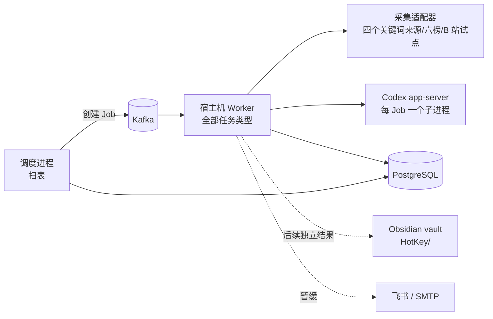

# 热点舆情监控平台总体设计

平台采用 Python/FastAPI、Next.js、PostgreSQL、Redis、Kafka 与 MinIO。业务范围见 PRD001—007、PRD046；领域设计见 Design002—007 与 [Design048](048-完整业务设计.md)。本文件定义共享架构、任务恢复、数据库保留、Web 布局与真实账户访问合同。

## 1. 结论

- **信息获取是当前核心**：按主题从逐一验收的来源持续获取帖子、评论与热榜，保留来源、时间、覆盖缺口和失败原因；相关性判断服务于检索和阅读。日报、Obsidian 知识库与推送分别作为后续独立结果验收；飞书推送暂缓，不能卡住信息获取验收。
- **公开Welcome与真实登录**：首页用于SEO，账号密码、GitHub和邮箱验证码共用账户会话，登录后进入业务页面；规则见§9.2。
- **统一业务底座**：主题、内容、分析、事件、日周月刊、通知、公开分发、模型榜、公告监控与运营管理使用同一任务、预算、回执和 HTTP 契约，不创建第二套运行时或唯一事实。
- **不做任务 DAG，用数据库扫表驱动流水线**。独立调度进程分别扫描采集、评论、热榜、分析、报告、推送和导出，用确定性 operation ID 创建 Job；重复扫描由数据库约束幂等。各结果的启用与验收相互独立。
- **只运行一个宿主机Worker**。Codex 登录态在宿主机，所有任务类型注册在同一个宿主机 Worker；容器Worker停用，避免错误角色抢消息。
- **知识库用 Obsidian**：HotKey 单向导出 Markdown 到现有 vault 的 `HotKey/` 子目录；问答使用 PostgreSQL `pg_trgm` 检索和 Codex 回答，不引入向量数据库或第二份正文库。
- **报告先确定性、后润色**。数字、排序、引用由程序生成；模型只写带引用编号的句子；模型不可用时输出模板版。报告生成、知识库写入和推送分别验收，不能因其中一项可用而宣布另一项完成。
- **来源逐项验收**：四个关键词来源、六个公开热榜与本人账号 B 站试点分别证明真实采集、持久化、分析与覆盖；微博等登录平台暂不接入。HN 仍用于评论父链与重放的基础验证。
- **配置统一**：环境文件与唯一 `.env.example` 只位于仓库根目录；API、Worker、CLI、Web 与 Compose 共用根 `.env`，生产显式使用根 `.env.prod`。Settings 根据源码位置读取根目录，进程注入优先；Web 配置只读取 API/Web/OpenAPI/公开 metadata 白名单字段，后端秘密不进入 Web 进程或客户端。
- **部署编排分离**：`docker-compose.yml` 只维护 API/Web 与按需 Worker、Browser、出口代理、CLI；`docker-compose-env.yml` 单独维护 PostgreSQL/Redis/Kafka，本地开发不默认启动。`docker-compose-prod.yml` 使用 Compose include 复用应用定义，通过显式 `--env-file .env.prod` 注入生产连接信息与密钥；两套应用的镜像、命令、profile、资源和安全限制一致。应用不声明对外部环境服务的 depends_on，API readiness 继续验证依赖；环境 Schema 只初始化全新空卷，拆分不删除或重建已有卷。
- **应用访问端口固定**：本机Web固定8666、API固定8667，启动入口、宿主映射、前端API origin/生成器、登录Web Origin、公开metadata及CI一致。本机地址为`http://127.0.0.1:8666`与`http://127.0.0.1:8667`；Compose内部8080及Browser WS3000不变，依赖服务复用已安装环境。
- **本机服务入口固定**：独立 RSSHub/SearXNG 服务仍由同级 Docker 编排管理；宿主机调用方选择 `127.0.0.1`，Compose 调用方选择 `host.docker.internal`，端口分别固定 1200/8888。主机选择与白名单冻结到来源连接版本，不能由请求输入指定任意地址；既定路由、SearXNG 引擎与禁止重定向边界见 Design002 §3。
- **评论关系保留缺口**：评论作品、根、直接父节点和回复目标为独立的同 owner 内容身份；来源只给出部分关系时以空值或身份占位表示未知，`content_threads.parent_relation_status` 标记父节点观察状态。来源契约见 Design002 §3.4，存量库重建遵守 §6.3。

## 2. 验证边界

代码、受控技术、真实运行与产品验收分别判断。M1 短窗在一个主题、HN 与一榜上验证最小链路，不能替代四来源六榜、72 小时持续运行、正式时效与质量抽检。报告、原主题周报、知识库检索/问答、真实 vault 与渠道核收分别验收，不作为信息获取或事件能力的技术前置。现行任务与未完成条件统一见 [BACKLOG](../../BACKLOG.md)，实际证据见 [Acceptance](../README.md)。

## 3. 架构总览

流水线顺序由调度进程的扫描条件保证，而不是任务之间互相触发：

| 扫描 | 条件 | 创建的 Job |
|---|---|---|
| 关键词采集 | `monitor_schedules.next_run_at <= now`，叠加来源节奏 | `keyword.search` |
| 评论 | 到期的高互动已入库帖子；B 站只读同轮缓存 | `source.comments` |
| 热榜 | 已应用热榜来源，独立间隔默认1800秒且可配置；M1窗口冻结实际间隔 | `source.hotlist` |
| 分析 | 有内容版本但缺当前规则/提示词标注，按主题攒批 | `analysis.annotate` |
| 报告 | 原主题日报按冻结窗口与分析等待上限；公开刊期按完整自然日/ISO周/月到期 | `report.daily`、`report.edition`；原主题 `report.weekly` 待实现 |
| 推送 | 固定可读报告/刊期/精选/公告 subject 缺投递记录且目标启用 | `notification.send` |
| 导出 | 报告等对象在上次导出后有变化 | `knowledge.export` |
| 事件 | 固定材料候选、事实/直接进展、归并/讨论回溯与小时热度；真实请求依开关和预算准入 | `events.cluster`、`events.consolidate`、`events.embed`、`events.signals`、`events.heat` |

每个 Job 的 operation ID 由扫描对象确定性派生（`uuid5(命名空间, 扫描类型:对象ID:版本)`），重复扫描命中现有唯一约束，不会重复创建。

| 领域 | 主责 |
|---|---|
| `monitors`、`connections`、`jobs`、`worker`、`content`、`sources`、`evidence`、`backups`、`cli` | 主题、来源准入与版本、调度、执行、内容、覆盖事实、证据与恢复 |
| `ai`、`analysis` | 唯一模型调用/预算账本、主题标注、独立精选/双评分、中文写作/翻译、评测与模型配置 |
| `reports`、`notifications`、`knowledge` | 原主题报告、日周月刊、SMTP/飞书投递、Obsidian 导出和检索问答 |
| `events` | 固定成员/事实、人工纠错、修订、跨故事关系、回溯与热度 |
| `publication`、`leaderboard`、`operations` | 内容许可/投影/分发、模型榜、站点设置及独立运营权限；细则见 Design048 |

## 4. 领域设计索引

| 范围 | 设计 |
|---|---|
| M1 信息获取 | [002 信息获取主链路](002-信息获取主链路设计.md) |
| M2 本人账号试点 | [003 本人账号 B 站试点](003-本人账号B站试点设计.md) |
| M3 事件与热度 | [004 事件与热度](004-事件与热度设计.md) |
| M4 报告与知识库 | [005 报告与知识库](005-报告与知识库设计.md) |
| M5 推送 | [006 推送](006-推送设计.md) |
| M6 账号、告警与导出 | [007 扩展能力](007-扩展能力设计.md) |
| 分析、分发、模型榜、公告与运营 | [048 完整业务](048-完整业务设计.md) |

跨领域读取经所属服务 DTO，原子写显式共用同一 Session，由最外层提交或回滚；持久数据共用唯一 `schema.sql` 与既有 MinIO。共享运行库保留与恢复遵守 §6.3。

## 5. 跨里程碑约束

- **调度/任务**：独立 `python -m worker.scheduler` 扫表，在业务事务中以确定性 operation ID 创建 Job/Outbox；Kafka 是唤醒，PostgreSQL 的状态/租约/预算/覆盖是事实。Worker 处理业务事务后提交连续完成 offset。各来源节奏由版本化预设与主题频率取更保守值；M1、M2 分别详述实际来源。
- **主题采集版本**：`monitor_topic_versions` 固定关键词、来源选择和主题间隔；当前主题/调度行只作投影，旧 Job 依其已固定的主题及连接版本解释。名称、报告与推送偏好独立于采集版本；来源准入和预算由对应领域在恢复前核对。
- **覆盖与时钟**：`collection_due_windows` 保存到期事实，采集预算周期独立计时；标注首次有效时间、主题状态变更、分析提示词首次启用与调度运行会话分别持久化，不能用当前状态重写运行事实。
- **Worker 拓扑**：当前只有一个宿主机 Worker 注册全部任务；容器Worker停用。Worker 父进程拥有 Kafka Consumer/offset，单任务子进程受进程硬截止和有界回收；任务类型默认值及重试时间口径见下节。不得用业务协作式截止代替硬截止。
- **模型接入/隔离**：本机 Codex app-server 每分析 Job 一个进程，适配器按 `initialize` → `thread/start`（ephemeral、read-only、approvalPolicy=never）→ `turn/start`（outputSchema、显式模型）调用。`HOTKEY_AI_MODEL` 显式选模型，批量输出根节点为对象；`Popen` 只传 `PATH`、`HOME`、`CODEX_HOME`、`LANG`，每 Job 独立空工作目录，拒绝审批类工具请求并在结束后清理。输入是非可信文本，结构化输出和引用受校验。`ai_calls` 只记 owner、Job、模型、版本、输入指纹、状态、token、耗时等元数据而非原文；`analysis_attempt` 调用前预留预算，限流延后。模型不可用时报告可模板降级；M1 标注与 M4 质量分别验收。
- **预算**：来源每轮、每日及全局请求/时间上限和模型尝试由持久预算账本约束；来源预算策略按 owner、source、metric、窗口规则保持稳定身份，连接升版不返还窗口已用额度。版本化非秘密执行策略保存于 `source_connection_versions.execution_policy`，只在全新空库的 `schema.sql` 初始化；保留库先走 §6.3 恢复路径。自动重试、限流重排和租约重放只使用剩余额度。真实Codex与付费模型请求暂停；X 在凭据与月上限明确前零真实请求。
- **HTTP 契约**：路由装饰器/Pydantic 为唯一源；API 边界映射稳定 ErrorView，成功资源/分页/受理 DTO 类型化，运行 OpenAPI 生成前端客户端。错误码、请求 ID、脱敏与 422 规则见 PROJECT.md 和 AGENTS.md。
- **安全与数据**：仅公开或本人授权数据；来源验证/限流停用并人工恢复。凭据不入库、日志、模型或Git；适配器校验主机白名单与每跳重定向，业务关联保持分区一致性。业务读写验证真实账户会话与个人归属；真实来源状态只凭持久化证据推进。
- **RSS 身份依据**：M1 的 Google News/36Kr 关键词条目优先使用来源 GUID，缺失时按规范 URL 回退；`content_records.identity_basis` 记 `guid` 或 `url_fallback`，供内容读取核对。Google News 固定查询入口拒绝重定向，RSS 快照不推断历史覆盖。完整Schema遵循下述新库重建门槛。
- **数据库**：`backend/database/schema.sql` 是全新空库唯一 DDL，开发库可在明确可丢弃时重建；连续验收库和正式库保留事实时，先验证备份，再新库原子建表、导入、核对和切换。完整门槛见下节。
- **共享底座责任**：目录与领域职责见 [PROJECT](../../PROJECT.md)，账户访问遵守 §9.2，恢复遵守 §6.3。来源软件许可、平台授权、模型准入与账户会话分别校验。
- **证据生命周期**：`lifecycle cleanup-once` 先核对合法到期与活跃引用保护，再持久记录删除目标、尝试和结果；对象、保留策略与谱系保持业务分区和版本一致，旧谱系不得被新结果覆盖。删除后保留最小审计与谱系缺口，缺失对象明确不可用；失败或未知结果可重跑对账，不得清空失败记录冒充完成。技术验收仍需隔离真实 PostgreSQL/MinIO 的故障后重跑，以及恢复后的谱系、输入哈希和残余对象核对；CI 通过不能替代这些证据，同桶副本的限制见 §6.3。
- **通用 Browser 准入**：`webpage.collect`、Firecrawl、Browser 运行时与 probe 分别验证；通用Browser处理器接入、凭据隔离及换版旧写端到端验证是启用前必需条件，当前缺口见BACKLOG。启用前须确定目标来源与授权、出口主机和逐跳重定向白名单、计量/预算及处理器，再固定 Job 类型、硬截止与恢复合同；未获准时维持禁用，不默认新增处理器、Schema/API 或真实平台请求。旧连接版本不得写新证据，probe 不算采集验收；验证码、认证失效或访问频繁即停，人工核查后才能恢复。

## 6. 共享任务与恢复

### 6.1 按任务类型的默认硬截止

`core/config.py` 按任务类型计算进程硬截止，B 站搜索与评论使用独立上限。Job 采集预算 `max_seconds` 与进程硬截止分别生效，硬截止须覆盖启动、处理、终止与持久化余量；保护值以所属 Design 和实际 Settings 合同为准，不代表性能已通过。

| 任务类型 | 默认硬截止 |
|---|---|
| `keyword.search` / `source.comments` | 90 秒 |
| B 站 `keyword.search` / `source.comments` | 240 秒进程硬截止；搜索 Job 最多 220 秒 |
| `source.hotlist` | 60 秒进程硬截止；请求预算 45 秒 |
| `webpage.collect` | 沿用现有计算 |
| `analysis.annotate` | 600 秒 |
| `report.daily` / `report.weekly` | 600 秒 |
| `notification.send` | 60 秒 |
| `knowledge.export` | 60 秒 |
| `events.cluster` | 至少 600 秒，按冻结模型超时取更保守值 |
| `events.heat` | 300 秒 |
| `knowledge.index` | 60 秒；每批最多 100 个对象 |
| `knowledge.answer` | 600 秒 |
| `report.export` / `content.export` | 120 秒 |
| `account.scan` | 复用获准来源截止 |

`alert.evaluate` 每 5 分钟评估，发送复用 `notification.send` 与既有通知账本。所有任务由独立调度和单 Worker 执行，任务类型名或配置存在不代表处理与恢复链路已完成。

### 6.2 首次启动、尝试与采集预算

- `jobs.started_at` 是**同一 Job 首次成功领取执行权的时间**，自动重试、限流后重排和手动重试都不得覆盖，用于首次启动时延与整单历时。`job_attempts.started_at` 是**当前尝试的开始时间**，每次重新领取新增一行，用于单次执行耗时。`jobs.collection_cycle_no/started_at/requests_sent` 分别保存采集预算周期、起点和本周期请求数，`job_attempts.collection_cycle_no` 保留尝试所属周期；计算 `deadline = collection_cycle_started_at + max_seconds`。Job 累计 `requests_sent` 不清零，用作请求尝试与预算预留唯一 ID 的序号；不能隐式复用 `jobs.started_at` 作为所有重试的预算起点。
- 首次领取时三者时间一致。自动重试、限流后重排、租约重放属于**同一采集预算周期**：保留预算起点，只获得剩余时间与请求配额；已结算请求不返还。用户明确发起的手动重试在校验连接和权限后开启**新采集预算周期**，起点取下一次实际领取时间，不把排队等待算入新预算；它只重置该 Job 的时间/请求上限，来源每日与全局预算继续累计。原 Job、`started_at`、operation ID、历史尝试与失败记录保留，预算周期序号隔离同一操作的幂等计量。重复点击手动重试保持幂等，不反复刷新预算。
- 分别报告**排队等待**（受理/到期至尝试开始）、**单次执行**（尝试开始至结束）、**整单历时**（首次开始至最终结束）及**当前预算已用/剩余**；不得用重置 `started_at` 美化耗时。人工重试须验证首次失败后两分钟手动重试可采、自动重试只用剩余预算、限流重排、重复点击与指标不倒退。

### 6.3 数据库重建门槛

- `backend/database/schema.sql` 是全新空库唯一 DDL，统一维护当前完整表、约束和索引，不保留待合并片段或第二套建表定义。SQLAlchemy 只映射该文件，`datetime` 统一对应 `TIMESTAMPTZ`；应用、持久化测试、CI、Compose 和备份校验共用此源。架构检查禁止额外 SQL 和 ORM 建表，隔离 PostgreSQL 核对全部表、列、类型、可空性和主键。可丢弃的本机开发库可停服务后用它重建，并重新加载受控样本；重建会删除原库事实，不把重建后的测试通过写成旧运行数据已保留。
- 连续运行库和正式运行库需要保留内容、Job、覆盖、预算、报告或审计证据时，先完成备份并实际验证恢复可读，再建全新空库应用完整 `schema.sql`。该文件自身的 `BEGIN`/`COMMIT` 保证DDL原子性，`psql -X --set ON_ERROR_STOP=on`、CI stdin与Compose entrypoint均使用此事务，额外 `--single-transaction` 可选；失败后核对无部分业务表。导入经过校验的数据后，切换前核对各核心表行数、owner/主外键、内容身份、来源连接版本、Job/Outbox/offset、覆盖窗口及预算余额，并抽查原帖与报告引用。核对不通过保持旧库可回退；禁止在旧库上直接执行完整 Schema 或假设存在自动迁移。
- 备份前暂停写入并记录最后提交边界；恢复对账包含关键 JSON、对象引用与对象内容哈希，不能只比行数。恢复后的已完成 Job 重放应幂等，待处理 Job 应保持可恢复；读写探针不得改变既有数据和预算。不一致时停止切换并保留旧库回退；代码、Schema 或对象集合变化后重新验证。同桶对象副本不构成独立灾备或 WORM，其他库或版本的演练不能代替当前库验证。

## 7. 共享风险

| ID | 风险 | 应对 |
|---|---|---|
| RSK-001-201 | 本人账号平台验证、接口变动、登录态失效 | B 站单来源试点；验证/限流即停、人工恢复；覆盖查询注明缺失 |
| RSK-001-203 | 模型幻觉进入报告 | 数字由程序填写；句子必须带有效引用编号；否则降级为模板 |
| RSK-001-204 | 平台合规与账号风险 | 只采公开或本人获授权数据；MediaCrawler 限个人非商业研究；限频、独立资料、遇风控停止，不破解或自动恢复 |
| RSK-001-206 | Codex 账号限流或模型下线 | 显式模型配置；限流延后；报告可降级；适配器可替换 |
| RSK-001-207 | 提示注入诱导 Codex 读取本机文件并写进输出 | 最小环境变量；空工作目录；尽量关闭 shell 工具；输出只接受结构化字段并校验引用 |
| RSK-001-208 | Obsidian 同步或用户编辑与导出冲突 | 只替换管理区块；原子写；哈希比对；vault 选用非 iCloud 路径 |
| RSK-001-205 | 重建数据库丢失运行证据或正式数据 | 遵守 §6.3 的停写、备份、实际恢复、新库建表、导入校验与回退门槛 |

## 8. 全局决策

决策编号不重用；领域专属决策使用所属设计的 DEC-00N-xxx。

| ID | 决策 | 所属设计 |
|---|---|---|
| DEC-001-109 | 本机 Codex app-server、可替换适配器，不发付费模型请求 | 001 共享；002、005 使用 |
| DEC-001-110 | 保留飞书和 SMTP 推送目标，渠道独立准入与验收 | 006 |
| DEC-001-111 | Obsidian `HotKey/` 单向导出并保留用户区块 | 005 |
| DEC-001-112 | 本机 Codex + PostgreSQL 检索问答，不引入向量库 | 005 |
| DEC-001-114 | 日报先以重点内容组织，事件验收后增加事件区块 | 004、005 |
| DEC-001-202 | 数字由程序计算，模型只写带引用编号的句子；不通过校验则降级为模板 | 005 |
| DEC-001-203 | 流水线由独立调度进程扫表驱动，确定性 operation ID 保证幂等；不做任务链式触发 | 002/004/005/006 |
| DEC-001-205 | 只运行一个宿主机Worker，注册全部任务类型 | 002/003 |
| DEC-001-206 | 任务硬截止按任务类型配置 | 002/003 |
| DEC-001-207 | Codex 每个分析 Job 启动一次，只传最小环境变量 | 002/004/005 |
| DEC-001-208 | 知识库检索用 PostgreSQL `pg_trgm`，不引入向量库 | 004/005 |
| DEC-001-209 | 沿用任务类型名 `keyword.search` | 002 |
| DEC-001-210 | 推送秘密只从环境变量读取；投递结果不确定时不自动重发 | 006 |
| DEC-001-211 | Obsidian 导出只写 `HotKey/` 子目录的管理区块，原子写，按内容哈希去重 | 005 |
| DEC-001-212 | 信息获取为当前核心；报告、知识库、推送各自独立验收，推送暂缓 | 002—007 |
| DEC-001-213 | 来源预设持有节奏与开关，主题频率取更保守值；节奏变更升连接版本并只影响后续 Job | 002/003/007 |
| DEC-001-214 | MediaCrawler 只作本人账号 B 站宿主机子进程试点，固定补丁提交、独立 CDP 资料，遇风控停止并人工恢复 | 003 |
| DEC-001-215 | 六榜按独立 `source.hotlist` 保存快照、排名与主题命中；合法空榜保存零条目观察，失败保留原到期桶与 Job 原因，快照通过原 Job/operation 关联到期事实；命中内容入库并经 Codex 判相关，事件归并独立验收 | 002/004 |
| DEC-001-216 | 覆盖查询以 `(owner_id,schedule_key,due_at)` 的持久到期事实为入口，按来源、能力、时间窗显示请求/页、停止原因、入库/去重、分析积压、预算与缺口；无 Job 保留未知，只有固定窗可信尾段证据可确认完整覆盖 | 002/007 |
| DEC-001-217 | `jobs.started_at` 保留首次启动；当前尝试另记，手动重试在下一次领取时开启新采集预算，自动重试沿用剩余预算 | 002/003 |
| DEC-001-218 | 可丢弃开发库可按完整 Schema 重建；连续运行库与正式库需先验证备份，再新建、导入与核对后切换 | 002—007 |
| DEC-001-219 | 日报只链接原帖或已存在笔记；目标笔记成功导出后补双链 | 005 |
| DEC-001-220 | MediaCrawler 证据分别记录上游基线、补丁后提交、实际适配器版本并关联 Job | 003 |
| DEC-001-226 | 用户名密码、GitHub OAuth App、邮箱验证码共用账户会话；按用户隔离资源，维护者显式映射已有分区 | PRD001 §2.1、001 §9.2 |
| DEC-001-228 | 公开 SEO Welcome；账号密码、GitHub 和邮箱验证码登录后进入系统，使用既定视觉、生成 API 与独立测试目录 | 001 §9.2、§9.4 |

## 9. Web 首页、账户与品牌

公开首页、登录入口与品牌母版保留于总设计，不并入M1—M6的业务验收。

### 9.1 Web 公开首页（知微见澜 / Ripplesight）

- **范围与信息架构**：公开首页解释“用户用关键词定义品牌、产品或话题的监控主题”，主入口通往现有主题创建流程。AI 是后续整理与分析能力，不是监控对象的限定。首页不展示模拟实时事件、统计值或未验收的数据；事件脉络只作能力说明。
- **视觉**：近白背景、Geist 轻字重两行标题、黑白胶囊操作、品牌主视觉与充分留白。首页使用“关注你在意的，看见新的变化。”，不展示模拟数据面板或指标。
- **组件与目录**：首页使用 `HeroSection`、`HomeContent`；主导航和指南归 `frontend/src/layout/` 的 `BasicHeader`、`UsageGuide`。`BrandMark`/`BrandLockup` 跨页面复用唯一图标母版；按钮、菜单和说明浮层沿用官方 shadcn/Radix 组件。首页内容为静态文案；“开始使用”通过 `/login` 回到 `/topics`，已登录后可进入 `/monitors/new`，配置和保存使用生成客户端与真实来源能力。
- **状态与可访问性**：静态首页无API状态；业务路由处理登录、加载、空、错误与重试。窄屏单列，链接支持键盘焦点，装饰`aria-hidden`，遵循减弱动态效果。
- **产品入口**：`/topics` 由 `TopicsWorkspace` 和 `TopicList` 提供关注配置列表，沿用生成 API 及加载/空/错误/分页/归档状态；主题名和运行状态在列表显示，规则及版本在详情页。`/events` 由 `EventList`、`EventHotList` 及事件详情页提供真实事件、固定成员和热度读取，不作为关注配置入口。各业务页复用导航并要求产品登录；运营页面的独立令牌与退出操作不属于 ToC 账户体系。
- **品牌元数据**：`frontend/src/app/layout.tsx`、`manifest.ts` 使用“知微见澜 / Ripplesight”；图标母版固定为 §9.3 的 `icon.png`。

### 9.2 公开欢迎页、登录与个人数据访问

公开 `/` 使用既定Welcome视觉，用SSR文案、canonical和OpenGraph提供SEO；公开说明仅 `/about`、`/privacy`、`/terms`、`/contact`、`/changelog`。`/login`不索引；其余“更多”及业务路由必须验证真实会话后才输出系统内容。业务页面复用BasicLayout、Header/Footer和容器，公开Header只显示站点与登录入口，系统Header显示工作区导航、账户与退出。登录默认 `/topics`，仅允许安全站内returnTo，失败或网络中断保留可重试状态。

`identity/`为持久身份领域：用户UUID直接作为业务owner_id；新GitHub/已验证邮箱首次登录创建个人空分区，同一已验证邮箱关联既有账户，稳定GitHub ID不能覆盖。密码登录接受已验证邮箱或原用户名，只登录已有账户；邮箱复用验证码输入的规范化规则，含@时仅查邮箱，用户名仍保持原3–64字符约束。Argon2哈希，错误账号、无密码账户与错误密码同一公开错误，认证受频率限制。会话用户View的has_password由哈希是否存在计算，不新增持久字段。邮箱验证后无密码账户进入`/account?setup=1&returnTo=安全站内目标`，保存后继续原目标；既有无密码账户也可从账户设置完成首次设密，访问登录页时引导至设置步骤。维护CLI显式创建/维护密码并映射旧分区；不让首个注册者取得历史数据，不创建部署密钥、单owner bootstrap或身份开关。现有业务表不批量改写；用户列表、详情、变更、任务、预算继续按owner检查。后台只按明确owner或有效账户枚举执行。

所有方式共用数据库不透明会话，token只存摘要，固定12小时不过度续期；会话Cookie为HttpOnly/SameSite=Lax，生产Secure。GET会话验证撤销/过期/凭据版本；DELETE会话退出并清Cookie。凭据更新在用户行锁下重新校验数据库会话，首次无密码账户只允许5分钟内新近验证会话直接设密；已有密码须当前密码或绑定用户及credentials_update用途的邮箱验证码，首次设置超时也须该邮箱验证码。密码变化递增凭据版本、撤销全部旧会话并在同事务建立当前新会话，轮换会话/CSRF Cookie。写请求的CSRF Cookie/header/token摘要与当前会话绑定；登录公共写操作校验同源Origin和自定义头。普通会话不能替代运营令牌、平台来源授权、许可证或模型预算。

邮箱验证码6位、5分钟、单次使用、最多5次错误；发送冷却及IP/邮箱次数有明确429，不记录明文验证码，认证邮件独立于报告推送。GitHub OAuth App 仅请求 `user:email` 读取已验证主邮箱，不请求仓库或组织权限；state/PKCE绑定浏览器、短时且只用一次，回调取消/过期/重放不登录，只接受GitHub稳定ID及已验证主邮箱。SMTP/GitHub未配置时options明确不可用；不得mock成功或自动读开发密钥。

API合同：GET `/api/identity/options`（getLoginOptions）；POST `/identity/sessions`（createIdentitySession，username字段接受邮箱或用户名）；GET/DELETE `/identity/session`（getIdentitySession/deleteIdentitySession）；POST `/identity/email/challenges`（sendEmailLoginCode）及 `/identity/email/sessions`（verifyEmailLoginCode）；PUT `/identity/credentials`（updateIdentityCredentials）经绑定CSRF及凭据证明后返回200 IdentitySessionView并设置新Cookie；POST `/identity/github/authorize`（startGithubLogin）返回authorization_url并设置浏览器绑定Cookie，GET `/identity/github/callback`经Web同源代理完成Cookie与安全303；身份View来自同提交OpenAPI。凭据更新的username保持原严格用户名规则，登录标识另用IdentityPasswordLoginInput，防止邮箱规则进入用户名维护。API统一ErrorView，公开健康/身份/站点联系之外的系统读写要求身份；RSS/Markdown/MCP等数据出口同样受会话保护，站点robots/sitemap改由Web只列公开说明，禁止通过旧SEO出口绕过页面保护。

代理仅允许HotKey身份Cookie和对应多个Set-Cookie，不透传任意Authorization或伪造forwarded头；SSR通过生成客户端逐请求带Cookie，不修改全局Axios默认值。CSP逐请求nonce及私有no-store保持，prefetch不绕过守卫；根metadata默认noindex，仅Welcome/公开说明显式索引。

完整Schema维护身份表，不批量新增业务身份外键或就地覆盖存量库。按§6.3备份、真实恢复验证、新空库完整DDL、导入计数/关联检查后切换hotkey，旧库保留回退。已有UUID到账户映射必须由维护者显式指定；缺失时保留数据，不猜测邮箱或用户名。真实GitHub授权和邮件收到分别取证，受控测试不能关闭相应产品AC。

### 9.3 Web 品牌标志

- **形态**：左侧展开的视窗轮廓、右侧开口和单个观察点，白底深色高对比，适配浅色页面。
- **资产与引用**：`frontend/src/app/icon.png`为唯一母版，由Metadata、BrandMark和Manifest引用；首页与业务页面复用“知微见澜 / Ripplesight”。图标为静态本地资源，文本名称提供可读回退。

### 9.4 Web 布局、页面与客户端

登录页 `/login` 不显示顶部 Header，包括路由加载和恢复状态；BasicLayout 仍统一管理正文滚动、页脚和通知。短请求通过主按钮忙碌与禁用防止重复提交，不提供额外的 HTTP 请求取消按钮；离页中止与迟到响应保护保留，真实任务取消和编辑/对话框退出继续按业务实现。

公共页面外壳由根 App Router layout 接入 `frontend/src/layout/BasicLayout`，统一头尾、正文容器和动态视口尺寸；Header/Footer 固定在两端，唯一 main 独立滚动，长短页面共用宽度及滚动条留白。各路由不重复外壳，指南、刊物/榜单二级导航与内层阅读尺度保留；阅读进度使用真实正文滚动节点，加载/错误/404及全局恢复复用同一视觉合同。组件位置与响应式/打印规则见 [Web Design](../../frontend/DESIGN.md)。

测试与业务源码分离：前端测试统一放 `frontend/tests/`，配置测试归 `tests/config/`；`src/` 禁止测试文件和测试依赖。Vitest 显式限定测试目录，独立测试类型检查不进入生产构建或 Docker 镜像。项目只维护正式前端，不保留第二套 Web。

关注配置、来源、内容、热榜、任务与报告读取使用官方Next.js/shadcn/Radix组件，页面组合按运行时OpenAPI取数；组件、路径、生成操作与状态覆盖登记在[Web Design](../../frontend/DESIGN.md#业务页面)。不新增模拟业务数据或通用资源框架；登录访问遵循§9.2。

创建与编辑的基础信息为名称、关键词、来源；进阶匹配和频率按需展开，报告/通知偏好不进入当前配置表单，编辑仍保留服务端已有值。来源页先展示连接设置，覆盖与能力放二级Tabs/Sheet；预设应用没有HTTP操作，沿用维护者CLI。列表遵守真实游标和部分/空/失败状态，受理响应不显示为采集完成。API客户端由`@umijs/openapi`读取FastAPI运行时OpenAPI统一生成至`frontend/src/api/`，调用唯一Axios封装`src/request.ts`；业务源码禁止手写请求及下载API URL，以ESLint和生成漂移检查验证。传输、写入头、逐请求CSP与noindex合同不变。
