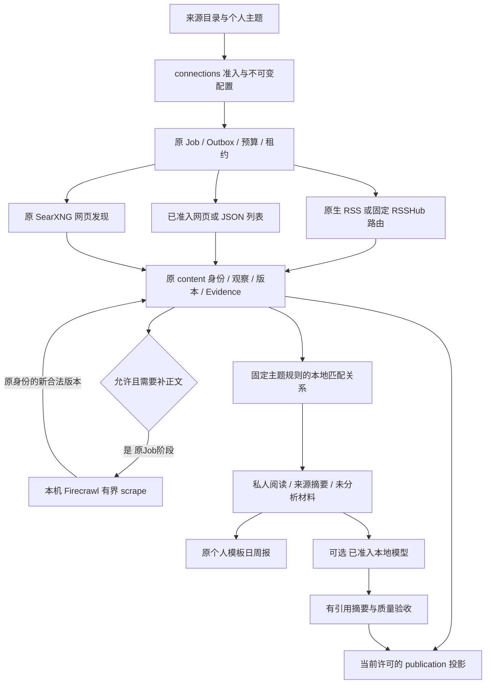

# Design007 扩展能力设计

本设计定义 M6 的领域合同，遵循 [总设计001](001-热点舆情监控平台总体设计.md)。需求为 [PRD007](../prd/007-扩展能力需求.md)，详细工作包和checklist见 [PLAN007](../plan/007-公开信息免费采集执行计划.md)，总体进度见 [BACKLOG](../../BACKLOG.md)。

## 1. 范围与不包含

M6 是逐能力准入边界：报告 Markdown/PDF 与原始数据 CSV/JSON 导出；按规则依赖 M3 事件/热度或 M4 情感，并依赖 M5 已验渠道的突发告警；平台明确允许读取的公开作者或本人获授权账号追踪；Reddit、小红书、微信公众号及后续登录来源。新增公开采集、订阅、去重与摘要目标为 X、Instagram、Facebook、Threads、抖音、Bilibili、微博，目标合同见本文 §10，当前免费本机路线见 §11；微博/知乎等官方能力与授权分别核对，六榜不能代替平台接入。不包含社交发布、绕过平台验证、付费 API/数据服务/代理/云模型，或以模拟/空结果宣称采集成功。现行需求与详细执行分别见 [PRD007](../prd/007-扩展能力需求.md) 和 [PLAN007](../plan/007-公开信息免费采集执行计划.md)，总体进度见BACKLOG。

## 2. 验证边界

按 [PRD001 §2.3](../prd/001-热点舆情监控平台需求.md#23-证据等级) 的证据等级分别判断；进度只见 BACKLOG，证据只见 Acceptance。

## 3. 架构与数据流

候选来源先核对官方能力、许可、授权、分页、限流、稳定 ID、评论父链和费用，再登记来源预设与能力，复用 `sources` 适配器 → `content` 持久化 → `jobs` 执行/预算/覆盖 → `analysis`。指定账号由 `monitors` 保存授权目标和规则，来源适配器只取已准入能力；已授权作者的新帖不受主题关键词过滤，分页或权限导致的未确认缺口必须可见。告警由 `events`/`analysis` 提供可追溯事实，`notifications` 在 M5 已验渠道上投递；导出从有权限的 `reports`/`content` 读取确定版本。共享 Worker/调度、错误契约和数据库门槛沿用总设计。

## 4. 领域、任务与数据状态

各能力采用以下目标合同：

- 账号追踪规划复用现有 `followed_accounts`/FollowedAccountService；当前只有账号ID/别名存储，授权连接版本、实际scan handler、窗口及水位尚需实现。来源须具备作者采集能力；计划中的 `account.scan` 以账号/版本/窗口幂等，只有可信尾段才推进水位，撤权停止写入。不能退化为关键词搜索或把有限feed冒充完整作者扫描。
- 告警由 notifications 域持有告警规则和触发记录；阈值/冷却必填、默认关闭，每5分钟按所选规则评估 M4 有效情感支持的最近1小时负面计数，或 M3 有效可比事件的同公式热度增量。M3 归并/热度不代替 M4 情感；缺少对应输入保持无法判定。持久锁保护触发/冷却，投递扩展subject_type/id/version并保留原报告唯一键，不能伪造报告对象。unknown占用冷却且不自动重发。
- 报告导出新增 `report_exports`，非cancelled结果按(owner,report_id,version,format,renderer_version)唯一，固定报告版本；原始内容导出新增 `content_export_requests`，冻结内容版本、各原观察/上游输入、发现时间、格式与schema_version，非cancelled结果按固定输入去重。两者保存对象引用、哈希、状态与失败，使用既有MinIO桶和jobs。后来同版本新增观察不改变原导出输入。取消后同operation仍返回原终态回执；用户用新operation显式重受理时创建新Export及原系统Job，旧Job不恢复。
- 执行准入在connections既有模型/服务校验能力、许可/授权依据、版本、主机、保留期和预算；Reddit、X、小红书、抖音、公众号及微博/知乎登录逐来源补官方/授权证据。未通过准入的能力保持blocked；获准后逐项验证该来源的采集、分页/评论与持久结果，准入材料不能单独关闭 FR-007-004。

## 5. 接口与页面

账号追踪提供 `/api/followed-accounts` 管理及手动runs；告警提供 `/api/alerts` 配置/历史；报告导出提供报告下POST exports和独立 `/api/report-exports/{id}` 状态/下载；原始内容导出提供 `/api/content-exports` 受理/状态/下载。各独立router经 `api/router.py` 聚合添加 `/api`；owner/CSRF、operation_id、状态和错误遵守所属领域合同，运行OpenAPI后生成客户端。Web提供配置、进度、空集、失败、无权限与下载入口。上述均为目标接口；导出分别核对报告引用、CSV公式防护、JSON null、原始字段与权限。

## 6. 调度、执行与截止

来源节奏按各自准入结果固定，不直接复制B站参数；X在凭据/月度上限确认前零真实请求。账号任务复用对应来源硬截止、预算和禁用检查。告警每5分钟评估、结果/冷却同事务提交，真实送达必须使用已获准渠道。`report.export` 和 `content.export` 初始硬截止120秒，报告产物上限5MB、原始导出单请求10000条；超限明确失败/422，不以截断文件冒充完整导出。PDF使用现有Playwright/browser装配，受限本地HTML、禁脚本/远程资源/文件URL，中文字体和renderer_version固定。修改工程保护值须同步 Design 与相关验证。

## 7. 失败语义与恢复

访问拒绝、验证/登录失效、429、有限分页、删除内容和网络/解析异常分别保留；不把空页或 HTTP 200 当完整采集。登录来源遇验证/频繁立即停用并由本人核查后人工恢复，不换号或绕过。告警发送后结果未知时沿用 M5 unknown 人工确认，不自动重发；导出失败不改变源报告/内容状态。跨轮次水位只有可信页尾/时间窗证据才推进。

## 8. 安全、风控与可观测

仅个人非商业、公开或本人授权数据；每个外部 HTTP 适配器强制主机白名单及逐跳重定向校验。X 只用官方 API 且真实请求以前确认凭据与月度上限；Reddit须当前官方API显式批准及OAuth，商业用途另须书面批准，公共Data API迁移和RSS退役按[PRD007官方依据](../prd/007-扩展能力需求.md)复核；匿名RSS或OAuth凭据本身不证明准入。小红书、抖音、公众号需先完成固定源码/许可、授权、实际分页/父链、限流及失败态验证，不继承 B 站成功结论。按来源/能力/时间窗显示版本、请求页数、预算、停止原因、入库/去重与缺口；导出/告警显示对象版本、权限和结果。

每个来源/能力的执行准入记录分别保存软件许可与平台/数据授权原文、取证日期、固定组件版本、授权持有人和允许能力、主机/重定向白名单、数据用途/留存限制、请求/频率/并发/费用上限及分页停止合同。缺失、拒绝、过期、组件换版或能力不匹配时拒绝受理和外部请求；配置/预设应用与真实 `persisted_read` 证据分开，不能由应用预设提升为真实可用。准入材料、获准能力、独立实施与真实验收分别留证，材料核查不能代替平台接入验收。

## 9. 验收设计要点与逐能力准入

| 能力 | 准入前提 | 准入与真实验收 |
|---|---|---|
| X | 官方 API 凭据、定价/月度硬上限、端点/分页/配额 | 未确认前零真实请求；确认后只读映射、预算、错误翻译与持久覆盖逐能力验 |
| Reddit | 当前显式获批的官方API、OAuth、商业用途书面许可（适用时）、端点/配额及迁移后的持续通道 | 稳定 ID、分页、评论父链、删除同步与重放真实验；匿名RSS无效，批准材料不代替持久读取 |
| 小红书/抖音 | 本人授权、固定源码/许可、账号风控与评论能力 | 各平台独立低频真实帖子/评论、验证停用/人工恢复，不能复用 B 站结果 |
| 公众号 | 获准自有/合作号、许可数据源或核准RSSHub路由；可见/再展示范围、原始身份/时间与更新率 | 逐入口核对真实新内容、分页/缺口、费用与撤权；RSS可解析或工具可请求不等于覆盖与数据授权 |
| 微博登录 | 本人授权、许可、入口、预算/风控 | 搜索/作品/评论/作者逐能力核对；公开热榜不算登录证据 |
| 知乎登录 | OPEN-001-107入口、本人授权、许可与分页/父链 | 问题/回答/文章/评论/作者逐能力核对；公开热榜不算登录证据 |
| 指定账号 | 平台明确允许读取目标公开作者的依据，或目标本人授权；稳定账号/作品 ID、轮询频次 | 新帖/旧帖更新、去重、停用及缺口逐来源验；本人接口与MediaCrawler试点不扩大为任意作者 |
| 告警 | 所选规则所需的 M3 有效事件/可比热度或 M4 有效情感，以及 M5 实际渠道通过 | 对应输入、一小时阈值、冷却、去重、unknown 与真实送达分开验 |
| 导出 | 真实有权限的报告/原始数据和格式定义 | Markdown/PDF、CSV/JSON 分别核对版本、引用、脱敏与失败 |

### 统一内容分发目标

[PRD007 FR-007-006 / AC-007-006](../prd/007-扩展能力需求.md#4-功能需求) 由 `publication` 的统一投影、HTML/API/RSS/Markdown/MCP 和逐次许可守门实现，合同见 [Design008](008-完整业务设计.md)。所属领域通过可读 DTO 提供内容/事件/报告，外部协议适配器不能各自放宽可见性、全文许可或撤回。获准公开范围之外的业务 API 和私人材料不进入公共投影；真实供应商、索引提交和产品验收仍分别留证。

本次匿名分发增量使用独立 `/public/` 路径：`/public/feed.xml`、`/public/feed/full.xml`、`/public/feed/all.xml`、分类与日周月刊RSS；`/public/items/{id}.md`、`/public/selected.md`、`/public/reports/{kind}/{key}.md`；`/public/api/items`（24h/7d、limit≤100、有界游标）、单篇、事件热度/故事与刊期JSON；以及 `/public/mcp` 的原五个只读工具和 `/public/agent.md`。RSS与精选Markdown最多50项；搜索最多40项/页，MCP latest/search支持同一有界游标。原根路径RSS/Markdown/MCP保留既有会话范围；站内许可并不自动授予匿名正文再分发。公开分发只由服务器显式配置的发布账号决定，不从Cookie选择；未配置时这些新增路径返回404、保持未发布。每次读取和ETag/304前复验ALL固定输入/当前许可，正文与搜索正文只用明确再分发范围。匿名新路径共享既有Redis计数，按发布账号与可信TCP对端每60秒最多120次，不采信转发头；超限429 `publication_rate_limited` 与有界Retry-After，Redis不可用503且不降级绕过。GET与MCP读取不创建Job、不采集、不调用模型。

领域主责、公开投影、授权/再分发依据、发布时间与延迟、撤回和缓存失效、搜索范围、游标/增量、错误与限流、API/工具名称及客户端继续按 Design008 核验。HTTP 从 FastAPI/Pydantic 生成同一 OpenAPI；不维护第二份公开契约。向量和任务继续遵守 Design008，本项目不引入独立向量库或新队列。

语义事件召回按 Design004 的持久向量合同接入：单独 embedding 配置默认关闭，仍受原 ai_enabled、预算、权限及真实 Job lease 限制，真实供应商继续暂停。向量保存在 PostgreSQL JSONB 并以有界纯函数 cosine 比较，不引入新向量库或并行队列；仅兼容模型/维数/固定文本哈希可读取。unknown 不自动重购，完整已保存向量可免费恢复。受控 HTTP 响应验证与真实提供方验收分别记录。

独立embedding冻结合同位于 `ai/embedding_contract.py`（纯数据/价格）与 `ai/embedding_services.py`（调用方事务中的原Job读取），HTTP adapter仅处理真实协议。供应商、模型、维数与币种价格共同固定；价格未知、未准入ai.embeddings组件或缺全局/来源预算都在HTTP前拒绝。每阶段原AiCall记录真实provider/model、冻结hash、计费和epoch，业务免费恢复复验同owner/job/purpose及成功回执，不能借用Codex组件或聊天group模型。

## 10. 七平台公开信息切片目标合同

承接 [PRD007 §4.2、§6与§8](../prd/007-扩展能力需求.md#4-功能需求) 的 FR-007-007—016 / AC-007-007—016。本节定义待实现的责任与边界，不表示七平台当前已接通；具体端点、字段、连接预设、停止/删除机制及测试须在对应平台准入后补齐，补齐前不进入该平台编码/启用。

| 责任 | 现有领域/界面 | 新增目标合同 |
|---|---|---|
| 平台与准入 | connections / sources；来源页 | 七平台目录按入口、版本、账号类型和能力给结论；文档声明、执行准入、真实试点及产品通过分开。保存读取/留存/站内展示/模型推理/公开分发/导出权与费用/删除合同，不以OAuth或网页可见代替 |
| 主题与作者 | monitors；主题/账号入口 | 复用不可变采集版本和原账号扫描目标；区分原生搜索、标签、本地过滤、榜单匹配，第三方公开作者须有该入口允许读取的依据。仅本人接口继续限本人，MediaCrawler继续固定B站主体 |
| 执行与观察 | sources → jobs → content；原任务与覆盖页 | 复用原Job/Outbox/预算/租约，连接换版、暂停与撤权阻止旧写。水位只确认实际获准窗口/分页范围，TOP、固定条数和敏感词空不证明完整；成本按供应商真实单位结算，unknown不重购 |
| 统一材料与重复 | content；原列表/详情，候选事件复用events | 原生ID/来源/三种时间/文本范围与关系缺口可读；同平台唯一身份，不变文本不伪修订。跨平台相似材料保留独立来源与候选关联，正式事件仍按Design004验证，提供解除误关联；不建第二正文库 |
| 摘要与报告 | analysis / ai / reports；已有摘要与个人日周报 | 冻结获准输入、模型/提示词和引用；视频首期只用实际文本。来源允许推理处理与模型/费用准入分别校验，训练不默认获准。无模型显示来源摘要/原材料与未分析，真实质量另验，不绕过现有暂停 |
| 许可、删除与出口 | connections / content / evidence / analysis / reports / publication | 普通暂停只停止执行，既有内容按有效许可读取；许可失效立即阻止受影响原文与派生读取。逐入口定标源站删除同步、检查间隔和最严删除期限，正文/对象/派生报告/投影/缓存一并处理；保留必要无正文审计，不以隐藏代替必须的删除 |

X坚持官方API和既有零请求门槛。Threads生产权限/账号门槛、Instagram专业账号/标签及Facebook获批Page是对应官方API路径的背景边界；微博官方CLI、抖音新旧搜索和B站授权稿件同样按各自接口核验。本轮免费入口按§11独立核对允许用途/对象，不继承API授权，也不把API账号类型强套到发布方feed；收费路径不进入本轮。官方资料以PRD007 §8为准，准入时再冻结当前版本。

Web复用来源、主题、内容、任务与报告页面及原生成客户端，不因平台数量另建业务门户。平台费用/窗口/缺口用于用户判断，技术配置留管理/任务详情。七平台目录本身可先交付，至少两个不同已准入平台的真实公开检索或作者读取才能构成跨平台采集阅读试点；仅本人数据、热点或外部导入不能代验该目标。原FR/AC与正式M1/M2窗口独立保留；新稳定性/摘要指标按NFR-007-001—005验，不写Acceptance通过结论。

## 11. 免费本机采集顶层设计

用户决定（2026-10-04）：复用本机 Firecrawl、RSSHub 等项目，不做付费实现。本节是当前路线合同；七平台均为目标，以下服务/路由核验仅是技术依据，执行状态见 PLAN007。FR/AC-007-016约束所有新增入口。

### 11.1 组件取舍与复用边界

| 组件 | 当前核验与唯一职责 | 本轮取舍 |
|---|---|---|
| HotKey 原业务主链 | sources/连接负责外部差异；原 Job/Outbox/预算执行；content/Evidence 持久化；monitors/analysis/reports/publication消费 | 保留 Python/FastAPI、Next、PostgreSQL/Redis/Kafka；不增加第二队列、文章库、计费账本或独立采集门户 |
| RSSHub | 本机1200，固定镜像 `diygod/rsshub:chromium-bundled-2026-09-24`，镜像内revision `0a3a66a1cb28a645ffe90577a68411886274a2ee`；把特定入口转换为订阅快照 | 每条路由独立批准；不是一个“RSSHub已连接”开关。固定路由/参数/缓存和下游行为，拒绝无法约束的风控回退 |
| Firecrawl | 本机3002 API与Playwright运行，已有HotKey `/v2/scrape` 适配器；本机源码HEAD `76df28f98dbe3b43b6fdd0c4a5fcddabdc861380` | 用于允许页面的正文提取，首版不启用云端Agent、模型JSON提取或付费引擎。源码HEAD与运行镜像分别固定，不能仅凭本地checkout证明运行代码相同 |
| SearXNG | 本机8888，当前镜像 `searxng/searxng:2026.9.25-487f51922` | 沿用已批准引擎；只作网页发现，不承诺平台原生搜索、作者更新或完整覆盖。HotKey直接使用原适配器，首版不绕经Firecrawl search形成隐式第二发现链 |
| 原生RSS/网页/JSON | 已有editorial `rss/web_list/json_list`配置、读取器和原单材料writer | 优先原生feed；普通详情可先复用已允许静态HTTP。显式选用Firecrawl，失败不切Jina/收费接口，不把通用JSON配置当平台适配 |
| MediaCrawler/通用Browser | 前者只有本人B站个人非商业固定试点，后者真实平台业务冻结 | 不扩到抖音/微博或任意作者，不将agent-browser验收工具用作生产爬虫。两者均不作为首批免费扩围的默认fallback |
| AIHOT参考 | 新核验SHA `85a550f2b2c121e0a9f53f93f96150380b29f936`；HotKey既有改编仍固定旧 `035f7b7...` | 借鉴配置→发现→正文→固定版本→派生读取的顺序；不启动第二AIHOT实例、不迁pg-boss/Node，本轮不新增或启用SocialData/Dajiala/Jina付费路径，不采用unknown自动再付费机制 |

本次对三个本机服务的根/健康端点只读检查均返回200；这只证明当时服务响应，不证明源站访问、正文质量或HotKey任务入库。Firecrawl API 镜像ID为 `05de2de888fb...`，Playwright为 `f2dc9430d594...`；上线前另冻结完整镜像摘要、实际适配器及配置哈希。核对本机Firecrawl与上述固定RSSHub的LICENSE，二者均为AGPL-3.0。软件许可、源站数据用途与处理权分别核验，保留现有第三方署名。[RSSHub固定许可](https://github.com/DIYgod/RSSHub/blob/0a3a66a1cb28a645ffe90577a68411886274a2ee/LICENSE)

### 11.2 业务与采集工具分层

HotKey控制“何时、为什么、对谁执行”；工具只取本次允许对象。RSSHub/Firecrawl内部队列是外部组件实现细节，不成为HotKey业务状态源。工具成功以后仍需校验目标页面/字段、当前许可及lease并持久提交；只有原Job→原内容版本→实际读取一致才算技术闭环。UI/GET/本地规则预览不调用这些工具，远端试抓仍是显式原Job。

默认发现选择：原生feed → 符合准入的固定RSSHub路由 → 显式网页/JSON配置。此顺序用于选定入口，不是运行中遇403/验证码后自动换一种抓法。热榜沿用独立HOTLIST任务；关键词路由、标签、固定作者流、本地过滤及网页索引分别登记，不能把所有入口标成SEARCH。

这里的SEARCH指产品能力声明；现有 `RssSourceAdapter` 技术枚举使用SEARCH并不证明原生关键词能力。实现须补查询方式/返回范围供UI与受理校验使用，不依据该枚举自动宣称全站检索。

### 11.3 七平台免费入口的核验矩阵

下表来自上述已安装RSSHub版本的源码/构建产物核验，**均未执行真实平台路由**。“候选”表示有代码，不表示已允许、已认证或已采集；正文只按返回文本范围判断，评论与历史须另验。

| 平台 | 固定版本中发现的入口 | 能力边界及免费路线决定 |
|---|---|---|
| 微博 | `/weibo/search/hot`、`/weibo/user/:uid`、`/weibo/keyword/:keyword` | 热榜、作者、关键词是不同路由；匿名helper自动生成/续约访客Cookie及异常重试，显式配置Cookie时续约分支报错停止。固定Cookie分支可单独验证授权和停止，不能由此宣布整route获准。长文、时间窗、分页和删除均待验证。[作者](https://github.com/DIYgod/RSSHub/blob/0a3a66a1cb28a645ffe90577a68411886274a2ee/lib/routes/weibo/user.ts#L52)、[Cookie分支](https://github.com/DIYgod/RSSHub/blob/0a3a66a1cb28a645ffe90577a68411886274a2ee/lib/routes/weibo/utils.ts#L137) |
| Bilibili | `/bilibili/popular/all`、`/bilibili/ranking`、`/bilibili/user/video/:uid`、`/bilibili/vsearch/:kw`、`/bilibili/video/reply/:bvid` | 有热门、作者视频、关键词与独立评论代码；user/video失败和ranking部分风控会转浏览器，现版本未见route关闭参数，先保持阻断；有界热门与其他无冲突入口分别研究。视频标题/简介不代表字幕；本人MediaCrawler边界保留。[热门](https://github.com/DIYgod/RSSHub/blob/0a3a66a1cb28a645ffe90577a68411886274a2ee/lib/routes/bilibili/popular.ts#L7)、[作者fallback](https://github.com/DIYgod/RSSHub/blob/0a3a66a1cb28a645ffe90577a68411886274a2ee/lib/routes/bilibili/video.ts#L214)、[搜索](https://github.com/DIYgod/RSSHub/blob/0a3a66a1cb28a645ffe90577a68411886274a2ee/lib/routes/bilibili/vsearch.ts#L9) |
| 抖音 | `/douyin/user/:uid`、`/douyin/hashtag/:cid` | 作者/话题候选；该版本未找到可确认的关键词/热榜路由。两route需要浏览器、只取初始列表，登录/签名/验证码停止及子请求预算未验；浏览器依赖须单独准入，不能借工具内置解除冻结。不借MediaCrawler源码宣称作者/评论已接通。[作者](https://github.com/DIYgod/RSSHub/blob/0a3a66a1cb28a645ffe90577a68411886274a2ee/lib/routes/douyin/user.ts#L14)、[话题](https://github.com/DIYgod/RSSHub/blob/0a3a66a1cb28a645ffe90577a68411886274a2ee/lib/routes/douyin/hashtag.ts#L12) |
| Threads | `/threads/:user`、`/threads/search/:keyword` | 源码读取threads.com页面内嵌JSON，未见分页/登录/浏览器fallback；search默认tags，recent/default分别固定，空结果抛错，不能当可信无更新。适合先做离线/有界验证；用途、删除及稳定性待核对，不能继承官方API权限。[作者](https://github.com/DIYgod/RSSHub/blob/0a3a66a1cb28a645ffe90577a68411886274a2ee/lib/routes/threads/index.ts#L11)、[搜索](https://github.com/DIYgod/RSSHub/blob/0a3a66a1cb28a645ffe90577a68411886274a2ee/lib/routes/threads/search.ts#L11) |
| Instagram | `/instagram/2/user/:key`、`/instagram/2/tags/:key`；private-api | user的guest分支之前读取全实例 `instagram:cookieJar`，并缓存一年；作者ID/userInfo缓存也无凭据模式隔离。当前部署为memory缓存，即使 `IG_COOKIE` 为空也不能证明认证隔离，执行固定阻断 `rsshub_anonymous_cache_isolation_unverified`。禁缓存及有效匿名配置须另有机器核验，review文字不能解除。tags依赖Cookie，private-api自动登录均排除。Picuki含Playwright fallback，不作替代。[共享jar](https://github.com/DIYgod/RSSHub/blob/0a3a66a1cb28a645ffe90577a68411886274a2ee/lib/routes/instagram/web-api/index.ts#L48)、[userinfo缓存](https://github.com/DIYgod/RSSHub/blob/0a3a66a1cb28a645ffe90577a68411886274a2ee/lib/routes/instagram/utils.ts#L56) |
| X | `/twitter/user/:id`、`/twitter/keyword/:keyword`、tweet/trends | web路径依赖认证Token，含Token轮转与敏感debug输出；另有第三方API分支。当前X官方API边界、零付费和秘密保护共同阻断启用；不采购第三方API、不把route存在当免费获准读取。仅保存用户链接不触发获取。[分派](https://github.com/DIYgod/RSSHub/blob/0a3a66a1cb28a645ffe90577a68411886274a2ee/lib/routes/twitter/api/index.ts#L9)、[web行为](https://github.com/DIYgod/RSSHub/blob/0a3a66a1cb28a645ffe90577a68411886274a2ee/lib/routes/twitter/api/web-api/utils.ts#L57) |
| Facebook | 未找到该固定版Facebook路由 | 保留产品目标，尚无可证明免费入口。未来仅评估允许的免费官方/发布方feed路径，网页索引或手动导入只用对应名称，不能关闭平台作者/关键词目标 |

Threads、微博/B站、抖音和Instagram先比较“允许用途、是否可限制fallback、真实字段/稳定身份、删除可见性”，按通过者选试点；不固定七平台同时开工。X和Facebook缺口保持可见；不存在可用免费路径时不承诺达到七平台总目标。

### 11.4 来源配置、主题关联与身份合同

**平台、入口和采集器分开。** 来源配置复用editorial profile/连接版本与现有预设，`rss`仍为来源类型；RSSHub是该类型下的固定本机连接模式，不增加第二registry。目标元数据由connections/sources提供：平台标签、入口键、采集器及版本、对象类型/稳定目标ID、查询方式、返回/文本范围、主机/路由/参数、缓存/频率、身份依据、用途/删除规则、零费用与资源限制。未知字段保持未知；元数据不是生产能力证明，Token/Cookie只在安全服务端配置。

**本机连接例外必须精确。** 普通editorial `public_url`和HTTP DNS守门继续拒绝loopback；仅配置 `rsshub` 专门模式后，复用 `rsshub_endpoint.py` 的host/1200校验，允许被冻结并经运营审批的精确路由。宿主为127.0.0.1、Compose为host.docker.internal。禁止任意内网URL、用户自定义主机/端口、跨源重定向或拼接未批准route。还须约束RSSHub的实际下游主机、重试、Cookie/浏览器分支；只保护本机请求地址不能代替下游出口保护。

**同目标配置受理去重。** 同owner当前RSSHub profile按精确platform/route/target判同目标；本机主机、输出上限、频率、revision或review变更应编辑原profile，不创建第二订阅。原PostgreSQL事务锁串行受理，重复或改目标冲突返回409 `editorial_target_conflict`，不遗留profile/connection/版本/审计半成品；同operation回放及原profile编辑保持稳定。不同owner或不同精确route独立。原生RSS保持原语义，不把所有同feed且不同规则的配置强行合并；本守门不授予任何平台执行许可。

**订阅流先采一次，再关联个人主题。** `source.editorial.poll` 归属profile，内容来源键为 `ed_rss_<profile UUID>`、native scope为editorial-profile。主题不可变版本新增 `editorial_profile_ids`，冻结当前owner选定的profile及原有规则；材料经持久匹配关系进入content/analysis/reports，不改写来源Job的归属，不为每主题复制feed配置或重新拉取。原M1 source_keys保持原语义，新增profile引用须由实际Pydantic/OpenAPI生成客户端。

content持有新增的**主题材料匹配关系**，键包含owner、topic、冻结规则版本、content版本及profile版本，引用原采集Job/观察和连接/许可版本；monitors只提供规则DTO。仅匹配该冻结主题版本选中的同owner profile；只记录本地规则命中及范围，不冒充模型相关性、精选或正式事件。该关系须持久化并由content读取、analysis输入及reports统计共同消费；原采集Job仍归属profile，不改写为topic Job，不伪造第二采集观察。补正文后按新content版本重算匹配，旧匹配可追溯；改选/主题停用阻止新匹配与执行，历史材料仍按有效许可读取，不能把普通停用当撤权。不能仅运行纯规则函数，也不能创建无原观察的空关联Job。

**身份遵循可靠证据。** 原生平台ID可信时按owner/平台/对象/原生ID识别；RSS GUID只代表该feed，URL fallback标明依据，不造平台ID或作者ID。首批同profile多主题复用原身份/发现/版本；重复创建相同route+target profile须受理去重。跨profile相同平台原帖的身份收敛是额外的content合同：规范URL首先用于定位/重复候选，只有可信原生ID或已证实同一稳定原帖对象的身份合同才能建立原身份别名/发现关联；弱GUID、链接相似、标题或转载不能自动合并。保留各入口观察、许可与出处。现有profile命名空间可能产生两份identity，未修正/验收前不能关闭FR-007-011的同平台去重。

canonical身份不扩大来源许可。原始观察按自身入口/版本/用途读取；补齐正文、匹配及其派生摘要/报告/投影对实际使用的**全部观察及固定版本逐来源、逐用途ALL复验**，不是只检查canonical记录的一个source_key。一个alias仍可读不能掩盖另一个真实输入已撤权；受影响结果失效，重新形成合法结果须有新的获准输入/版本，不回写旧输出。源站删除或留存期限取所有实际依赖适用的最严条件。

主题匹配及真实版本输入依赖已分别落到 `content_topic_matches`、`content_version_inputs`，由content持有；原writer和content/analysis/reports消费者共用这些事实，不建立第二正文表。唯一Schema、ORM和独立PostgreSQL断言同步；只初始化本次新空测试库，业务数据库尚未升级。跨profile身份收敛按§11.10继续实现与验证。仓库目前仅有FollowedAccount身份存储，未有可执行 `account.scan` handler；完整作者订阅另需稳定作者目标、窗口、可信尾段、实际原Job任务与水位。Threads feed只有用户名和有限快照，不能因此宣称作者扫描通过。

### 11.5 正文补齐及无模型降级

现有Firecrawl `webpage.collect`按 `web/webpage/请求URL哈希`创建身份，不能直接用于RSS原帖补齐。新增阶段由content装配在原Job中执行，冻结**原内容身份、预期输入版本、规范原帖URL、当前读取/保存用途、连接版本和预算**；HTTP只由sources适配器发出。优先复用feed已确认正文/同次详情响应；只有允许且内容不足时显式调用本机Firecrawl，保留现有最长20秒、响应体≤2MiB、提取正文≤10万字符的限制，逐目标定标更严值。

结果通过目标HTTP状态、最终URL/逐跳出口、登录页/验证码、空正文和文本范围校验，再在同一身份上形成真实内容版本及Evidence，不建立webpage副本。输入版本已变、连接失效、cancel或旧lease时拒绝写入，必要时由当前版本显式重受理。正文失败保留合法标题/来源摘要及失败原因；markdown成功不能自动标全帖/全视频，也不能推导发布时间、作者ID或互动计数。停用不能靠重试切云端或更换登录身份。

显式配置 `body_extraction.enabled` 且 `required` 时，feed apply保持SourceRun staged，在原Job未终态期间推进正文阶段。`prepared_page._body_phase`只保存固定原身份/输入版本、request_pending与完成引用；响应正文仅在内存中进入同一事务的Content版本，终态留下 `_body_receipt`。请求后未提交的进程中断保持unknown并人工核查；恢复不重新apply feed或重发未知请求。已经完成的Job不得恢复为running；后补正文须显式受理新的原系统Job，引用原identity/profile/观察和输入版本，也不得转为webpage.collect。feed成功与正文失败分开记录；本轮必需正文失败则按固定范围判partial/failed，不伪造feed水位。RSS读取准入不自动授权原帖全文，正文受理还需当前profile用途、Firecrawl组件及目标出口策略，复用§11.4的ALL真实依赖守门。

模型关闭为首版默认：显示来源摘要、已取得原始文本、未分析标记和有出处的模板日/周报。此路径不生产模型评分、情感或已确认事件。确有获准本机模型时才另定provider/model/资源/提示词与输入用途，复用原AiCall账本和固定版本；翻译也属于模型能力，未执行不声称中文模型摘要。仍须达到PRD007的30份摘要/100事实质量门槛，运行本地模型本身不证明质量通过。

### 11.6 调度、预算、失败与删除

沿用APScheduler进程时钟、原PostgreSQL到期事实/Job/Outbox/lease及单宿主Worker。profile到期采集与个人报告到期各自独立；模型关闭不阻断阅读/模板报告。新增路由初始默认关闭，候选节奏可从小时级定标，但最终以允许频率、RSSHub缓存和实际负载取更严值；首次只取有界feed快照，缓存命中/304是观察事实，不等于原平台产生新内容。没有可信尾段只表示本轮快照已处理，不推进“全平台已同步”水位，不回灌全历史。

供应商费用为明确零，收费/计价未知依赖在调用前拒绝；无key、免费额度或开源许可证均不单独证明零费用。现有账本计量服务调用、请求和并发；条目、字节/正文长度与时间先作为有界执行和观察事实，所需账本扩展在实施前冻结，不建新预算账本。RSSHub/Firecrawl会触发多次下游请求，须区分本机调用与真实源站请求，无遥测时后者标未知。固定路由、有限快照、禁止隐式回退及组件并发上限先约束负载；没有准确遥测不得宣布全链精确计量。首版Firecrawl只走scrape，不启用批量crawl/自动search/extract。

| 情况 | 业务结果与恢复 |
|---|---|
| 本机服务不可达/超时、路由404或解析全失败 | failed/protocol/unsupported按实际错误区分；不写“没有更新”，保留上次合法材料；只按原Job有界恢复 |
| 可信空快照、304/缓存结果 | 记录观察时间、返回范围和缓存信息；未得可信范围为partial/unknown，最近尝试不覆盖最近真实内容成功 |
| 登录页、验证码、访问风控、403/429 | 拒绝自动换号/轮Token/绕行；风控或登录失效停用，人工确认后新有效版本恢复。429按已准入退避，不能重提频凑样本 |
| 一个来源故障/额度耗尽 | 仅停止相关入口，其他已就绪来源独立到期；旧版本或撤权后禁止新增请求/写入 |
| feed中不再出现旧条目 | 不能判为原帖删除；feed快照滚出和源站删除是不同事实 |
| 确认删除/转私密/许可失效 | 按原许可及派生依赖立即拒绝读取，按准入期限清除须删除的正文/对象/缓存；所有摘要、报告、公开投影同步失效 |

每条route上线前明确原帖核对/删除通知或其他可履行机制、检查间隔与数据最严期限。无删除可见性不能声称持续删除同步；如留存合同无法满足，限制为允许的链接/摘要能力或保持不可执行，不能用全页正文长期存储补缺口。

### 11.7 页面和能力状态

复用 `/sources`、个人主题、内容详情、任务/覆盖与报告页。来源页展示七个平台及具体入口的“候选/待验证/可执行/试点/稳定/受限/暂停”和原因，各状态保留独立证据，不用服务健康自动升为可执行。示例文案是“微博｜作者订阅流｜待验证”“B站｜热门榜｜范围受限”“Facebook｜免费入口待确认”；仅为界面目标，不能写成当前真实通过。

主题配置允许选择当前owner已获准profile；显示“订阅流本地过滤/标签/原生关键词/网页发现”及实际频率。作者入口缺稳定身份/scan时不可选；不要因无凭据就自动可用，也不要因有凭据就一概隐藏。阅读展示出处、三种时间、原文/来源摘要/提取正文范围及重复候选；故障保留已合法材料和可恢复入口。普通产品流程只展示影响判断的范围/更新信息，路由、API、镜像与安全细节留来源管理/任务详情。

### 11.8 agent-browser 验收合同

用户已指定使用 [agent-browser](https://github.com/vercel-labs/agent-browser)；它用于HotKey界面验收，不能用浏览器测试结果替代实际下游采集/库/预算或生产爬虫准入。不据代码写七平台 AC 通过。

| 层次 | 样本与必须核对的结果 | 结论范围 |
|---|---|---|
| 受控集成 | 独立 `hotkey_test_<suffix>`、同版本API/Web；RSS/JSON/HTML离线样本、固定Firecrawl响应，含缺ID/时间、空/partial、同帖跨两profile/不同用途与删除期限、单alias撤权、正文修订后rematch、旧lease、终态Job后补及收费fallback阻断 | 证明规则、身份、ALL真实依赖和独立原观察、事务与安全；同profile重放不能代验跨profile，受控不能代替真实平台 |
| 浏览器产品检查 | agent-browser桌面/窄屏，两个实际隔离测试账户及匿名会话；来源目录→选择profile/规则→保存→手动任务→持久列表/原帖→重复/正文范围→模板报告；检查键盘、焦点、加载/空/错误/暂停与权限 | 保存实际操作、截图和脱敏网络/Job引用；刷新/GET不外采，热榜不变作者/搜索选项，计价未知不执行，模板不冒充模型 |
| 免费真实短窗 | 一个获准route从原Job持久到页面，对照原帖/规则/连接/预算；再按通过者组成两平台试点，手动及一次合法自然到期分别取证 | 服务200、目录枚举、浏览器mock、原链接可打开均不足；每平台10条及适用分页按AC-007-008，不足则继续采样 |
| 稳定/摘要/发布 | 同库同版本逐能力72小时且20次合法到期；真实摘要抽检与原报告AC分别执行 | 不拼窗口、不提频凑分母；没有本地模型/足够样本时摘要质量未通过。七平台总目标按AC-007-015逐项保留缺口 |

测试认证通过真实测试账户/会话及CSRF，不绕过业务认证，也不向模型/命令行打印密码或Cookie。浏览器截图/trace存放工作区外，执行场景/checklist唯一维护在PLAN007，实际证据索引进入已有Acceptance；不新建第二测试计划或QA状态文件。源码/API和受控验收通过后才替换同版本QA服务，当前业务库/镜像不因设计工作重建或迁移。

### 11.9 当前实现合同与未完成范围

目录 `GET /api/source-capabilities/public-platforms` 按七平台、18个入口和九类能力返回状态；文档候选、执行准入、试点与产品通过互相独立。读取目录不受理Job、不采集、不记供应商费用。私人主题的 `GET /api/topics/editorial-sources` 只返回同owner来源名称、范围、频率、可选性和停止原因。主题版本冻结最多32个不重复profile引用；`content_topic_matches` 引用原来源Job与独立观察，`content_version_inputs` 固定实际使用的全部观察。原M1来源键与主题任务归属保持原语义。

RSS配置的 `rsshub` 分支固定本机127.0.0.1或host.docker.internal的1200端口、上述40位revision、精确route/参数及允许条目主机。`POST /api/editorial-sources/{id}/rsshub-approval` 使用原operations审计、来源修订、配置版本及服务器计算的完整配置SHA256；服务端组件准入记录为 `collector.rsshub.<profile UUID>`。配置中的review自声明不能替代独立审批，审批不自动启用来源或改变数据用途。内部请求上限、禁止身份续约/浏览器或付费fallback必须有当前审查依据；缺失/过期/换版均在HTTP前拒绝。RSSHub实际源站请求数无遥测保持未知。

正文配置的 `body_extraction` 默认关闭，最多5个目标（可在已审查范围内明确设为1—20）、单次20秒/2MiB/10万字符；`max_target_requests` 是经审查的保守预算上界，不是观测请求数。`POST /api/editorial-sources/{id}/body-approval` 固定 `firecrawl/2.11.162`、部署依据、读取/保存/费用/出口/请求上界、审查与到期（最多90天），并绑定完整配置SHA。服务端组件键为 `collector.editorial_body.<profile UUID>`，未通过时零HTTP；源码commit和运行语义版本分列，不伪造40位commit。当前来源字段用途及全部输入、原Job租约/取消、连接与保留期在请求和提交前再验。本机call在原账本结算，目标请求额度按经审查上界保守消耗，源站实际数仍为未知。

正文结果只在内存中进入当前合法Content版本，不缓存响应正文到SourceRun。保存同原identity/source/Job的真实新版本、独立正文观察及feed+body全部输入；之后对固定主题规则重新匹配。来源原始发布时间不由正文推导。机器提取的页面文本不会对外宣称完整原帖或视频。停止/撤权后读取按ALL即时拒绝；原Evidence清理任务递归删除受影响版本、分析、事件、报告、公开投影、正文回执及对象目标。有效的其他独立观察可以保留其原版本，不能保留依赖已撤权输入的派生文本。

增强导出使用原 `report.export` / `content.export` Job、Outbox、租约与现有MinIO桶；新增报告导出与内容导出请求表冻结固定版本、各实际原观察/上游输入及发现时间、schema、renderer、产物哈希。当前schema版本为 `private-export-v2`，renderer版本为 `private-export-v2-chromium1243-pingfang9ff3ce9439fe`；版本值来自reports导出合同，旧manifest不按新版重释。后来同版本有新的观察时，生成/下载仍按原manifest复验，不重新挑最新观察。读取权不自动授予私人文件导出：处理及实际字段用途必须显式包含 `hotkey:personal-file-export:v1`。受理、生成、PUT、提交及下载复验ALL；产物对象在PUT前挂到全部原Evidence的清理目标，继承原到期，未获准的导出不生成对象。取消是导出自身终态，同operation回放原Export/Job，新operation显式重受理创建新的原系统Job；去重使用排除cancelled的唯一索引。四格式120秒/5MiB/10000条硬限；CSV防公式、JSON保留null，Markdown保留范围和引用。PDF固定本机Chromium1243及实际PingFang字体哈希，离线且禁脚本/请求；缺对应renderer明确失败。其他部署环境须独立review可用renderer，不能隐式下载字体或转远端服务。

告警复用五分钟 `notification.scan`，新增notifications所属规则、不可变规则版本及评估事实，不建立告警队列。负面指标仅统计最近一小时首次取得的材料中有效M4情感结果，同identity只计最新有效版本一次，不代表源站全量；热度指标必须是同事件、同公式的可比一小时快照。缺输入保留unknown，固定窗口幂等、冷却和投递subject为alert，保留原报告投递唯一键。历史GET也复验固定输入及分析哈希，失效只读投影为withdrawn/value=null，保留原触发审计且不写库。规则默认关闭，目标需当前revision真实已验回执，发送总开关及既有渠道授权分别有效；保存配置不触发测试邮件。

上述新增结构只在隔离空测试库初始化。业务库迁移、七平台真实route准入、跨profile可靠身份收敛、稳定作者scan/可信水位、逐入口删除同步、72小时窗口及本机模型摘要质量继续属于未完成范围；本次共享实现不自动完成这些目标。

运行组件复核仍有硬缺口：本机Instagram构建产物的共享jar逻辑与固定源码一致（SHA256 `99633076c0238e5a5aaa4fbd041636aad6b4cdf0c594432832fb6fc4da27ce2b`），memory缓存且无凭据模式隔离，已阻断匿名执行。Firecrawl当前运行BUILD_SHA未知且Playwright waterfall已配置；HotKey请求未指定forceEngine，调用方预算上界不证明组件实际请求/引擎硬限，因此现有运行实例尚不能据健康200授予正文采集。B站作者路线含Cookie日志及浏览器fallback，微博固定Cookie的详情分支和fanout未证明同身份/有界，均保持阻断。只读源码/运行配置核验未请求任何真实平台route。

### 11.10 跨来源身份与独立观察输入（实施合同）

本合同继续拆解FR-007-011，并不记录验收通过。新增结构仅为content所属 `content_native_identities` 与 `content_observation_inputs`；原内容、观察、Evidence、Job与派生物仍是唯一业务事实，不另建别名正文或队列。原ContentRecord的首来源身份保持历史值，新读取与来源筛选按实际选定观察的来源上下文解析。

**强身份受理。** 首批可执行证明仅限已固定revision、精确路线且当前服务器审批有效的Threads RSSHub Job。原XML根item.link必须是无query/fragment/userinfo/相对地址或xml:base归一化的 `https://www.threads.com/t/<code>`；大小写敏感opaque `threads_shortcode` 是原帖命名空间，不能假称数字API ID。blockquote内引用、转载、弱GUID、标题、归一化后才出现的URL及外部HTTP ingress自宣都不能授予强身份。sources生成有界server-only proof，content依据实际Job、冻结profile/配置和当前批准重新校验。当前准入必须显式授予新增实际字段 `native_identity` 的用途 `hotkey:native-object-dedup:v1`；缺此用途仍按原profile身份摄入合法RSS，不自动升权或合并。Instagram shortcode只可离线研究，缓存隔离阻断期间不得用于执行或归并。来源许可在身份处理前校验。

**并发与冲突。** 同owner、platform、object_type、namespace、native_id唯一指向原ContentRecord；native键及原profile身份按稳定顺序获取原PostgreSQL事务锁，两profile同时首次采集仍只有一个内容身份，但各有自己的原Job、观察、Evidence及发现事实。同profile旧弱身份与可信映射冲突时停止，不能静默迁移旧历史；跨owner永不合并。新证明与用途每次写入复验，旧观察proof不能替新增来源授权。

**观察依赖。** ContentObservation新增可空来源快照（真实source_key/native_scope/external_id/identity_basis、profile、强证明）与input_basis。新raw观察为 `source_v1`，只依赖自己的来源Evidence；新正文等派生观察为 `observations_v1`，由 `content_observation_inputs` 冻结实际上游观察。边为同owner、不可变、无自环及有界无环；不把不同观察的用途和最严期限合并到共享版本。相同实际文本/表示可共享原ContentVersion，正文指纹不含feed_observation_id；每个正文观察仍冻结自己的feed输入。旧NULL按原Job/Record及 `content_version_inputs` 严格解释，不能借新图重释旧合同。

**固定消费者与清理。** 内容、主题匹配、analysis/event/report、公私分发、媒体及导出所有新增派生manifest冻结实际所选观察及递归输入闭包；生成/读取/下载对全部实际来源逐用途ALL检查，不再用canonical首来源或最新观察替代。EventMember等原首来源复合FK与相应manifest须同批修正为真实观察上下文约束；保留旧行的严格legacy守门。A撤权、过期或物理清理后，依赖A的输出失效，独立B的同版本合法观察可保留；B不能挽救A已冻结的输出。清理递归到依赖观察，只有版本无独立合法观察才删除该共享版本；旧version图继续按旧合同清理。

正文选择固定原profile、Job与source operation的feed观察。另一个profile同原帖的更新不能误杀当前合法目标；当前profile自己的输入修订、旧lease、取消、审批变更仍拒绝。所有跨域消费者使用所属域helper/DTO，保持caller transaction，不导入外域ORM。

普通分析的 `analysis-observations-v1` manifest冻结整批实际帖子、评论观察及完整闭包，canonical JSON哈希进入原Job operation和原ContentAnnotation唯一键；同正文版本的A/B输入形成不同签名。DTO、字段校验及canonical签名归纯 `content.analysis_schemas`，事务查询与冻结函数归 `content.analysis_inputs`；其他Schema不通过DTO间接加载ORM/Session。该模块拆分不改变持久JSON、签名或HTTP契约。入队、执行、持久化、当前读取和M4告警均复验完整原批次，不能仅验证输出对应单帖。事件新增成员冻结原annotation ID与原post observer，再复验当时主题规则及relevant分类；同版本另一条分析不能替代。历史need ledger仅保留原完成时间/状态审计，不返回已失效摘要或将其认定为当前可用。

大页校验在单次调用内批量读取观察依赖、原Job上下文、Evidence及当前来源/留存策略，再分别判定每份原manifest的ALL闭包。不得把整页变为共同授权组、按同版本折叠不同观察，或将结果缓存到后续请求/事务；同一事务内后续校验也必须读取已更正的当前策略与可见性。单份闭包仍限2000观察，聚合超过工作界限时分组处理，不能使独立合法输入连带失效。统计同时保留已保存的提示版本身份与当前可读输入证明，失去证明不消除原提示歧义。实际来源、原Job上下文及整批annotation身份也按单次调用分组读取，仍核对原owner/topic/rule/version/observer，不以最新标注替换。Evidence实体读取复用已有可读资源谓词及精确ID集合，避免再将同一资源表嵌入自身IN查询；owner、类型、过期、删除及当前事务刷新语义保持一致。

SAME_OCCURRENCE融合后保留的Fact frame依赖全部原报告成员，后续StoryReport/SignalFact带完整事实观察闭包；候选页截断不能截断授权检查。公开故事匹配原Member observer/source，并复验叙述的全部历史输入来源，包括已removed的原成员；独立B公开投影不能替A私有叙述提供公开许可。无Derived的旧兼容叙述同样守门，不按当前active卡片重建历史文字权限。公开索引/相关故事与其正文入口共用该守门。

旧NULL摘要只在原成功 `analysis.annotate` AiCall可追到完整原Job帖子/评论输入且全部旧叶Evidence仍合法时读取；没有Job/输入/叶证明时关闭，不借modern B观察解释旧图。物理删除按原依赖清理旧派生文字，即使共享根Version仍由B合法保留；jobs所属清理helper只移除受影响原Job scope中的 `prompt_items` 正文副本，保留原身份、manifest、hash、状态、attempt与计量。被清理的scope不再提供legacy输出读许可。

完全相同feed材料的后续poll返回原receipt，不隐式建立新正文任务；非终态原Job重放只恢复原checkpoint。旧Job终态后的补抓仍须另行明确受理新原系统Job。私有PDF固定锁定Chromium与字体，检查实际二进制并显式启动该路径；缺失/启动失败返回renderer_unavailable，超时单列，无自动安装或回退到用户浏览器。

实施先建立隔离PostgreSQL失败场景，再同步唯一DDL、ORM与完整消费者：双profile并发一身份/两观察、弱证明不合并、修订及多主题、A撤权/过期/物理删除B保留、同正文版本不同闭包、A导出不被B挽救、原Job正文阶段、跨owner、旧图兼容及FK回滚。受控通过才进入agent-browser同版本双账户验收；不把它代为平台真实10条、可信作者水位或72小时验收。

# SC07 外部摄入回执与准入

外部来源使用与 profile 绑定的专属服务端令牌, 默认无令牌和无私有
`editorial_ingress_hmac_secret` 时关闭写入。HTTP 只读取实际连接 peer,
不自行解析 `X-Forwarded-For`; 部署须明确可信代理范围。peer 经私有稳定 salt
HMAC 后进入原 `source.editorial.ingest` Job scope, 不存原 IP 或令牌。
Jobs 所属 helper 在 caller transaction 内以 owner + peer 哈希 advisory lock
计数原 Job 的滚动 60 秒准入, 同 owner 跨 profile 合计至多 10 次。
已有同 operation + 相同请求的重放返回原回执, 不重复占额度。

单次至多 50 项、4 MiB。整体契约与秘密字段验证在准入前完成, 单项材料
无效只保存安全拒绝代码与索引, 不持久非法 raw。202 返回原 Job、SourceRun
及逐项 pending/succeeded/duplicate/rejected 回执; 同令牌 GET 精确 run 回执
不触发工作、不返回正文或密钥。SourceRun 既有 prepared_page JSON 承接阶段材料
和项索引, terminal 仅保留回执; 不添加队列、回执表或第二内容身份。

外部执行复用原单材料 writer, savepoint 仅隔离明确物料错误。当前来源许可、
配置、lease 或取消失效必须停止整个事务; 不伪装为单项拒绝。部分拒绝的 run
为 partial, 不推进来源成功采集时钟。成功与同材料重复均返回已有固定内容
版本 ID, 重放不再写内容、Evidence 或派生处理任务。
