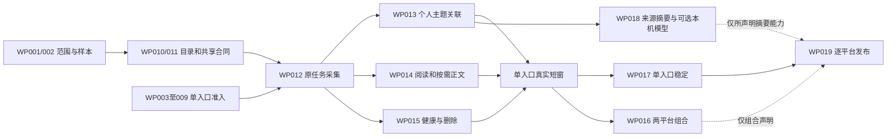

# PLAN007 公开信息免费采集执行计划

更新日期：2026-10-04，Asia/Shanghai。需求源为 [PRD007](../prd/007-扩展能力需求.md)，技术合同为 [Design007](../design/007-扩展能力设计.md#11-免费本机采集顶层设计)。本文件按用户要求从 [BACKLOG](../../BACKLOG.md#七平台公开信息执行计划) 迁入详细执行计划，负责工作包、依赖、检查清单和完成记录；BACKLOG只保留总体进度及入口，实际验收证据仍进入已有Acceptance。

## 1. 范围、交付与记录方式

主线是 X、Instagram、Facebook、Threads、抖音、Bilibili、微博的公开信息发现、订阅、监控、阅读、去重与摘要；复用本机RSSHub、Firecrawl、SearXNG和HotKey原业务主链，供应商费用硬上限为零。沿用WP-007-001—019，并补充WP-007-020—022承接PRD已有增强导出、告警与统一分发，三项按自身前置独立交付，不阻断主线基础阅读。

计划编写完成不等于功能完成。2026-10-04已开始共享实现：目录、精确RSSHub模式、主题持久关联、原身份正文阶段、ALL清理、导出、告警和公开分发进入代码与隔离验收。工作包状态以§5为准，具体结果与未完成项见§9；受控结果不升级七平台真实准入或产品状态。X现有零请求、付费模型暂停、通用Browser冻结及MediaCrawler本人B站边界保持有效。

| 对象 | 唯一记录位置 | 更新规则 |
|---|---|---|
| FR/NFR/AC的定义与阈值 | PRD007及引用的共享PRD | 计划引用原编号，不改号、不缩小验收范围；需求变化先改PRD |
| 接口、事务、身份、权限、任务阶段及数据结构 | Design007/所属Design | 每个实现切片先冻结合同；代码、Schema和生成客户端同步 |
| 工作包状态、执行步骤和checklist | 本PLAN | 每项勾选引用实际结果或证据；状态只在本文件逐WP维护 |
| 产品总体状态 | BACKLOG | 汇总本计划已完成范围和剩余阻断，不重复WP表或第二套checklist |
| 验收通过/失败及原始证据索引 | [共享Acceptance](../acceptance/001-共享运行门槛验收.md)、[信息获取Acceptance](../acceptance/002-信息获取主链路验收.md)等所属文件 | 实际产生后记入；不预分配EV、不把未执行/skip当通过，不新建平行QA流水 |

状态使用`planned → ready → in_progress → done`；缺必要条件记`blocked`并写明条件/下一步，`paused`仅用于明确暂停的范围。`done`只表示该WP声明范围完成，不自动关闭其引用的全部FR/AC。逐平台入口在相应WP下按“平台×入口×能力×版本”记实例，不因一个实例通过而勾掉整个七平台工作包。

## 2. 功能需求与验收追踪

原定义仍在PRD；本表将每项功能落到执行责任和可观察交付。FR与AC编号不是全部一一对应，特别是导出FR-007-001对应AC-007-004，告警FR-007-002对应AC-007-001。

| 功能需求 | 可执行交付范围 | 工作包 | 验收标准 | 主要非功能要求 |
|---|---|---|---|---|
| FR-007-001 增强导出 | 固定版本Markdown/PDF、获准CSV/JSON；独立任务/下载/失败/权限 | WP-007-020 | AC-007-004 | 共享可追溯、正确、可靠、资源、安全；NFR-007-004/005适用部分 |
| FR-007-002 突发告警 | 一小时有效输入、阈值/冷却/去重、已验目标送达及unknown人工处理 | WP-007-021 | AC-007-001 | 共享正确、可靠、资源、安全；NFR-007-004/005适用部分 |
| FR-007-003 指定账号追踪 | 稳定作者ID、原account.scan、非关键词新帖、可信分页/水位和停止 | WP-007-003—009/011—013/016/017 | AC-007-002/003/008/009 | NFR-007-001/003/004/005 |
| FR-007-004 后续来源 | 七平台逐入口交付；其他候选保留原范围、用途和阻断 | WP-007-003—009/011/012/019 | AC-007-003/005/015 | NFR-007-001/003/004/005 |
| FR-007-005 准入证据 | 软件/数据许可、身份、用途、费用、版本、分页、删除和待确认项 | WP-007-002—011/015 | AC-007-005/007/014/016 | NFR-007-004/005 |
| FR-007-006 统一分发 | 同一许可投影的RSS/只读API/MCP/Agent Markdown、撤回及缓存 | WP-007-022 | AC-007-006 | 共享可追溯/正确/安全；NFR-007-004/005适用部分 |
| FR-007-007 能力目录 | 七平台及入口状态、对象/能力/范围、选源与阻断原因 | WP-007-010/013/016 | AC-007-007 | NFR-007-005；共享可观测 |
| FR-007-008 主题/作者订阅 | 本owner profile引用、冻结规则、持久匹配与统一读取/分析/报告消费 | WP-007-011—013/016 | AC-007-008；作者适用AC-007-002 | NFR-007-001/004/005 |
| FR-007-009 有界增量 | 手动/自然到期、实际返回范围、重叠/水位/partial、撤销旧执行 | WP-007-011/012/015—017 | AC-007-009 | NFR-007-001/003/004/005 |
| FR-007-010 统一阅读 | 原帖/关系/三种时间/未知值、实际文本范围；条件性正文补齐 | WP-007-012—014/016 | AC-007-010 | NFR-007-001/002/005 |
| FR-007-011 去重/重复候选 | 原生同对象唯一、跨profile可靠收敛、独立出处、候选展开/解除 | WP-007-011/014/016 | AC-007-011 | NFR-007-001/004/005 |
| FR-007-012 有引用中文摘要 | 无模型来源摘要/未分析；获准本机模型的固定输入、质量和失效 | WP-007-018 | AC-007-012 | NFR-007-002/004/005 |
| FR-007-013 健康/成本 | 尝试与成功分列、请求/缓存/资源、80%提示/硬限/费用0、停止可见 | WP-007-010/012/015/016 | AC-007-013 | NFR-007-001/003/005；共享可观测 |
| FR-007-014 用途/撤回 | 真实依赖ALL逐用途复验、删除同步、摘要/报告/投影/对象/缓存失效 | WP-007-011/014/015/018/020—022 | AC-007-014 | NFR-007-004/005 |
| FR-007-015 发布结论 | 每平台目标能力/范围/缺口及证据审阅；七平台总体退出 | WP-007-016/017/019 | AC-007-015 | 所声明能力适用NFR-007-001—005 |
| FR-007-016 免费本机路线 | 精确本机连接、收费/未知fallback请求前拒绝、无模型诚实降级 | WP-007-001—019 | AC-007-016 | NFR-007-001/005；共享资源/安全 |

FR-007-004中的Reddit/小红书/公众号/知乎等仍由原范围保留；本计划不追加其生产接入承诺或解除冻结。评论、回复/父链、旧帖新评论和历史能力由选择该能力的入口实例分别加AC-007-003测试；新帖扫描、评论计数或热榜不能代验。

## 3. 非功能需求的执行与测量

| 要求 | 验证动作与样本 | 通过阈值/分母 | 工作包与证据 |
|---|---|---|---|
| NFR-007-001 身份/费用正确 | 固定原帖做重叠分页、同owner多主题/跨profile、消息重放、未变文本、真实修订；达到原账本硬限再受理 | 同对象重复identity=0，未变正文伪修订=0，超硬限新外部请求=0；预占/实耗/unknown/累计可复算。免费路径费用0有依据，已消耗请求不因重试返还 | WP011/012/014/015；独立PG唯一键/事务、原Job/attempt/usage与材料版本对账；本机call不冒充源站请求 |
| NFR-007-002 可核查 | 原文与字段抽检；真实模型输出逐事实标注，固定输入/模型/prompt；另测无模型、缺文本、撤回 | 每条材料有出处/时间依据，未知显式；模型≥30份摘要且≥100事实，直接支持≥95%，严重编造=0。无模型/不足样本的质量项保持待验 | WP014/018；固定content/input版本、原AiCall、人工标注和用户核对。原始阅读可独立发布，不伪造模型摘要 |
| NFR-007-003 持续更新 | 冻结代码/镜像/库/连接/规则/频率/相位，枚举应到期实例；按平台能力统计成功、可信空、失败、partial、未尝试与延迟 | 连续≥72h且≥20次合法到期；有效完成/全部应执行≥95%，到期→持久可读中位≤10min。失败/预算耗尽/partial/未尝试留分母，长间隔延长，不提频/拼窗 | WP017；T0/T1、due/Job/入库时间、缺口/分母和延迟样本。平台发布时间→发现延迟单列，旧M1口径不改 |
| NFR-007-004 撤权/删除 | 两profile同帖不同用途/期限、单alias撤权；检查运行中旧lease、直接读取、摘要/报告/投影/缓存/对象及旧ETag | 停用/撤权后相关新请求和旧写=0；许可/删除事实入系统后下一次读取拒绝，须删除对象在冻结最严期限内清除。feed滚出不推定删除 | WP015/018/020—022；受控ALL/缓存/期限、真实获准删除/授权失效和完成时刻。源站同步机制缺失不能关闭该项 |
| NFR-007-005 隔离/安全 | 两账户及匿名、CSRF/猜测ID/旧版本；故障源与健康源并行；受控429/验证码/收费fallback/恶意正文 | 跨账户访问/秘密泄露/未经准入外部或模型请求=0；健康源合法任务不被故障源阻塞；风控停止且不自动轮换身份/付费/绕行 | WP010/012/013/015/016/018及独立扩展；脱敏请求/出口记录、原状态/预算、真实会话与agent-browser。受控故障不人为诱发真实平台限流 |

共享NFR继续引用 [PRD001 §5](../prd/001-热点舆情监控平台需求.md#5-共享非功能需求)：NFR-001-101可追溯、102数据正确、104可靠执行、105故障隔离、106资源控制、107安全、108分析质量、111可观测。UTC存储、Asia/Shanghai展示，重启/重放幂等、失败保留材料与窗口、请求/并发上限适用于每个实现切片。只有实际启用对应分析时才开展共享每主题100条、相关性≥90%/情感≥80%的质量抽检；模型关闭不把这些结果记通过。

本次不臆造P95、SLA、用户并发或机器容量阈值；若实现需要，先由WP001/011按设备与样本定标。Firecrawl沿用最长20秒、响应≤2MiB、提取文本≤10万字符的既有上限；源站/route更严限制优先。条目/字节/时间先作为执行和观察事实，账本扩展仍归原jobs合同。

## 4. 阶段、依赖与首轮实施

| 阶段 | 入场与可执行范围 | 退出条件 |
|---|---|---|
| A 共享准备 | WP001/002、平台离线资料、WP010/011的共享合同 | 样本/入口/版本/免费门禁及数据关系明确；目录与受控准备完成不代表平台采集 |
| B 首个允许入口 | 一个对应WP003—009准入；WP011→012→013，WP014必需阅读/身份，WP015资源/权限 | 原Job→原材料→冻结主题匹配→范围阅读/模板的受控闭环；有且需要全文才补正文，无全文许可不强制scrape |
| C 真实产品与稳定 | 各入口受控通过后做其短窗；WP016两平台组合，WP017单入口稳定 | 手动与合法自然到期、Web/API/库/预算/原帖对账；稳定按NFR003独立开窗，不等第二平台 |
| D 摘要与扩围 | WP018的无模型路径可早做；本机模型另准入；WP019其余平台重复B/C | 模型质量按NFR002，七平台按AC015逐一退出；免费路径缺失保留未完成 |
| E 原扩展独立交付 | WP020/021/022仅在各自真实材料、用途/渠道/输入前置成立后做 | 分别AC004/001/006；不把导出、告警、公开分发追加为私人采集阅读的统一前置 |

图中WP018对发布只约束实际声称的摘要能力，基础采集阅读不等待本机模型质量；WP016只约束两平台组合，单平台稳定/发布不等待第二平台。原058→009→014仅约束原M1/事件正式验收，不追加到本轮所有阅读切片。

首轮候选先做WP010目录/零付费门禁，冻结WP011，接WP012精确RSSHub模式和WP013主题关系；WP014/015按字段和安全影响并行。Threads作者/search、Instagram匿名作者先做离线字段，B站热门可复用独立HOTLIST基线；微博/B站其他路由、抖音分别处理Cookie/浏览器/fallback合同。X与Facebook目标保留，未有允许免费路径时仅推进资料/缺口工作。

现阶段没有已核定人数、历史速度和可用工时，不承诺具体上线日/总周数/故事点。实现切片达到DoR后按实际可用时间排入，建议留约20%回归余量；Schema/OpenAPI/生成目录串行，平台离线工作可并行，真实运行遵守单宿主Worker和逐来源并发/频率。72h稳定与两周价值试点是观察窗口，不是开发估算。

## 5. 工作包及唯一状态表

下面沿用原WP编号。主责角色须在开始对应切片时落实执行/复核人员；平台工作包下的实例状态及适用证据以实际产生为准。各工作包的执行动作见§6，验收场景见§7，统一入场/交付检查见§8。

| 工作包 | 状态 | 主责与工作 | 前置/并行 | 交付和完成条件 | 需求/验收 |
|---|---|---|---|---|---|
| WP-007-001 范围定标 | in_progress | 产品：确认试点主题/作者、执行及验收角色、样本与容量 | 当前免费决定已确定；不再询问付费月额度 | 供应商费用0，实例资源/请求限制明确；具体样本、分工和剩余假设记录；不承诺未知团队速度 | FR-007-016；AC-007-016；PRD §1/7 |
| WP-007-002 基础与差距 | in_progress | 后端/Web：冻结现有代码、Schema、本机镜像/路由，补离线样本 | 可与003—009资料并行，无真实平台请求 | 样本覆盖GUID/原生ID/URL、时间缺失、有限快照、登录/空/partial、重复、修订、删除与收费fallback；明确受控/真实区别 | FR-007-005/007—016；AC-007-005/007—016；NFR-007-001—005 |
| WP-007-003 X免费边界 | blocked | 来源：核对当前官方边界及RSSHub的认证/接口/Token轮转/日志 | 只读可先做；现有X零请求有效 | 只有允许、零费用且安全的目标能力才可准入；付费官方/SocialData不实现，未成立保持blocked而非改爬虫绕行 | FR-007-004/005/007/015/016；AC-007-003/005/015/016 |
| WP-007-004 Threads免费入口 | planned | 来源：固定作者/search路由及页面数据契约 | 离线优先；允许用途/字段/删除明确前不真实启用 | 标签/default/recent、作者身份/permalink/时间、有限快照、无结果错误及正文范围分别固定；不继承官方API审核权限 | FR-007-003—005/007—010/014/016；AC-007-002/003/005/008—010/014/016 |
| WP-007-005 微博免费入口 | planned | 来源：hot/user/keyword；明确Cookie模式/长文子请求/停止 | 可并行资料，匿名续约分支当前阻断 | 禁止访问异常后自动续Cookie；固定Cookie分支受控失败/停用及授权有效性有据，采样/文本/删除边界明确；不使用付费CLI/API补齐 | FR-007-003—005/008—010/014/016；AC-007-002/003/005/008/009/014/016 |
| WP-007-006 抖音免费入口 | planned | 来源：user/hashtag及正常浏览器请求界限 | 不扩大MediaCrawler，不解除通用Browser冻结 | 固定UID/话题ID、初始列表/描述范围、下游预算与验证码停止；无已核实keyword/hotlist则明确缺口。浏览器依赖须另获准，不以服务内置绕过 | FR-007-003—005/007—010/016；AC-007-002/003/005/008—010/016 |
| WP-007-007 Instagram免费入口 | planned | 来源：匿名公开user页面候选 | 可与004并行；private-api自动登录和tags Cookie首版排除 | 固定公开对象、shortcode/ID及时间/文本；登录门槛/限流停止、无分页标范围；不借Picuki TikTok路径代验 | FR-007-003—005/007—010/014/016；AC-007-002/003/005/008—010/014/016 |
| WP-007-008 Facebook免费缺口 | blocked | 来源：寻找允许的免费官方/发布方feed入口 | 已安装RSSHub版无对应route；只读继续 | 有明确允许的目标作者/关键词路径才准入；索引/导入/自有数据各独立命名。暂无路径保留blocked，不强配Firecrawl平台搜索 | FR-007-004/005/007/015/016；AC-007-003/005/015/016 |
| WP-007-009 B站免费入口 | planned | 来源：popular/vsearch/user/video及共享Cookie/WBI行为 | 热门走原HOTLIST；本人试点独立 | 热门单页独立验；作者/排行风控浏览器fallback及敏感日志阻断先处理，关键词单页不能完整水位。公开视频描述不等于字幕；不扩大本人许可 | FR-007-003—005/007—010/016；AC-007-002/003/005/008—010/016；本人试点另按PRD003 |
| WP-007-010 目录与零付费门禁 | done | 后端/Web：平台×入口×能力状态、服务端准入、收费/未知下游拒绝 | 002后，共享受控部分无需平台就绪 | 图标/installed/candidate不自动可选；feed过滤/HOTLIST/原生search分开。所有收费/未知fallback在HTTP前拒绝，刷新不采集 | FR-007-007/013/016；AC-007-007/013/016；NFR-007-005 |
| WP-007-011 逐入口实现合同 | in_progress | 后端：精确RSSHub连接模式、profile引用、主题匹配关系、身份收敛及同身份正文阶段 | 002＋对应入口准入；共享设计可先做，平台字段未定不写占位 | 明确DTO/事务/唯一键/原Job、政策及下游上限；主题材料关系由content持有，consumer/许可更新齐备；跨profile不猜平台ID。Schema/OpenAPI影响固定 | FR-007-005/008—011/014/016；AC-007-005/008—011/014/016；NFR-007-001/004/005 |
| WP-007-012 原任务与免费采集 | in_progress | 后端：固定路由rss模式/原source.editorial.poll/lease/预算/材料writer | 对应011；Schema和生成改动串行 | 精确本机例外不放开内网；原Job保存真实材料。取消/重放/换版/超限/异常停止受控通过，内嵌服务请求有界，不建新队列 | FR-007-003/008—010/013/014/016；AC-007-002/003/008—010/013/014/016；NFR-007-001/005 |
| WP-007-013 个人主题与作者 | in_progress | monitors/content/Web：profile选源、固定规则匹配关系及全部消费者 | 010/011，联调依赖012及同版客户端 | 采集一次服务多个本owner主题；content/analysis/report使用同一合法匹配事实。完整作者scan另须稳定目标/水位；不能仅存昵称/运行纯规则函数 | FR-007-003/008/010/014；AC-007-002/008/010/014；NFR-007-001/004/005 |
| WP-007-014 阅读、身份与按需正文 | in_progress | content/sources/Web：字段/重复候选及跨profile归一，符合条件才Firecrawl补原身份 | 对应011/012，与013可并行 | 必需验实际文本范围/出处/身份/权限与重复；已有正文不补抓，只获准摘要时按范围阅读且正文能力保持未过。需且获准时原版本→有界scrape→同身份真实新版本；不调用webpage.collect造副本，过期结果不覆盖 | FR-007-010/011/014；AC-007-010/011/014；NFR-007-001/002/004/005 |
| WP-007-015 健康、资源与删除 | in_progress | jobs/connections/content及派生消费者：缓存、实际请求、故障/停用、用途与删除 | 011/012，公开试点前满足 | 本机call与源站request分开，无遥测为未知；请求/时长/并发硬限、费用0、风控停止和双账户权限通过；快照消失不当删除，删除合同可履行 | FR-007-009/013/014/016；AC-007-009/013/014/016；NFR-007-001/004/005 |
| WP-007-016 agent-browser两平台试点 | in_progress | 验收：桌面/窄屏、真实测试身份、两个获准平台的阅读闭环 | 各平台011—015＋真实准入；可先受控UI，不要求模型/旧M1全窗口 | 配置→原Job→列表/原帖/重复→来源摘要/模板报告→暂停/恢复；每平台10条真实材料和适用分页/手动/自然到期。截图和脱敏Job/库/预算对账，无mock冒充真实 | AC-007-002/003/007—011/013/014/016；适用NFR-007-001/004/005 |
| WP-007-017 逐能力稳定窗口 | planned | 验收/后端：同库同版、分母/空/失败/partial/延迟 | 对应平台自己的真实短窗及合法预算，不等016两平台组合 | 连续≥72小时、≥20次合法到期、有效完成≥95%、到期至持久可读中位≤10分钟；不凑频、不拼库/时段；有限快照不宣称全覆盖 | FR-007-009/015；AC-007-009/015；NFR-007-003 |
| WP-007-018 摘要与个人报告 | in_progress | analysis/ai/reports：先无模型来源摘要/模板，后可选本机模型 | 无模型部分与014并行；真实模型另需本地provider/资源/用途准入 | 阅读/模板与模型质量分别验；30摘要/100事实、直接支持≥95%、严重编造0。缺模型保留未分析，不启付费模型/翻译；报告按原PRD005 | FR-007-012/014/016；AC-007-012/014/016；NFR-007-002/004/005；个人报告另按PRD005 |
| WP-007-019 扩围与发布审阅 | planned | 产品/验收：各入口重复合同/短窗/稳定，价值试点与缺口记录 | 每平台独立达到自己的必需AC；摘要声明另需018 | 发布只写已验能力/范围/延迟；热榜/导入/本人试点不关闭公开目标。七平台均达到AC015才关闭总目标，免费限制冲突保持未完成 | FR-007-015/016；AC-007-015/016；所声明能力适用NFR-007-001—005 |
| WP-007-020 增强导出 | in_progress | reports/content/evidence/Web：Markdown/PDF、CSV/JSON独立任务及下载 | 固定真实版本、导出用途/规模及当前权限；不依赖全七平台 | 四格式真实产物、中文/字段/引用/公式防护、原任务/幂等/失败及下载时撤权通过；120秒/5MB/10000条上限 | FR-007-001；AC-007-004；共享NFR及NFR-007-004/005适用部分 |
| WP-007-021 突发告警 | in_progress | events/analysis/notifications/Web：所选规则阈值、冷却、原投递和核收 | M3有效可比事件/热度或M4有效情感；M5已验目标及既有发送范围 | 一小时窗口可复算、5分钟评估、持久冷却/重放/unknown/撤权、真实核收；未获准发送保持待验 | FR-007-002；AC-007-001；共享NFR及NFR-007-004/005适用部分 |
| WP-007-022 统一可发布分发 | in_progress | publication/来源协议/Web：RSS/只读API/MCP/Agent Markdown | 当前公开许可、统一投影/版本及实际出口合同；私人阅读独立 | 各实际客户端范围/出处/分页/版本一致、ALL及撤回/旧缓存守门、GET无副作用；每个出口独立验 | FR-007-006；AC-007-006；共享NFR及NFR-007-004/005适用部分 |

## 6. 逐工作包执行checklist

所有条目初始未勾选。每次勾选应在同一WP下写明结果及已有Acceptance/具体产物引用；“代码已写/测试全绿/服务200”不能代替真实AC。平台WP按入口实例使用同一清单，已完成一个实例不能把全平台项勾为通过。

### WP-007-001 范围与资源定标

- [ ] 确定试点主题、两个候选平台的公开目标样本、执行/复核角色及允许数据用途；收费预算固定0。
- [ ] 冻结实例的请求/并发/间隔/文本和硬截止，列出设备容量与删除期限待定项；未确认项有下一步和影响范围。
- [ ] 确认首轮实际容量与提交切片边界，分别标注共享可立即做、平台阻断及独立扩展，记录本轮交付范围。

### WP-007-002 固定基线与样本

- [ ] 固定代码SHA、Schema哈希、QA库身份、服务镜像/route/config版本；保留其他工作区修改，证据不含秘密。
- [ ] 准备正常/缺ID或时间/可信空/截断/登录HTML/404/429/收费fallback及视频文本样本；标明脱敏受控与真实来源。
- [ ] 准备同帖多主题/两profile、真修订、不同用途/期限/单alias撤权和重放样本，并关联FR/NFR/AC。

### WP-007-003—009 七平台逐入口准入

- [ ] 每个平台列出具体route/对象/能力/固定版本和下游依赖，分开热榜、作者、标签、关键词、正文、评论/回复、历史；未知保持未知。
- [ ] 逐用途确认读取/保存/展示/模型/再分发/导出及软件许可、身份、零费用、限流、缓存、分页/尾段、删除机制。
- [ ] 检查内部子请求、敏感日志、Token/Cookie轮换、浏览器fallback和风控后重试；可约束且有证据才进入执行准入。
- [ ] 为正常、空/partial、登录/验证、限流/撤销提供受控样本；填写停止/人工恢复规则及当前未决项，不用空feed判“无更新”。
- [ ] 所选目标能力准入确实成立才关闭该入口的准入工作；没有允许免费路径记blocked，资料整理完成另记事实。

| WP/平台 | 本平台必须补的检查 | 当前设计边界 |
|---|---|---|
| WP003 X | 官方允许路径/费用；认证Token轮转与secret debug；第三方分支不得自动启用 | 现有官方API/零请求边界，收费排除 |
| WP004 Threads | 作者稳定身份/permalink/时间；search tags/default/recent及空结果抛错；有限页面快照/删除 | 网页候选独立准入，不继承API权限 |
| WP005 微博 | 匿名访客续约和固定Cookie错误停止分支分开；逐帖长文/转发/评论额外请求 | 匿名自动续约阻断；固定Cookie需授权/停止验证 |
| WP006 抖音 | UID/话题ID、初始作品列表、描述范围；浏览器子请求/验证码停止 | 无确认关键词/热榜，不能借工具内置解除Browser冻结 |
| WP007 Instagram | 匿名user页面、shortcode/ID、时间/无分页；登录门槛停止 | private-api自动登录和Cookie tags首版排除；Picuki不能替代 |
| WP008 Facebook | 查证免费允许的目标入口/字段/主体，不把站外索引当作者列表 | 当前固定RSSHub无route，目标保持未完成 |
| WP009 B站 | popular/搜索/作者/排行分别评估；Cookie/WBI/敏感日志/风控browser fallback；评论原生关系 | 本人MediaCrawler边界独立；热门和描述不代验作者/视频摘要 |

### WP-007-010 目录与零付费门禁

- [x] 以服务端平台×入口×对象×能力返回文档/执行/试点/产品状态及原因；候选不可自动进入选源。服务端七平台/18入口、认证目录与浏览器操作见EV-002-061。
- [x] 校验费用0、未知/收费provider请求前拒绝、无隐式云端fallback；GET/刷新/本地预览新增外部调用=0。原factory、X group默认拒绝及服务器组件审批的受控测试见EV-002-061。
- [x] 验证RSS本地过滤/HOTLIST/标签/原生search文案与受理一致；技术SEARCH枚举不产生全站检索承诺。目录与个人profile选源各自返回实际范围，见EV-002-061。

### WP-007-011 数据与执行合同

- [ ] 冻结精确本机rss模式的host/1200/route/参数/下游出口、DTO和配置版本；不放开任意内网。
- [x] 固定topic版本的profile引用、匹配唯一键及原采集Job/观察/许可；列出content/analysis/reports消费者与事务。`content_topic_matches`/`content_version_inputs`及同事务消费者见Design007 §11.4/11.9、EV-002-061。
- [ ] 固定跨profile可靠身份收敛/原始观察/ALL真实依赖；URL只作候选，稳定原生对象证据成立才收敛。
- [ ] 固定正文非终态checkpoint/幂等/截止/终态及后补新原Job合同、适用Schema/ORM/OpenAPI与测试范围；未定字段不先写占位。

### WP-007-012 原任务与采集

- [ ] 复用原registry/poll、Job/Outbox/预算及单材料writer；配置读取和试抓受理分开，原事务成功后才返回已受理。
- [ ] 精确本机连接和下游守门分别验证，route/host/重定向非法在请求前拒绝；费用/权限/lease每阶段复验。
- [ ] 测正常/空/partial/协议错误、硬限/取消/撤权/换版/旧lease、消息重放及实际Worker进程恢复，核对Job与持久内容。
- [ ] 缓存/304/有限feed只记实际观察范围，未得可信尾段不推进完整水位，未知源站请求数不记1或0。

### WP-007-013 主题及作者扫描

- [x] 同owner主题选择获准profile并冻结任一/全部/排除词/别名及查询方式；另一owner的profile拒绝。真实会话及PostgreSQL隔离见EV-002-061。
- [x] 一次采集服务多个主题，落持久匹配关系，读取/分析/报告消费同一固定合法版本；旧topic规则不按当前配置重释。持久消费者回归见EV-002-061。
- [x] 主题改选/停用阻断新关联/执行，合法历史按许可读取；正文修订形成新匹配而不回写旧事实。固定版本、暂停与body输入回归见EV-002-061。
- [ ] 作者能力有稳定目标/作者列表/原account.scan与水位，包含不命中主题词的新帖；有限feed或昵称不足时保持作者scan未通过。

### WP-007-014 阅读、身份与按需正文

- [ ] 核对原帖、帖子/作者ID依据、关系、发布时间/发现/采集时间、未知值和视频描述范围；无全文许可按实际范围阅读。
- [ ] 同平台同对象、多主题/两profile/重放精确去重；真修订有版本，跨平台转载保留独立出处及可解除候选。
- [x] 已确认正文跳过补抓；需要且获准才冻结原identity/输入版本/profile用途/Firecrawl组件和出口，沿用20秒/2MiB/10万字符上限。缺审批零HTTP及当前ALL/原预算测试见EV-002-061；真实源站补抓未启用。
- [x] 正文写同身份真实版本；过期/取消/旧lease不得覆盖；非终态阶段可恢复，已完成Job后补显式新受理，失败与合法feed成功分列。终态拒绝、unknown不重抓和独立观察受控测试见EV-002-061。

### WP-007-015 健康、资源与删除

- [ ] 当前尝试/最近成功/缓存/实际请求/资源/入库/重复/修订/停止分别可见，80%提示及硬限拒绝在原账本对账。
- [ ] 受控服务宕机/404/429/风控/登录失效时，故障源停止、健康源继续，不轮换身份或转收费服务；人工恢复有有效版本。
- [x] 普通暂停保留合法阅读；撤权/删除/用途收紧后ALL实际依赖立即拒读，原始观察仍按自身许可；旧ETag不能返回失效材料。系统收到受控事实后的PG/Redis及删除链验证见EV-002-061，真实源站删除发现另见下一项。
- [ ] 实际确认源站删除机制/间隔/最严期限并核对正文/对象/缓存/摘要/报告/投影清除；feed滚出不能当删除同步成功。

### WP-007-016 agent-browser与两平台试点

- [x] 同版本API/Web、独立QA库、两个真实隔离测试账户及匿名会话就绪；认证/CSRF不绕过，截图/trace脱敏。本轮受控QA与普通会话验收见EV-002-061；真实平台材料仍按后续条目待验。
- [ ] 在桌面/窄屏按§7操作目录→配置→原Job→持久列表/原帖→重复/范围→来源摘要/模板报告→暂停/权限；检查键盘/焦点/加载/空/错误。
- [ ] 两个不同获准目标平台各≥10条不同真实可读原帖，适用原生分页、一次手动及一次合法自然到期留证；低量延长不造样本。
- [ ] 浏览器结果与原帖、content版本/匹配、Job/预算一致；受控网络与真实运行分开记录，每个平台给独立结论。

### WP-007-017 稳定窗口

- [ ] 各入口短窗通过后冻结T0/UTC/展示时区、代码/库/连接/规则/间隔/相位/合法到期分母；不用其他入口样本补分母。
- [ ] 连续≥72h且≥20次合法到期；所有失败/partial/预算耗尽/未尝试留分母，可信空才算完成；不提频或拼窗。
- [ ] 复算完成率≥95%与到期→持久可读中位≤10min，源站发现延迟单列；版本/库/统计条件变化按规则重开窗口。

### WP-007-018 摘要与个人报告

- [ ] 无模型先验来源摘要/原材料/未分析和原个人模板日报周报，数据/引用/窗口/未知计数正确，不生成模型评分/翻译结论。
- [ ] 本机模型分支确有provider/model/资源/输入用途准入后，冻结输入/模型/prompt及原AiCall；无付费外呼、正文指令不执行。
- [ ] 抽检≥30摘要/≥100事实、直接支持≥95%、严重编造0；单帖与多来源范围分列，不足样本或模型未启用保持质量待验。
- [ ] 撤回输入使相关摘要/报告失效；个人报告按PRD005原AC独立核对，不把公开weekly当个人周报。

### WP-007-019 扩围与发布

- [ ] 七平台每项已验能力/对象/文本/排序/分页/频率/延迟与不支持项有实际证据，更新来源可用说明。
- [ ] 单平台达到自身必需AC可独立交付；热榜/手动导入/本人数据不关闭公开关键词或作者目标，全部七平台达AC015才关闭总目标。
- [ ] 实际开展5—8用户两周价值试点，固定首周/次周配对口径与有效材料/整理时间；30%下降仅假设，未测不报达成。
- [ ] 将实际结果记已有Acceptance、WP结果记本PLAN、总体进度同步BACKLOG；未完成/阻断继续明确保留。

### WP-007-020 增强导出（独立）

- [x] 冻结报告/原始内容版本清单、窗口、格式/renderer/schema及当前导出用途；原Job/MinIO引用及重放唯一键明确。`private-export-v2`实际原观察冻结、cancelled/new operation及用途ALL见Design007 §11.9、EV-002-061。
- [ ] 分别生成Markdown、PDF、CSV、JSON真实文件并实际打开；PDF中文/分页、CSV公式防护、JSON null/字段脱敏与出处核对。
- [ ] 按Design007验120秒硬截止、5MB报告/10000条原始数据上限，超限明确失败，不截断冒充完整；失败不改原对象。
- [ ] 受理、生成前和下载各复验权限/固定版本/导出用途；受理后生成前撤权不得生成，生成后撤权不得下载，跨账户/匿名/重放/失败恢复留证；公开Markdown或浏览器打印不关闭四格式AC004。

### WP-007-021 突发告警（独立）

- [ ] 所选规则有M3可比事件/热度或M4有效情感及M5已验目标；默认关闭，缺输入显示无法判定。
- [x] 冻结一小时窗口/输入/规则/事件版本、阈值/冷却/5分钟评估节奏，验证超阈值/未超/边界/缺失与重放。11项隔离PG使用受控M3/M4事实验证，见EV-002-061，不代表真实模型/事件产品质量。
- [x] 原事务持久触发/冷却，发送前再复验规则、目标与许可；规则停用/换版后旧触发不得发送，停用后新增发送=0；unknown占冷却并人工处理，不自动重发或再付费。受控投递边界及历史只读撤回投影见EV-002-061；没有真实渠道发送。
- [ ] 仅在既有范围已获准发送时执行真实送达与接收方核收；未获准时完成受控工作并保留真实发送待验，不因写计划新增发送授权。

### WP-007-022 统一分发（独立）

- [ ] 冻结允许公开的publication投影及全文/摘要/链接范围；个人主题、账号材料、评论、预算和秘密不进入公开出口。
- [ ] 逐出口核对RSS/只读API/MCP/Agent Markdown的同内容/事件/报告版本、出处、窗口、分页及实际限流，接口仍来自原OpenAPI。
- [ ] 真实材料/实际客户端分别验，许可收紧/隐藏/撤回及旧缓存/ETag同步，所有实际成员ALL守门，GET不外采/调用模型。
- [ ] 每个出口独立记证据，已有Web/API或工作区能读不代验再分发权限与AC006。

## 7. 验收场景与证据闭合

每个场景需要起点数据、操作与可观察结果；下表是原AC的执行索引，不替代PRD完整定义。受控验证使用独立QA环境；真实平台、模型、发送等只在该目标当前准入及既有授权成立后运行。

| 原AC | 起点/用户角色 | 操作与应有结果 | 必需证据及承接WP |
|---|---|---|---|
| AC-007-001 告警 | 所选M3或M4真实有效输入、M5已验目标；获准用户/接收方 | 配阈值/冷却，验证超/未超/缺输入、重放、撤权及unknown；发送前复验规则/目标/许可，规则停用/换版拒绝旧发送；窗口数值可复算、冷却不重触发、已获准告警真实核收 | 受控规则/恢复＋真实输入/送达＋接收方核收；WP021 |
| AC-007-002 作者 | 稳定目标/作者列表/许可和真实新帖；订阅用户 | 手动/合法到期扫描不命中主题词的新帖、修订、分页/权限缺口；不漏掉获准窗口内该类新帖，可信尾段才推进，撤权旧写为0 | 受控＋各作者入口真实scan/原帖＋浏览器；WP003—009/012/013/016/017 |
| AC-007-003 逐来源能力 | 当前来源×能力准入和真实输入；来源/验收角色 | 分别取搜索/正文/评论/回复/热榜/增量，核请求页/范围/身份/关系/停止；仅给所用能力结论 | 受控边界＋每个能力真实持久结果＋产品核对；WP003—009/012/014—017 |
| AC-007-004 导出 | 固定真实报告/原始版本及导出权；本人/他人/匿名 | 生成并打开四格式；字段/引用/中文/公式/JSON未知一致，超限失败、失败不改源对象；生成/下载复验，生成前撤权不产文件、生成后撤权不下载 | 受控/真实四产物/实际打开与权限；WP020 |
| AC-007-005 准入 | 固定条款/版本/用途/身份/费用或缺失项；产品/来源 | 审阅逐能力原文；未知/不支持/失效/未定费用不记通过，软件与数据许可分开；准入不代实际采集 | 资料审阅与受控门禁；真实采集另按AC003；WP002—011 |
| AC-007-006 分发 | 公开/私有/禁止再分发/撤回固定材料；实际客户端 | 逐RSS/API/MCP/Markdown读同版本，改许可/撤回再读/旧缓存；范围一致、私有不可读、GET无外采/模型 | 受控许可＋真实材料/每个实际客户端＋产品；WP022 |
| AC-007-007 目录 | 七平台及候选/准入/受限/不支持/停用样本；用户 | 从目录到选源核对象/查询/范围/原因；候选不可执行、热榜/本人数据有明确名称，前后台一致 | 资料＋受控＋agent-browser；WP010/013/016 |
| AC-007-008 主题/组合 | 两个不同获准公开关键词/作者平台及匹配/不匹配样本；用户 | 配词/别名/排除或作者→保存→手动/自然到期→读回原帖；规则方式/版本明确，每平台≥10不同可读原帖及适用分页 | 受控＋两平台各自真实Job/Web/API/库＋产品；WP012/013/016 |
| AC-007-009 增量/稳定 | 单入口冻结范围/频率/连接；来源/验收 | 重叠、可信空/partial、重放/换版/取消及合法到期；水位不越证据，完成NFR003才标稳定，故障隔离 | 受控故障＋真实分页/到期/连续窗口＋产品；WP012/015/017 |
| AC-007-010 字段/阅读 | 两平台真实帖子/引用/视频描述及缺值；读者 | 列表/详情打开原帖，对ID/关系/三种时间/范围；未知不造零，不把描述当转写，非热榜/导入代验 | 受控字段＋真实两平台＋agent-browser抽检；WP014/016 |
| AC-007-011 去重/候选 | 同帖两profile/用途期限差异、修订及转载反例；用户/验收 | 重放、多主题发现、展开/解除候选、单alias撤权/正文rematch；同对象唯一，来源/观察保留，派生ALL复验 | 受控/真实重复材料、identity/版本/预算对账＋产品操作；WP011/014/015/016 |
| AC-007-012 摘要 | 当前获准本机模型及真实合法材料/标注集；读者/质量角色 | 生成单帖/主题摘要核事实、缺口和固定版本；关闭/失败/撤回时有诚实降级，质量达NFR002 | 受控＋真实模型/标注＋事实核对；模型未启用只验降级；WP018 |
| AC-007-013 资源/费用 | 固定单位/硬限、免费依据、预占/unknown；用户/验收 | 达80%/硬限/重复/失败，核账本/出口/UI；免费无账单标不适用仍证明0费用，错误不显示无更新 | 受控＋真实免费Job/资源/无收费出口对账＋产品；WP010/012/015/016 |
| AC-007-014 用途/删除 | 实际原始及派生依赖、可履行期限；owner/另一账户/匿名 | 暂停保留合法历史；撤权/转私密/确认删除/收紧后全出口拒读，必须删除的对象及时清除，私有不公开 | 受控ALL/缓存/双账户＋真实删除/授权机制与时限＋产品；WP015/018/020—022 |
| AC-007-015 发布 | 该平台采集/阅读/权限/恢复/持续性实际证据；产品/验收 | 审发布说明，至少公开关键词或作者目标通过；评论/热点/历史只写已验项；七平台逐一结论，总目标不提前关闭 | 当前真实证据审阅；WP016/017/019 |
| AC-007-016 免费路线 | 固定本机组件/route/依赖、故障/收费fallback与模型关闭样本；验收 | 原Job执行，受控诱发故障核出口/预算；收费/未知在HTTP前拒绝、资源有界、服务坏不是空、本地过滤/模板名称准确 | 受控出口/预算＋获准免费真实Job＋浏览器；WP010/012/015/016/018 |

### 场景：来源目录、选源与一次运行

起点：同版本QA API/Web、真实测试账户A、一个已准入profile及一个候选profile，规则/连接版本固定。用户角色为主题订阅者；受控与真实运行各自留记录。

1. 使用agent-browser打开来源页，读取七平台及具体入口、对象/查询方式/状态/原因；候选不能执行，技术枚举不改变文案。
2. 进入个人主题，选择A的获准profile，设置任一/全部/排除词及别名，保存；UI/API显示同一冻结配置，B的profile不可选/不可受理。
3. 明确点击立即运行，记录返回的原Job/operation；刷新/GET进度不新增外采，等待实际任务终态而不只等待HTTP200。
4. 打开持久列表/详情和原帖，逐项核对主题命中、content版本、三种时间、未知值及文本范围；失败/partial时保留原因和旧合法材料。
5. 读取已有来源摘要/模板日报周报，核固定材料/窗口/未分析；下一次合法自然到期另留Job/预算/持久结果，不由手动重试代替。

预期：AC007/008/010/013/016适用部分有界、可追溯且无收费副作用；两平台试点必须再对第二个不同平台重复，不用一个平台两个route充数。

### 场景：作者新帖与有限快照

起点：作者目标有稳定ID及允许作者列表/原account.scan，样本同时包含命中/不命中主题词的新帖、旧帖修订和明确分页缺口。用户角色为作者订阅者。

1. 保存作者目标并记录连接/规则版本；昵称解析或保存别名不算scan完成。
2. 执行手动scan，核对作者获准返回范围内两类新帖均持久可读，原帖/作品ID及作者关联正确；同轮重放无重复身份。
3. 验证可信尾段、有限快照/缺页/权限受限三类结果；仅第一类推进对应完整水位，其他结果保留实际范围与原因。
4. 到期scan再次核新作品及已有作品真实修订，随后受控停用/换版/撤权；旧lease不得继续写新结果。

预期：AC002的作者语义成立；只有有限feed、缺稳定ID/scan处理器或无真实不匹配样本时，作者完整验收仍待验，主题过滤成功不能替代。

### 场景：按需正文、身份和任务恢复

起点：三条同owner材料分别为已确认正文、仅获准来源摘要、确需且获准补正文；最后一条绑定原identity与输入版本v1，另有旧lease/已经终态的Job。验收角色为后端及读者。

1. 前两条进入阅读，检查没有补抓HTTP、没有伪造新正文版本，UI按实际full/summary/description范围呈现。
2. 第三条在非终态原Job的冻结阶段调用本机scrape，核准入/预算/20秒/2MiB/10万字符约束；结果合法后在同identity形成真实v2并记录Evidence/输入版本。
3. v2触发新主题匹配，旧v1匹配仍可追溯；模拟输入升级、撤权或旧lease返回，过期结果不覆盖，不重复创建webpage身份。
4. 在正文阶段中断并恢复，核checkpoint/幂等/已用预算；已终态Job的后补必须显式新受理原系统Job，不能把旧succeeded改running。
5. 受控空/登录HTML/验证码/超时导致正文失败时，保留合法来源摘要，阶段失败/partial与feed观察成功分列，不切收费云服务。

预期：AC009/010/011/014/016及NFR001/005适用部分通过；正文不需要或不允许时只证明跳过/范围正确，不关闭未提供的全文能力。

### 场景：跨profile与撤回ALL依赖

起点：profile P1/P2有已证实同一原生对象，但用途/删除期限不同；原始观察、正文版本、主题匹配、摘要/报告/公开投影及对象缓存依赖可列出。账户A/B和匿名分别操作。

1. 分别发现同一对象、多主题及重放，核identity/发现/观察/版本唯一或合法关联；相似URL/转载反例仅为可解除候选，不能误合并。
2. 按各自许可读取P1/P2原始观察，核每个派生结果真实使用的ALL输入/用途，而不是仅canonical source_key。
3. 受控只撤权P1：使用P1的正文/匹配/摘要/报告/投影及旧ETag立即拒读；P2的独立合法原观察按自身许可判断，不替失效派生掩盖P1撤权。
4. 收到真实允许测试的源站删除/转私密或当前授权失效事实，记录发生/发现/拒读/清除时间并按最严适用期限核对象/缓存。
5. B和匿名尝试A的私人材料/下载/任务，均拒绝；普通暂停再测，合法历史仍可读，新增请求/旧写停止。

预期：AC011/014与NFR004/005边界可复核。只跑受控撤回不关闭真实源站同步，不因另一个alias合法而恢复旧派生输出。

### 场景：故障隔离、资源硬限与零付费

起点：QA环境两个来源分别受控故障/正常；原Job账本有接近80%和硬上限样本，收费/未知fallback及模型关闭出口可观察。角色为验收人员。

1. 运行故障来源及正常来源，分别核失败/partial/停止与正常完成，旧合法材料保留，最近尝试和最近成功分列。
2. 将受控额度推进到80%及硬限，核提示、账本预占/结算与硬限后新外部请求0；人工重试/消息重放不返还累计实耗。
3. 诱发403/429/登录/验证码/服务404，核固定退避/停用/人工恢复，出口没有换Token/Cookie、转收费服务或绕行。
4. 请求收费/未知provider或模型分支，验证HTTP前拒绝；本机调用与未知源站子请求分开，无供应商账单写N/A并以免费依据/出口记录证明0费用。

预期：AC013/016与NFR001/005可对账；真实平台不人为制造风控，受控限流样本只证明技术边界。

稳定窗口与模型抽检分别严格执行§3/§6的分母、输入版本和阈值；上述浏览器步骤只证明当次产品操作，不能代验72h、30份摘要/100事实或真实告警核收。

## 8. 入场、交付和证据checklist

### 开始一个实现切片前（DoR）

- [ ] 选定WP与具体入口实例；FR/NFR/AC、执行/复核角色、交付范围、输入/输出和目标文件明确。
- [ ] 依赖已成立或只选择不依赖阻断的共享/受控工作；免费、数据用途、身份/版本/删除及停止合同可审阅。
- [ ] Design已冻结DTO、原Job/checkpoint/lease、事务/唯一键、跨域消费者及ALL许可；正文/模型/发送条件分支不隐式启用。
- [ ] 已准备成功、边界、失败/恢复、重复/撤权与双账户样本，标明受控/真实与所需证据层次。
- [ ] 涉及结构仅使用唯一Schema和独立测试库；涉及API先定Pydantic/路由，再同版生成客户端，范围和容量可执行。

### 完成一个实现切片后（DoD）

- [ ] 必需功能checklist有可定位结果，FR/NFR/AC映射完整；范围内受控、数据库、浏览器、真实/质量证据按要求分别满足。
- [ ] 身份/版本/主题关联/Job/预算/权限对账，恢复/旧lease/消息重放检查适用并通过；无真实输入的AC继续待验。
- [ ] zero paid出口、秘密/跨账户、失效ALL和字段范围检查通过；正文/缓存/模型/模板及原生/本地能力文案诚实。
- [ ] 完成按影响需要的工程检查并保留结果；失败/skip/deselected/未执行不算通过，不只贴“tests passed”。
- [ ] 实际证据记所属Acceptance，本PLAN写WP/实例结果及剩余条件，BACKLOG只更新总体；所有适用检查完成才将该范围状态改done。
- [ ] 修改相关PRD/Design/PROJECT/AGENTS或生成物的必要一致性内容，保留并行修改；发布说明与已验证能力一致。
- [x] 清理本次独立测试库/临时资源，保留可复核脱敏证据；不删除业务库/卷，不因实现自动提交、推送、上线或发送。本轮库、对象、临时服务、会话及凭据清理见EV-002-061，后续切片重新执行本项。

### 按改动影响选择工程检查

| 改动 | 必需检查与顺序 | 适用限制 |
|---|---|---|
| 纯计划/需求/设计文档 | 本地链接/章节锚点、全部16FR/5NFR/16AC映射、WP与checklist/依赖一致、git diff --check | 证明文档完整与一致，不计功能/平台AC通过 |
| 后端业务/适配器 | backend内 `uv run --locked ruff check .`、`uv run --locked ruff format --check .`、`uv run --locked mypy`、`uv run --locked pytest`；必要真实源协议/故障/恢复分别留证 | 命令按同一uv环境执行；真实供应商不由mock替代，GET/导入不联网 |
| Schema/ORM/事务/Job | 唯一Schema+映射/断言，独立真实PG结构与失败回滚；必要Kafka/Redis/MinIO、重放/旧lease/进程重启 | 仅 `hotkey_test_<suffix>`；成功或失败后清理，业务库hotkey不跑测试 |
| API/客户端/Web | 同版本API→`pnpm openapi:generate`/`openapi:check`顺序执行→lint/typecheck/format:check/test/build→agent-browser | 所有业务请求用生成客户端；不手改生成文件，桌面/窄屏/真实身份与网络边界均适用 |
| 真实运行/稳定/质量/发送 | 先明确目标允许范围和前置，冻结真实窗口/样本，按本计划NFR/AC采证复算 | 真实限流不人为制造、无收费fallback；发送/账号申请/上线沿用已有授权，文档本身不扩大授权 |

### 证据引用模板

在对应WP下追加一行实际执行记录，字段为：`入口实例｜检查项/AC｜执行者/时间｜代码与组件/连接/规则版本｜证据层次｜已有Acceptance/EV或实际产物引用｜Job/operation/attempt及内容/输入版本｜结论｜剩余条件`。只在产生实际证据时填写，未执行填未执行，不预填通过。数据库身份、T0/T1/分母、人工标注集、原帖及脱敏截图/trace按该场景补充；凭据、原Cookie/Token和私有正文不写计划或日志。

### 阻断与不适用处理

- [ ] 阻断记录具体WP/入口/能力、缺失事实、影响范围、责任角色、当前可做动作与解除证据；仅阻断相关切片。
- [ ] N/A有明确合同依据并经范围复核：例如纯本机无供应商账单、无正文权时不执行scrape；N/A不能免除费用0证据或把缺的全文能力记通过。
- [ ] 模型未启用/样本不足、某平台无免费入口、必需真实窗口未跑均是待验/阻断，不用N/A关闭原需求；不得为拿账单/样本启收费服务或提频。
- [ ] 新需求或条件变化回到PRD/Design，更新受影响的依赖/实例/checklist；编号不重用，旧证据不移作新版本证明。

## 9. 执行记录与剩余条件

2026-10-04首轮共享实现由Codex并行切片完成；根代理负责集成、同版客户端、QA与agent-browser，来源/导出、正文/分发、主题/ALL/删除/告警分别实现并交叉复核。没有已知团队速度/工时，不据此推算排期。原始技术与浏览器证据集中记录为 [EV-002-061](../acceptance/002-信息获取主链路验收.md#ev-002-061七平台免费路线的共享实现与隔离验收)，不新建QA文件。本节是§5状态的执行说明，受控实现不能替代逐平台产品退出。

| 工作包/实例 | 本轮实际交付与证据层次 | 当前结论及剩余条件 |
|---|---|---|
| WP001/002 共享准备 | 零费用范围、固定本机组件/route审查、离线RSS/JSON/Firecrawl样本、跨owner及故障/撤回样本已进入代码与独立PG测试；121表canonical Schema在新空库由原始化入口初始化并核对。 | 部分完成；逐平台真实用途/删除机制、试点对象、实际容量/频率仍需定标，业务库尚未迁移。 |
| WP003—009 七平台入口 | 目录保留七平台/18入口的文档能力及限制，RSSHub精确模式与运营配置哈希审批可复用。未开启七平台真实请求；X/收费路径继续拒绝，Facebook免费目标缺口继续blocked。 | 平台实例尚无真实准入/采集/原帖短窗证据，§5原状态保持；没有把目录或本机服务200改成平台available/product passed。 |
| WP010 共享目录与零费用 | 服务端目录、普通owner选源、真实会话隔离、候选不可选、本地过滤/HOTLIST/原生搜索范围及请求前拒绝已实现，浏览器读目录与受控门禁回归通过。 | 本WP声明的共享范围done；逐平台能力/稳定性仍由各平台实例验收，源站请求数无遥测仍为未知。 |
| WP011/013 主题数据合同与消费 | profile引用冻结topic版本，content-owned匹配/实际版本输入、一次入库关联两个本owner主题、content/analysis/reports同版本消费及普通profile安全DTO完成。真实PG及普通owner HTTP验证权限、只读无副作用、规则改选/暂停和ALL撤权。 | 主题共享部分完成，WP整体in_progress；跨profile可靠身份收敛、完整account.scan作者目标/分页/可信水位未完成。 |
| WP012 原采集任务 | 固定本机RSSHub模式、独立服务端审批、原poll/材料writer与Job/Outbox/lease/预算复用已实现，受控非法route/出口/审批换版/取消/重放及有限快照范围验证。 | 部分完成；实际免费源站、自然到期、真实Kafka Worker执行中恢复及完整来源资源对账待验。 |
| WP014 原身份正文/读取 | 默认关闭的正文配置及独立审批、有界本机scrape、原Job非终态checkpoint、同identity新版本/独立正文观察、实际feed+body输入ALL、rematch/终态拒绝/unknown停抓完成受控PG验证。普通页面展示来源名称/出处/文本范围。 | 部分完成；真实源站正文与原帖抽样、跨profile收敛/候选展开与解除仍待验。无全文许可不启用补抓，正文分支不作为基础阅读前置。 |
| WP015 删除及安全 | 当前ALL输入读取守门、原Evidence递归删除派生版本/引用分析/报告/事件/公开投影/回执，以及导出文件挂原观察清理目标已实现。真实PG删除链和本机MinIO实际文件删除通过；普通暂停与撤权分开，双owner不互删。 | 部分完成；真实源站删除发现/检查间隔/期限、全部健康指标与故障源并行运行仍需逐入口证据。 |
| WP016 agent-browser | 根代理以API8867/Web8866和真实隔离owner/匿名会话验证目录、profile选源、主题保存/开始关注、原生产executor处理受控来源一次并持久匹配1条、范围阅读、v2导出取消/新operation成功/CSV488字节下载、默认关闭告警保存及390px无溢出，目录1440×1000/390×844完整加载。owner B只见本人选源，读A内容/主题/导出/下载四项404；匿名alerts转登录，无publisher的公开四出口404不转登录。截图/事实JSON/文件在本机受限 `plan007-20261004` 目录。 | 受控持久材料的产品操作通过，真实provider调用0、没有常驻Kafka Worker参与；两个获准平台各10条不同真实原帖、适用分页、手动及自然到期尚未开展，WP仍in_progress。 |
| WP017 稳定窗口 | 本轮未开真实逐入口稳定窗口。 | planned；须各自短窗及预算成立后冻结同库同版本连续72h且20次合法到期，不拼旧EV、不提频凑分母。 |
| WP018 摘要/个人报告 | 来源摘要、已取得原始文本和未分析标记保持诚实；主题材料固定版本的报告读取消费者经PG回归。付费模型暂停，本轮不调用本机或远端模型。 | 部分完成；个人模板日报/周报原AC及新增profile实际运行待验。本机模型准入、30份/100事实质量和真实AI调用未执行，质量保持待验，不能写N/A或passed。 |
| WP019 扩围/发布 | 本轮整理实现/未完成范围，七平台缺口保持可见。 | planned；AC015逐平台目标、稳定窗口和5—8用户两周价值试点均未完成；不发布七平台全支持声明。 |
| WP020 私人增强导出 | 原导出Job、四格式有界renderer、`private-export-v2`冻结观察/上游manifest、CSV公式防护/JSON null、用途ALL、取消/重放/新operation以及原Evidence文件清理实现。12项真实PG/本机MinIO通过；14项unit、39项architecture通过；四格式真实文件自动检查、中文PDF局部QuickLook视觉检查。浏览器普通owner实际CSV下载成功。 | 部分完成；没有自动中文文本抽取/多页分页数量验收，四格式技术产物不代全部人工阅读与原报告AC。120秒/5MiB/10000条边界按适用测试证据判断。没有导出用途时blocked；导出不作为基础阅读前置。 |
| WP021 告警 | 默认关闭的规则/不可变版本/历史API及UI、原五分钟notification.scan、有效一小时输入/阈值/冷却/重放/unknown/发送前ALL实现；11项真实PG通过，失效历史只读隐藏值不改审计。 | 部分完成；M3/M4及已验目标为受控前置，真实渠道发送/接收方核收未执行。未配置SMTP或发送测试，AC001仍未通过；不作为基础读取前置。 |
| WP022 统一公开分发 | 明确公开owner与再分发用途，统一许可投影的RSS/API/MCP/Agent Markdown、ALL/撤回/旧ETag和实际Redis限流实现；分发自身6项新空PG/本机Redis回归通过，正文10项及既有9项组合共25项通过。 | 部分完成；真实获准材料及实际外部客户端逐出口验收待补，AC006未关闭；私人读取和增强公开出口独立。 |

本轮受影响的schema/主题/删除/告警/原通知/architecture集合76项通过，多个专项交集不累加。最终后端Ruff app/tests、format661文件、mypy414文件和全仓库diff空白检查通过；旧结构失败与修复后的新空库结果分别保留。canonical SHA256为 `5e605adef2e7786adc325974e6d7ee77daa70698f0b0e07065a01a3334040694`，根QA121表。所有本轮 `hotkey_test_plan007_%` 库已清理并查询确认0；本测试MinIO对象逐key删除、两代QA owner前缀为空，8866/8867服务和测试浏览器会话已停止。脱敏事实/截图/下载保留；临时账号凭据与seed/联调等9个文件已删除并断言不存在。业务Docker8666/8667保持，业务数据库未迁移，未以本轮QA替换生产。

最终集成结果：完整后端原结果1955通过/25跳过/2失败；X预览fixture改按当前默认免费门禁断言零请求，MinIO fixture规范本机回环主机，修复后两项精确重跑通过，原失败保留，未再跑完整后端，不声明同次全量全绿。最新完整前端87文件567项通过（18.19秒），lint/typecheck/format通过；显式API8867生成客户端及temp-index漂移检查exit0，真实索引SHA前后不变。Web生产 `pnpm build` exit0，39/39页面生成；失败/skip或尚未重跑不计通过，不影响上述已有专项的限定结论。实现、构建、受控运行及真实平台/窗口/模型/发送各自判断，未完成项仍按§5和本节继续推进。
