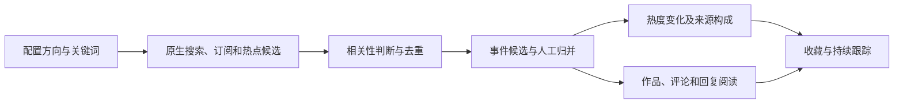

# 热点事件监测平台：市场调研与竞品分析

调研日期：2026-09-30（Asia/Shanghai）。用户明确的用途是获取关注方向的热点事件，例如 AI 领域的热度变化，并要求将调研结论写入 docs、更新当前需求。本轮结论已由 PRD001 v5.1 及 PRD002/003/004/005/007 承接，逐项关系见第 11 节。Research 的 completed 仅表示公开资料调研完成，不表示需求验证、设计完成、来源接入或产品验收通过。

## 1. 产品判断

建议定位为：**面向关注 AI 等专业方向的研究者与内容策划者，提供主题订阅、事件发现、升温观察、讨论阅读和来源追溯的工作台。**

用户设置“大模型、AI Agent、开源模型”等方向后，主要获得五个答案：

1. 最近出现了哪些值得关注的具体事件？
2. 哪些事件正在升温，热度来自哪些平台？
3. 多篇新闻、帖子和视频分别在讨论同一事件的哪些方面？
4. 评论中的主要观点、实际体验和争议是什么？
5. 这些结论依据哪些原文，目前哪些来源或评论尚未采到？

研究支持以下产品决策：

- **主题订阅与实体消歧应优先设计。** Feedly 提供概念、AND/OR/NOT 与来源选择；Inoreader 区分关键词和具体实体，并提供保存前结果预览。可以借鉴这些交互降低噪声。[Feedly 文档](https://docs.feedly.com/article/699-guide-to-ai-feeds-market-intel)、[Inoreader 官方更新](https://www.inoreader.com/blog/2026/09/introducing-mentions-redesigned-search-and-smarter-monitoring-feeds.html)
- **首页以事件组织信息。** Talkwalker 展示话题簇、传播图和趋势分析；新榜展示跨平台上榜与关键词声量。适合把同一事件的报道和讨论归在一起，再显示新增进展。[Talkwalker](https://www.talkwalker.com/products/social-listening)、[新榜热点榜](https://www.newrank.cn/hotkeys)
- **热度与评论覆盖需要解释。** 新榜的 DeepSeek 分析明确说明其作品统计选取一定影响力账号，不能代表完整内容总量；Brandwatch 的来源说明也保留各平台评论限制。这使“采集范围可见、观点可追溯”成为值得验证的产品价值。[新榜案例](https://www.newrank.cn/article/detail/30030)、[Brandwatch Listen 来源说明](https://social-media-management-help.brandwatch.com/en/articles/12767982-sources-for-listen-mentions)

以上是根据公开产品资料形成的判断。市场缺口、用户付费意愿及相对竞品优势仍需用户访谈和同题实测验证。

## 2. 调研方法与证据等级

本轮实际使用：

| 工具 | 调研职责 | 本轮证据 |
|---|---|---|
| GitHub 插件 | 读取公开仓库、README、LICENSE 与配置/来源代码 | MediaCrawler、TrendRadar、RSSHub、Playwright、HN API 等 |
| Context7 插件 | resolve 后查询最新文档，核对工具职责 | MediaCrawler、Firecrawl、Playwright 三组文档 |
| Firecrawl 插件及网页调研技能 | 搜索与抓取竞品官网、帮助中心、价格页和平台文档 | 国内、海外、主题阅读工具与来源边界 |
| Web 浏览工具 | Firecrawl 无法读取页面时补核 | X 官方搜索接口文档；抖音页面仍未取得有效正文 |

证据口径：

- **公开事实**：实际读到的产品规则、文档、价格或许可证。
- **厂商声明**：平台覆盖、刷新速度、数据规模、AI 效果等营销承诺；本轮没有采购或试用验证。
- **产品建议**：本报告提出的定位、流程、优先级和指标。
- **待确认**：未取得有效正文、文档存在差异、评论覆盖与合同权限未知。

官网页面是检索当时的快照。成功返回网页或 HTTP 200 不代表正文有效，也不代表真实采集、评论完整性或产品验收已通过。仓库声明的功能不等于目标账号和平台上可以持续运行。

本文保留支持结论的公开原始链接和固定提交；GitHub/Context7/Firecrawl 查询原始输出仍在本机调研工作资料中，不作为仓库内可共享的依赖，也不将整页抓取正文并入 docs。本轮以公开资料为范围，没有竞品账号试用、采购、客户访谈或真实社交爬虫运行。

## 3. 市场与用户需求

### 3.1 本轮观察到的市场分层

| 市场层 | 代表方案 | 用户购买的主要价值 | 与本产品的关系 |
|---|---|---|---|
| 主题订阅与信息阅读 | Feedly、Inoreader | 降低搜索、筛选和重复阅读成本 | 最直接的日常使用对照 |
| 热点榜与内容趋势 | 新榜、TrendRadar、Google Trends | 发现上榜、声量和搜索兴趣变化 | 提供发现入口与热度信号 |
| 企业社交聆听 | Brandwatch、Talkwalker、Brand24 | 跨来源监听、分析与协作 | 借鉴事件和趋势组织，评估数据成本 |
| 国内舆情服务 | 识微商情、新浪舆情通、清博 | 企业/政务监测、预警与报告 | 借鉴查询与覆盖管理，核实适用套餐 |
| 数据采集与订阅基础设施 | MediaCrawler、RSSHub、Firecrawl、Playwright | 获取网页、搜索结果或平台数据 | 构成实施候选，不直接替代完整产品 |

这是按公开能力划分的产品市场，不是市场份额排名。现有方案已经覆盖关键词监控、主题订阅、趋势与 AI 总结等需求，说明供给成熟；不能据此认定用户一定需要新的平台。

### 3.2 首期用户与待验证任务

| 优先级 | 用户 | 使用任务 | 需要交付的结果 |
|---|---|---|---|
| 首期 | 关注 AI 的个人研究者/产品经理 | 每天了解新模型、新工具、开源进展和重要争议 | 少量相关事件、原始证据、升温原因与讨论入口 |
| 首期可验证 | AI 内容策划者 | 寻找有信息增量和讨论空间的选题 | 事件发展、平台差异、代表性评论与来源 |
| 后续 | 行业研究团队 | 追踪公司、技术路线和事件变化 | 可复查的历史与协作记录 |
| 独立后续 | 品牌/公关团队 | 监测声誉风险与危机处置 | 告警、值班、权限、审计及服务保障 |

**首期价值假设**：用户愿意持续使用一份有来源依据的 AI 事件清单，以减少跨站搜索、重复阅读和进入评论区的时间。评论观点能否显著提高事件判断质量，需要实测。

本轮没有客户访谈、留存数据或付费实验。因此不提供缺乏依据的市场规模、增长率或收入预测。若未来商业化，可按“实际可触达目标团队数 × 验证后的年付费额”估算市场，并把来源许可、API 配额、维护和运营成本计入成本模型。

## 4. 重点竞品比较

### 4.1 对 AI 热点获取最有参考价值的产品

| 方案 | 已公开能力 | 适合借鉴 | 对本需求的限制或待确认项 |
|---|---|---|---|
| [Feedly AI Feeds](https://docs.feedly.com/article/699-guide-to-ai-feeds-market-intel) | 概念/公司/事件查询、AND/OR/NOT、标题或正文选择、来源集合和结果预览 | 主题配置、消歧、持续收集与降低噪声 | 相关资料主要面向文章情报；本轮未证实完整社交评论树。Market Intelligence 套餐价格未核实 |
| [Inoreader](https://www.inoreader.com/pricing) | 监控 Feed、规则、过滤/去重、公开 Feed 搜索、趋势文章；实体 Mentions 与预览 | 轻量订阅、关键词/实体组合、解释查询范围 | 公共 Feed 搜索范围取决于其来源库；Mentions 对英/法/德表现最佳是官网说明，中文效果待测；评论树未证实 |
| [新榜热点榜/声量通](https://www.newrank.cn/hotkeys) | 跨平台上榜数、热度展示、每小时更新；历史案例展示关键词跨平台作品统计 | 中文平台热点发现、平台间对照与内容选题 | 热榜有上榜门槛；案例明确采用部分账号范围；不能将声量当作全网总量，评论正文/回复能力待确认 |
| [TrendRadar](https://github.com/sansan0/TrendRadar) | README 声明热榜、RSS、关键词或 AI 兴趣筛选、增量推送、AI 分析 | 低成本验证“关注方向→发现候选→阅读”的日常流程 | 聚合结果中的关键词匹配与平台原生搜索分别看待；完整评论采集能力未证实 |
| [Google Trends](https://support.google.com/trends/answer/4365533?hl=en) | 搜索兴趣样本、按时间/地域归一化到 0—100 | 补充公众搜索兴趣与升温信号 | 分数不是帖子量、评论量或支持比例；低量词的 0 不能解释成没人关注 |

新榜 2025 年的 DeepSeek 案例说明了适合借鉴的链路：关键词查跨平台作品 → 观察趋势 → 选取热门内容 → 分析不同平台内容偏好。该案例是历史方法参考，不用于描述当前 AI 市场规模。[新榜原文](https://www.newrank.cn/article/detail/30030)

### 4.2 社交聆听与舆情产品对照

| 方案 | 公开定位/能力 | 借鉴点 | 关键边界 |
|---|---|---|---|
| [Talkwalker](https://www.talkwalker.com/products/social-listening) | 多网络关键词监控、话题/对话簇、传播图、趋势与提醒 | 事件聚合、升温提示、传播路径 | 覆盖规模为厂商声明；各平台评论与二级回复的完整性未核实；标准方案询价 |
| [Brandwatch](https://www.brandwatch.com/products/consumer-research/features/) | 社交研究/监听、分类与主题分析等 | 查询、标签、分析与来源说明 | Listen 与 Consumer Research 属不同产品，套餐不可混写；Listen 来源帮助页明确存在 owned/非 owned 和授权范围差异 |
| [Brand24](https://brand24.com/prices/) | 关键词提及、提及趋势、告警；Pro 方案起列出 AI Events Detection | 提及峰值关联事件、明确额度与刷新节奏 | [Boolean 临时筛选](https://help.brand24.com/en/articles/3267755-boolean-search)已采集提及与项目采集规则不同；评论指标不自动等于评论正文 |
| [识微商情](https://m.civiw.com/product/sq) | 官网展示关键词组合、主题生命周期、传播分析和预警 | 主题规则、时间线、来源与传播分析 | 覆盖与速度为官网承诺；评论分析材料不证明全量二级回复；价格待询 |
| [新浪舆情通](https://www.midu.com/yqt/product) | 关键词监测、聚类/主题检测、热点追踪、分析与报告 | 事件生命周期、查询、告警配置 | 评论分析说明包含新闻单篇评论，不能扩大为所有社交平台评论；不同官网页回溯期有差异，需确认具体合同 |
| [清博](https://www.gsdata.cn/) | 已确认官网及产品入口；详细能力须取得有效正文或合同后确认 | 国内市场候选对照 | 首页静态壳与演示站跳转不足以证明当前标准版功能；未核实项保留未知 |

**公开价格对照（美元，不含税费，查询快照）**：

| 产品/方案 | 月付 | 年付折算每月 | 对使用范围的影响 |
|---|---:|---:|---|
| Inoreader Pro | 9.99 | 7.50 | 轻量订阅工具成本基准；具体增购与 AI 额度另核 |
| Brand24 Individual | 249 | 199 | 3 关键词、2,000 提及/月、12 小时刷新；未列 AI Events Detection |
| Brand24 Team | 349 | 299 | 7 关键词、10,000 提及/月、1 小时刷新 |
| Brand24 Pro | 499 | 399 | 12 关键词、40,000 提及/月、实时刷新；列 AI Events Detection |

价格依据：[Inoreader 价格](https://www.inoreader.com/pricing)、[Brand24 价格](https://brand24.com/prices/)。这些方案在来源、额度、分析和服务上不同，不能直接按单价得出性价比排名。企业级产品并非不能用于个人研究，其公开功能与成本结构需要按具体需求核对。

## 5. 评论能力必须单独比较

选择竞品或采集工具时，至少分别确认以下五项：

1. 评论数等互动指标。
2. 顶层评论正文。
3. 回复正文、直接父节点与线程根。
4. 新增回复、旧帖新评论及内容变化。
5. 页数、排序、截断、权限、时间窗口与删除缺口。

具体证据：

- **YouTube**：官方说明 commentThread 返回的 replies 可能只是一部分，需要通过 comments.list 与 parentId 补取。这要求顶层和回复分别分页验收。[YouTube 官方文档](https://developers.google.com/youtube/v3/docs/commentThreads)
- **Brandwatch Listen**：不同来源存在授权与账号范围限制；Reddit 来源说明也不能承诺每条帖子评论都收全。不能把这一帮助页解释成 Brandwatch 所有产品套餐均有相同能力。[Listen 来源说明](https://social-media-management-help.brandwatch.com/en/articles/12767982-sources-for-listen-mentions)
- **新榜声量通案例**：公开展示作品数量和点赞等对比，尚不能证明评论正文或二级回复采集。[案例](https://www.newrank.cn/article/detail/30030)
- **MediaCrawler**：README 声明多平台关键词搜索与二级评论，配置中评论/子评论开关与条数上限分别存在。它提供研究候选，需要逐平台、逐能力测试。[README](https://github.com/NanmiCoder/MediaCrawler/blob/380b426000aac3d612837ed72c99808347dc94c9/README.md)、[配置](https://github.com/NanmiCoder/MediaCrawler/blob/380b426000aac3d612837ed72c99808347dc94c9/config/base_config.py)

报告与页面应写“已采样评论中的主要观点”，同时标出样本、排序和时间。某类观点占比只描述明确分母内的数据，不能外推为所有平台用户意见。

## 6. 信息源与采集路线

### 6.1 AI 事件来源的三种职责

| 来源角色 | 首期候选 | 产品用途 | 验证重点 |
|---|---|---|---|
| 事实源 | 官方公告、开发者博客、项目 README/发布资料 | 确认发布与变更事实 | 原始链接、发布时间、版本与正文 |
| 讨论源 | HN；后续逐项评估 B站、Reddit、YouTube、X 与中文社区 | 判断关注和争议，阅读体验与评论 | 搜索/作品/评论/回复各自的能力与缺口 |
| 扩散源 | 新闻 RSS、行业媒体、公开热点榜 | 发现传播范围与候选事件 | 重复转载、采样范围、榜单快照与更新时间 |

当前先按 Plan058 A 使用一个主题、HN 公开搜索与一条冻结的已准入热榜，在同一隔离库核对搜索、帖子、HN 评论父链、榜单快照/主题命中及阅读/覆盖/恢复；随后 B 扩至四关键词来源和六榜。官方公告与开发者资料是判断事件事实时的证据候选，并未因本次调研成为新增自动采集来源。本人授权 B 站保持 M2 独立试点；其他中文社区与海外平台按 M6 逐来源准入，不把市场建议写作现有来源已可用。

HN Algolia 的公开文档提供故事/评论搜索、按日期检索、数值过滤与分页，适合验证关键词和讨论关联。它是 HN 的搜索索引服务，并非全网社交搜索。[HN Search API](https://hn.algolia.com/api)

### 6.2 工具与授权边界

| 工具/来源 | 已核实的职责 | 实施判断 |
|---|---|---|
| Firecrawl | 网页正文、结构化提取及浏览器动作 | 适合公开文章读取；平台搜索、评论展开、滚动与分页仍需专门适配和结果验证 |
| Playwright | 浏览器交互与认证状态复用 | 可支撑必要交互；选择它不会自动解决来源授权、稳定性或评论完整性 |
| RSSHub | 将不同来源转为 RSS；部分路由支持关键词 | 每条路由单独检查，不统一承诺任意关键词或完整评论 |
| TrendRadar | 热榜/RSS聚合、筛选与推送 | 用于发现和产品验证；完整搜索与评论能力另行建设 |
| MediaCrawler | 多平台搜索、作品和二级评论的研究代码 | 当前 LICENSE 为 Non-Commercial Learning License 1.1；README 也明确限制商业用途，不能当作可直接商用的底座 |
| X API | 官方近期搜索与全历史搜索的不同访问范围 | 官方文档近期范围为 7 天；全历史与付费/Enterprise 权限有关；真实请求和成本需先确认 |
| Reddit API | 官方接入与使用条款 | 商业用途等需单独协议；不能把公开网页等同于产品化数据授权 |
| 抖音官方接口 | 搜索和评论能力入口可发现 | 本轮有效正文不足，权限和范围待核；搜索摘要中的“评论数据”也可能指评论数，不能确认文本能力 |

依据：[Firecrawl 文档](https://docs.firecrawl.dev/features/scrape)、[Playwright](https://playwright.dev/docs/auth)、[RSSHub](https://github.com/DIYgod/RSSHub)、[MediaCrawler LICENSE](https://github.com/NanmiCoder/MediaCrawler/blob/380b426000aac3d612837ed72c99808347dc94c9/LICENSE)、[X 搜索文档](https://docs.x.com/x-api/posts/search/introduction)、[Reddit Data API Terms](https://redditinc.com/policies/data-api-terms)。

许可证与平台使用许可分别核实。TrendRadar 的 GPL-3.0、RSSHub 的 AGPL-3.0、Playwright 的 Apache-2.0 已读到原文；商业化分发或服务边界应按所选版本与接入方式评估，不将代码许可证当作目标平台数据许可。[TrendRadar LICENSE](https://github.com/sansan0/TrendRadar/blob/792bcc3928b1617bba09df34989fd5675c159b86/LICENSE)、[RSSHub LICENSE](https://github.com/DIYgod/RSSHub/blob/88ecc47faf6231b91dc89ba85a3788ce56c51ca9/LICENSE)、[Playwright LICENSE](https://github.com/microsoft/playwright/blob/5b8c4a0f524d916ca3a2e3e401a9cfb07b4ea42a/LICENSE)

开源结论的固定版本证据：[TrendRadar README](https://github.com/sansan0/TrendRadar/blob/792bcc3928b1617bba09df34989fd5675c159b86/README.md)、[MediaCrawler README](https://github.com/NanmiCoder/MediaCrawler/blob/380b426000aac3d612837ed72c99808347dc94c9/README.md)与[LICENSE](https://github.com/NanmiCoder/MediaCrawler/blob/380b426000aac3d612837ed72c99808347dc94c9/LICENSE)、[RSSHub LICENSE](https://github.com/DIYgod/RSSHub/blob/88ecc47faf6231b91dc89ba85a3788ce56c51ca9/LICENSE)。这些提交不晚于调研日期；仓库近期活动不等于平台适配可用。研究读取的 MediaCrawler 提交与 HotKey 固定试点版本 `mediacrawler-1bd07bc-hotkey-safe` 不是同一版本；本轮不升级该试点、不改变每帖一级评论 ≤20、不启用楼中楼。许可证结论须在实际采用版本及本地补丁上重新核对。

本轮仅调研公开资料，没有登录社交账号、运行社交爬虫或发起付费模型调用。

## 7. 目标产品流程与分阶段交付

### 7.1 从方向到事件

示例为产品设计，非真实新闻：用户订阅“开源大模型”，发现“某团队发布新模型”，同一事件归入官方公告、HN 讨论、中文媒体解读和 B站体验视频。阅读时可看到技术变化、关注增速、代表性体验及评论采集缺口。

### 7.2 主题规则

- 方向：大模型、AI Agent、多模态、开源模型等。
- 实体与别名：公司、模型/产品名、项目名、中英文称呼。
- 条件：包含/必须包含/排除、时间、语言、来源。
- 保存前预览：只读取当前 owner 已有、可读取的持久化样本，展示匹配原因和来源能力；不触发外采、模型请求或 Job。无样本/样本过旧时显示样本不足，不能写作来源没有结果。
- 条件变更有版本，历史采集结果可追溯当时的规则。

沿用现有主题名称和任一词/全部词/排除词组；别名由用户明确填写，不新增嵌套查询语言、自动实体扩写或分类体系。时间/语言等条件按来源标为原生执行、本地过滤、不支持或未验证，不引入未定义的配置字段。采集条件变更创建不可变采集版本，单纯改显示名称不升级采集版本。

“AI”容易过宽，英文子串还可能误命中。建议使用主题 + 实体/别名 + 相关性判断，并保留人工纠正。来源未原生支持的条件，只有本地确可执行时才标为本地过滤；否则标不支持或未验证，不能静默宣称生效或伪装为平台原生搜索。

### 7.3 事件卡片

M3 的事件发现与卡片需求保留：

- 事件标题、摘要、首次发现时间与最近进展；首次发现时间不冒充实际发生时间，有可靠发布时间时另列。
- 命中主题及相关性依据。
- 当前关注与升温状态，分来源统计及更新时间。
- 代表性报道与讨论入口；有可核验证据时另附首发/官方依据，不承诺每个事件都取得首发。
- 已采作品和评论数量、来源可用性与缺口。
- 沿用主题关注入口及人工合并/拆分，修订可追溯。

事件收藏和排除等额外交互仅为后续验证候选，未在本轮新增实施承诺。

跨来源归并应区分“同一模型发布事件”“不同版本发布”“后续争议/故障”等。相似关键词或标题只形成候选，人工确认与修订要可追溯。

### 7.4 评论整理

事件下先按作品保留评论线程，避免把不同作品下的回复拼接。M1 先阅读原始评论和父链，M3 事件只组织已有代表性证据；M4 独立验收新生成的讨论问题、情感与观点质量。M4 整理结果要求：

- 主要讨论问题：能力变化、使用体验、成本、开放程度、可靠性。
- 观点类型：实际体验、支持、质疑、补充证据与中立说明。
- 每个观点的代表性原文与链接。
- 被引用评论的所属作品、父链和采集时间。
- 采样排序、分页/条数上限、失败或截断。

“好/坏”情感可作为辅助标签。AI 方向用户通常还需要理解具体问题与观点依据，这是需要用用户反馈验证的设计判断。

## 8. 热度设计建议

**分别说明观察到的关注、升温、来源构成和覆盖。** 当前 M3 沿用 Design004 v1 热度公式、3 小时窗口/前 24 小时基线和已定升温阈值，本轮增加贡献解释、缺失字段与可比性展示，不替换公式或宣布需要新分数才能完成现有切片。以下是可观察信号与后续校准候选，不全部构成本轮新增 FR。

可观察信号：

| 信号 | 计算依据 | 限制 |
|---|---|---|
| 新增相关作品 | 指定窗口内去重后的已采作品 | 受搜索、采样和来源可用性影响 |
| 新增参与者 | 指定窗口内可识别作者数量 | 账号可见性不同，不能跨平台自动认作同一人 |
| 互动增量 | 同一作品多次观察的赞/评论等差值 | 缺失值与 0 分开；计数下降保留事实并核查 |
| 升温 | 当前窗口与可比历史基线对照 | 低基数设置最小样本量，避免单条内容导致虚高 |
| 来源扩散 | 事件出现的独立来源/平台与时间顺序 | 镜像和转载来源不能当成完全独立传播 |
| 数据可信度 | 覆盖、时效、缺口、事实来源与抽检 | 与热度单独展示 |

设计要求：

- 不同平台先在各自可比窗口内分析，再形成跨来源展示；不直接相加点赞、榜单热值和 Google Trends 指数。
- 排名、累计互动和短窗增量各自说明单位与窗口。
- 抓取失败与来源停用时，显示“数据不足/更新中”，不把它解释成事件降温。
- 新来源加入会改变观测范围，比较历史趋势时标记这个变化。
- 权重、窗口和异常规则可追溯；用户能查看一次排序的主要原因。

公开资料不能证明现行权重适合全部平台。现有分数只描述已准入来源、已采样作品和明确窗口；本轮不把它命名为全网热度、不将榜单热值或 Google Trends 指数混入现有互动公式。新增参与者、跨平台传播推断、最小样本门槛或归一化公式须另有样本和设计决策，不能据本报告直接改变当前算法。

## 9. 优先级与验证路线

| 现行阶段 | 本轮承接 | 边界与退出条件 |
|---|---|---|
| M1 / Plan058 A→B | 先一个主题、HN 与一榜同库演示，再四来源六榜扩围；方向规则、样本预览、查询执行方式和能力矩阵进入 PRD002 | 058 原有 A/B 条件不扩张；新增 FR 的 Design/Plan 合同另补。72 小时和正式指标后验 |
| M2 | B 站实际固定版本的代码许可证证据 | 保留宿主机/独立 CDP、≤20 一级评论、无楼中楼、风控即停与本人恢复；未升级或新增真实运行结论 |
| M3 | 方向事件发现、事件卡片、热度解释、覆盖可比性及代表性帖子/评论出处 | 保留已有真实三平台、人工修订和热度验收；新增 AC 独立后验，Design004/相关 Plan 待补 |
| M4 | 观点逐条引用、样本分母、证据不足说明 | 生成观点质量不成为 M1/M3 前置；分析质量、报告、知识库各自后验 |
| M6 | 后续来源逐能力、逐版本准入 | 软件许可与数据使用许可分别记录；搜索、评论正文/回复、增量和限额各自有证据 |

报告、邮件、知识库仍为非核心后续能力。PRD 已承接的新需求不表示既有 Design/Plan 已覆盖；[Plan 索引](../plan/README.md#调研新增需求的实施合同边界)列明待补范围，本轮不新建 Plan、不改变任务完成状态或 Acceptance 结论。

### 9.1 需要验证的产品指标

- **有效发现**：每周用户收藏或确认有用的独立事件数，同时观察被忽略/排除事件。
- **相关性**：固定 Top-N 事件及随机内容样本的人工相关率；两种指标分开。
- **发现时效**：入库与可核对的发布时间/首次已知时间之差；缺时间的条目单列，不能混入准确时效样本。
- **归并质量**：人工基准上的错并、漏并与修订次数。
- **评论质量**：父链抽检、引用有效率、观点摘要是否保留争议与不确定性。
- **可信覆盖**：来源 × 能力 × 时间窗口的成功、空结果、截断、失败与停用情况。
- **使用价值**：完成一次“了解一个事件”所花时间、重复阅读量、周活跃与回访。
- **成本**：每个有效事件的请求、来源额度、模型用量和维护时间。

数值目标应结合基线与现行 PRD 确定；本轮没有宣布任何指标已达标。

### 9.2 用户与竞品验证实验

建议选取 5—8 名关注 AI 的目标用户作为探索样本，持续两周；这只能验证早期方向，不能代表市场总体。

每人固定 2—3 个关注主题，记录当前每日查阅来源与耗时。用相同主题和日期范围对照手动查阅、一个主题订阅工具和本产品原型，核对：

- 哪些重要事件被发现或遗漏？“重要”由用户或人工基准定义。
- 相同事件重复出现多少次？是否能保留不同进展和观点？
- 升温提示是否有可复查原因？是否由采集故障造成？
- 评论摘要是否帮助理解事件？是否断章取义或漏掉主要反对意见？
- 一周后用户还愿意打开和调整主题吗？

首期以个人使用验证为主。商业化意愿在来源权限、数据质量和持续价值可说明后另做价格实验。

## 10. 未决事项与下一步决策

1. 最重要的 2—3 个 AI 细分方向及中英文实体词表。
2. 哪些中文平台对事件发现有实际信息增量，优先用样本比较。
3. 评论的默认采样排序、条数、更新窗口与父链处理。
4. 跨来源热度的可比窗口和最小样本量。
5. 各来源真实权限、持续可用性与成本；付费来源按预算准入。
6. 竞品同题实测：完整搜索结果、评论/回复、早期事件发现和错误归并。

**本轮交付的是有公开来源依据的研究与建议。** 竞品官网能力尚未变成试用结论，开源功能尚未变成 HotKey 真实集成证据，定位建议尚未经过用户需求验收。

## 11. 调研结论 → 需求 → 验收追踪

| 结论与直接依据 | 产品决策 | 现行需求承接 | 验收与实施边界 |
|---|---|---|---|
| Feedly/Inoreader 的持续主题、实体/别名与预览可用于降低噪声；中文效果尚待实测 | DEC-001-221/222 | BR-001-109；FR-002-008、FR-002-009 | AC-002-009、AC-002-010；只用已有词组与持久样本，新增合同待补 |
| 热榜/RSS 匹配与平台原生关键词搜索职责不同；HN 搜索 API 与 HN 官方条目 API 也不同 | DEC-001-222/225 | FR-002-010/011；FR-007-005 | AC-002-011/012、AC-007-005；逐来源方式/限额/真实窗口核对 |
| 新榜、Talkwalker 展示趋势和事件组织，适合“关注方向→发现事件→观察变化” | DEC-001-221/223 | BR-001-109；FR-004-003/004 | AC-004-002/003；M3 后续，保留现行公式及原验收 |
| 新榜样本范围、Google Trends 归一化及 Brandwatch 来源差异说明热度和覆盖需要解释 | DEC-001-223 | BR-001-110；FR-004-004、FR-004-005 | AC-004-003、AC-004-004；组件可复算，缺口/来源变更不当作降温 |
| 评论数、正文、顶层/回复、旧帖新回复是不同能力；YouTube/MediaCrawler 文档明确有配置或分页差异 | DEC-001-224/225 | FR-002-011；FR-004-006；FR-005-002、FR-005-008；FR-007-005 | AC-002-012、AC-004-005、AC-005-001、AC-005-009、AC-007-005；M1 原始阅读/M3 代表证据/M4 生成观点 |
| 固定版本许可证与平台数据权限分别成立，公开仓库不自动授权商业化 | DEC-001-225 | FR-003-002、FR-007-005 | AC-003-001、AC-007-005；核对实际采用版本，不按新上游升级当前试点 |

以上 10 项新增 FR、10 项新增 AC 与既有条文补充，源自本轮 Research048，不伪造为 PRD001 v3.0 原编号迁移。总决策和新增 BR 见 [PRD001](../prd/001-热点舆情监控平台需求.md#产品定位与目标流程)、[全局新增追踪](../prd/001-热点舆情监控平台需求.md#72-research048-新增需求追踪)。

用户价值和指标目标仍需实测。本轮未将市场规模、评论完整率、中文实体识别准确率、平台全量覆盖或用户付费意愿写为已验证事实。公开来源与价格为 2026-09-30 查询快照；后续采购/准入应核对当时版本与合同。
