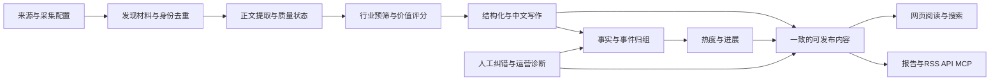

# AIHOT 功能拆解与 HotKey 需求对照

## 1. 结论、依据与适用范围

AIHOT 与 HotKey 的功能链路高度重叠，值得学习的是内容产品闭环：材料质量、精选解释、同事实去重、事件进展、人工纠错、可解释热度、报告编选和一致的内容出口。HotKey 应在既有采集、任务、预算、证据和阅读底座上补齐这些能力，继续保留关键词监控、评论父链、原生热榜和覆盖证明。

两者的用户与输入仍有区别：AIHOT 是运营者配置行业信源和标准、匿名读者阅读的资讯策展站；HotKey 是用户配置关注主题，持续观察获准来源并追溯结果和缺口的监控产品。固定分类主题页不等于可编辑监控规则；精选价值不等于主题相关性；独立来源关注热度不等于互动热度；开源代码存在不等于本项目真实验收通过。

本次使用用户指定的三项能力：GitHub 读取仓库元数据、文件树与代码版本；Firecrawl 读取仓库页面及线上首页、Agent 页；Context7 核对 FastAPI 的契约生成与 pgvector 的召回限制。另以固定提交的只读源码副本追踪处理器、服务、数据、任务和页面，没有安装或运行 AIHOT。HotKey 只读核对源码、PROJECT、BACKLOG、PRD/Design/Acceptance；没有启动服务、连接运行库、发起来源/模型/渠道请求。本轮交付是分析和文档更新。

| 证据 | 范围与限制 |
|---|---|
| [AIHOT 固定提交](https://github.com/KKKKhazix/AIHOT/tree/035f7b7f6e26cf203562ddd6065ff7adc1bb0c07) | 下文源码结论均绑定此提交；代码存在仅证明静态实现可追踪，未验证供应商、部署、性能或质量 |
| [仓库说明](https://github.com/KKKKhazix/AIHOT/blob/035f7b7f6e26cf203562ddd6065ff7adc1bb0c07/README.md) | 作者说明它是生产代码快照，未开放生产信源和运营数据；示范信源不能证明生产覆盖 |
| [线上首页](https://aihot.news/)与 [Agent 页](https://aihot.news/agent) | Firecrawl 本次返回 HTTP 200，可见热点/精选/进展及使用说明；仅证明页面内容，不证明安装、交互、后台、API 或开源部署已验收 |
| HotKey `9f79d751` | 下文对照为本次编辑前的静态代码快照；动态进度以 [BACKLOG](../../BACKLOG.md) 为准，运行结论只见 Acceptance |

本文是研究证据和基线差距，正式“需要做什么”已原位进入所属 PRD，技术定标进入对应 Design，排期只在 BACKLOG；不建立第二份可写需求或执行计划。历史 Research048 的有效编号与要求继续保留，原调研从 Git 查阅。

### 2026-10-02 全量迁移决定

用户在本次研究后明确要求全部迁移，包括此前可选/非核心的模型榜、Codex 重置公告、月报与分享海报，并选择保留 Python/Next.js/Kafka。正式全量范围见 [PRD046](../prd/046-AIHOT全量业务迁移需求.md)，技术承接见 [Design048](../design/048-AIHOT全量迁移架构与兼容设计.md)，连续执行见 [Plan062](../plan/062-AIHOT全量业务迁移执行计划.md)。下文的源码事实与初始差距保留；§9 的“可选、不迁入或不在排期”属于本次决定前的建议，不再用于排除上游业务模块。迁移仍不复制上游品牌、运行技术栈或已知缺陷，实际收费/平台/渠道启用条件独立有效。

## 2. 完整功能链路与角色

AIHOT 分为匿名读者和管理员：读者浏览、搜索、收藏、读报告、订阅内容；管理员配置来源、模型与预算，查看材料全链路，重跑或修订结果。HotKey 当前 Demo 已决定无产品登录，这种职责区分可以用于页面组织，不能据此恢复管理员账号或身份骨架。来源登录态仍属于采集授权。

AIHOT 的来源有三种参与方式：`editorial` 进入阅读/精选；`hot_signal` 提供讨论关注证据，不创建事件或公开单篇；`isolated` 不参与分析/热度。HotKey 可学习“输入用途分开”，但必须继续按连接版本和来源能力准入，不将角色标签当授权。

## 3. 来源、采集与素材管理

### 3.1 六种来源是六类适配器

| AIHOT 类型 | 实际功能与依赖 | HotKey 对照与处理 |
|---|---|---|
| RSS/Atom | 解析标题、作者、日期、摘要/正文、媒体，使用 ETag/Last-Modified | HotKey 已有固定 Google News/RSSHub 入口；可以补素材质量，不能自动宣称任意 feed 已接入 |
| 网页列表 | CSS/Markdown/更新日志规则取链接，详情补日期/摘要，正文 Readability；困难页面可用付费 Jina | HotKey 已有公开单网页 Firecrawl，尚非任意列表配置器；未来逐站定入口与范围 |
| JSON 列表 | 点路径字段映射、URL 模板与时间单位，部分 HTML 内嵌 JSON | 可作为未来来源适配方式；不能将通用映射推定为平台完整分页 |
| X 搜索 | SocialData 付费接口，原生帖子/作者/引用、分片、有界翻页、水位和 backlog | HotKey 约定官方 API；当前无凭据/月上限，不能迁移该付费供应商或发送真实请求 |
| 微信公众号 | 极致了/Dajiala 付费列表与正文，每轮最多 8 篇新文，首轮最近 7 天；有界正文重试 | HotKey 公众号待逐能力准入；供应商可取正文不等于采集/展示/转载授权 |
| 外部摄入 | 带 token 的批量写入入口，限频/条数，新来源隔离等待准入 | 属未来可选集成；写入授权、来源证据、身份/时间/许可仍必须校验 |

证据：[来源类型](https://github.com/KKKKhazix/AIHOT/blob/035f7b7f6e26cf203562ddd6065ff7adc1bb0c07/packages/backend/src/sources/types.ts)、[采集说明](https://github.com/KKKKhazix/AIHOT/blob/035f7b7f6e26cf203562ddd6065ff7adc1bb0c07/docs/sources.md)、[来源处理器](https://github.com/KKKKhazix/AIHOT/tree/035f7b7f6e26cf203562ddd6065ff7adc1bb0c07/packages/backend/src/sources)、[摄入路由](https://github.com/KKKKhazix/AIHOT/blob/035f7b7f6e26cf203562ddd6065ff7adc1bb0c07/apps/api/src/routes/ingest.ts)。

六类入口不提供 HotKey 所需的通用评论正文、直接父节点/回复目标、旧帖新回复和六个原生热榜快照。X 引用/回复关系及热度信号也不能代替逐来源评论采样验收。

### 3.2 采集与素材功能拆解

| 功能 | AIHOT 静态实现 | HotKey 需要保留或补齐 |
|---|---|---|
| 来源管理 | 新建、编辑、启停、频率、类型配置、失败/近期材料、试抓 | 已有固定来源目录、连接版本、启停与预设；任意来源管理器未实现，不先重建 |
| 试抓预览 | 会发外部请求，部分 X/Jina 预览也收费 | 现有规则样本预览仅读本地资料、零外采/模型；两种预览必须清楚区分 |
| 有界调度 | 每分钟扫到期，普通/X/公众号不同并发，失败退避，预算延后 | 复用现有来源预设、静默/风控、硬截止、预算和持久到期账本 |
| 自动调频 | 每日按近 7 天新文章产出改变 interval | 仅作优化参考；产出少不证明覆盖好，不能自动放宽已准入频率或覆盖合同 |
| 增量与重放 | 成功后推进 cursor，部分入库失败按身份重放，X 留 backlog | 保留跨轮确认范围、未知尾段与缺口；Job checkpoint 不冒充完成水位 |
| 身份与版本 | URL/原生ID等 identity，题文变化生成 revision；多来源同 URL 留发现关系 | HotKey 原生内容 ID、来源身份、内容版本、观察与评论父链已有更明确合同 |
| 正文提取 | HTML Readability，失败可用 Jina；仍失败保留未确认 | 区分列表摘要、完整正文、截断、失败与许可；失败不删发现，来源搜索不默认补抓正文 |
| 时间与历史 | 发布时间/发现时间/backfill/timeline 分开，旧材料降低优先级 | 保留发布时间未知，不伪造；历史材料可检索，但不因今天入库称新发布 |
| 传播范围 | 来源站内全文与再分发全文分别配置 | 补许可依据和投影，不把公开数据或成功抓取当公开转载许可 |

证据：[采集调度](https://github.com/KKKKhazix/AIHOT/blob/035f7b7f6e26cf203562ddd6065ff7adc1bb0c07/packages/backend/src/sources/collect.ts)、[统一材料入口](https://github.com/KKKKhazix/AIHOT/blob/035f7b7f6e26cf203562ddd6065ff7adc1bb0c07/packages/backend/src/content/materials.ts)、[正文提取](https://github.com/KKKKhazix/AIHOT/blob/035f7b7f6e26cf203562ddd6065ff7adc1bb0c07/packages/backend/src/content/extract.ts)。

AIHOT 的首轮导入和历史排除不能简化成“backfill 全不算热点”：首轮新文可进入事件/热度，却仍不推送或入报告；发现晚于发布 48 小时或未知发布时间的历史材料另受排除。HotKey 不迁移这些窗口，继续按自己的来源、统计和报告合同处理。

## 4. 相关性、精选、写作与质量校准

### 4.1 必须区分的五个判断

| 判断 | 用户含义 | HotKey 当前与目标 |
|---|---|---|
| 关键词命中 | 字面满足规则 | 已有任一/全部/排除、规范化及已有样本预览 |
| 主题相关 | 内容确实谈论关注对象，排除同名歧义 | 已有 Codex 标注与理由；真实调用暂停，质量未验 |
| 精选价值 | 相关内容中值得优先阅读的增量 | 未有独立标准/状态/校准；新增 FR-005-009 |
| 事实关系 | 与某事实/事件相同、后续或只是背景 | 现有候选同事件确认不足；新增 FR-004-007 |
| 写作与翻译 | 忠实、易读地表达已有事实 | 已有一句话摘要/情感/观点字段；中文标题、推荐理由、译文和引用增强待补 |

AIHOT 先做行业预筛，再两次价值评分，同时结构化，最后按材料质量写作。预筛有 pass/block/unknown；unknown 继续，不能将没有结论等同无关。默认 T1/T1_5/T2 平均门槛为 60/65/76，近入选平均分严格大于 50 可走更完整写作。这是其行业标准，不能变成 HotKey 相关性或质量阈值。

一般文章流程通常为预筛 1 次、评分 2 次、结构化 1 次、写作 1 次，共约 5 次模型请求；向量、关系确认/复核、事件综述、报告导语与全文翻译另计。不同分支、解析重试、图像失败回退会改变次数。完整成本不能按“两次评分”估算；同模型两次也不自动保证独立误差或效果提升。

证据：[分析编排](https://github.com/KKKKhazix/AIHOT/blob/035f7b7f6e26cf203562ddd6065ff7adc1bb0c07/packages/backend/src/editorial/analyze.ts)、[评分配置](https://github.com/KKKKhazix/AIHOT/blob/035f7b7f6e26cf203562ddd6065ff7adc1bb0c07/industry/selection.ts)、[写作校验](https://github.com/KKKKhazix/AIHOT/blob/035f7b7f6e26cf203562ddd6065ff7adc1bb0c07/packages/backend/src/editorial/writing.ts)。

### 4.2 写作、翻译和评测功能

| 功能 | AIHOT 实现与限制 | 对 HotKey 的要求 |
|---|---|---|
| 中文阅读辅助 | 中文题摘要、理由、分类/主体/标签；检查原文未出现的公司不能编入标题 | 绑定原文版本，区分事实和推断，缺材料不生成确定结论 |
| 全文翻译 | 仅获准、selected/public 的完整正文；分块，保留链接/代码，失败可能 partial | 作为可选增强，显示范围/失败/版本；摘要不是全文翻译，读取不即时调用模型 |
| 原文与译文 | 同篇阅读、来源链接、引用帖和媒体 | 优先可信出处与材料质量，图库/视频等不提前加入当前范围 |
| 版本化标准 | 提示词哈希，逐能力模型配置，仅影响后续任务 | 先定义判断版本/输入与重算边界，复用 `analysis`/`ai`/`jobs` |
| SelectBench | 自标 gold、开发/留出分集、同样本模型比较、阈值扫描、错例/分层 | 需实现离线校准，相关性与精选分开，不照搬门槛或建一个未使用的框架 |
| 评测指标 | TP/FP/FN/TN、precision/recall/F1、用量/耗时；either/执行错误单列 | 明确所有分母和弃权/异常，不能删失败抬高效果，也不降低现行 100 条抽检目标 |

证据：[翻译](https://github.com/KKKKhazix/AIHOT/blob/035f7b7f6e26cf203562ddd6065ff7adc1bb0c07/packages/backend/src/editorial/translate.ts)、[评测脚本](https://github.com/KKKKhazix/AIHOT/blob/035f7b7f6e26cf203562ddd6065ff7adc1bb0c07/scripts/eval-selection.ts)、[评测后台](https://github.com/KKKKhazix/AIHOT/blob/035f7b7f6e26cf203562ddd6065ff7adc1bb0c07/packages/backend/src/admin/selectbench.ts)。

## 5. 事实、事件、进展、热度与人工纠错

AIHOT 分为 article → fact → story：同一次发生的多篇报道进入 fact，直接后续事实可挂在 story 中；相关主题不因此全部归成一事。HotKey 的稳定事件身份已有受控切片，仍需补关系语义、实际事件页面、人工修订和热度。

| 功能 | AIHOT 静态行为 | HotKey 采纳方式 |
|---|---|---|
| 候选召回 | 近 14 天题摘要向量，候选有界；无向量时字符相似度降级 | 学习候选不等于结论；保留 `pg_trgm`、关键词和 72 小时当前合同 |
| 关系确认 | 同次发生、同事件、无关、综述类；部分低相似结果复核 | 补关系证据与新事实/背景边界；不引入向量依赖或自动多模型费用 |
| 新进展 | 同事实重复折叠，直接进展独立保留 | 需减少重复阅读，同时让新事实可见；不同版本发布不能误并 |
| 事件综述 | 冻结输入身份/hash，提交再核版本，来源变更后重核 | 可借鉴慢结果不能覆盖新状态、引用和衍生结果失效 |
| 人工纠正 | 已有拆离、合并、重分组及人工状态保护 | HotKey 必须补完整合并/拆分交互、原因、修订冲突与排除约束 |
| 完整编辑器边界 | 当前后台未见指定移入目标 fact 或完整 story 拆分入口 | 不从“人工改归属”概述推定功能完整，验收以实际操作为准 |

证据：[归组](https://github.com/KKKKhazix/AIHOT/blob/035f7b7f6e26cf203562ddd6065ff7adc1bb0c07/packages/backend/src/events/group.ts)、[关系判定](https://github.com/KKKKhazix/AIHOT/blob/035f7b7f6e26cf203562ddd6065ff7adc1bb0c07/packages/backend/src/events/relate.ts)、[人工纠正](https://github.com/KKKKhazix/AIHOT/blob/035f7b7f6e26cf203562ddd6065ff7adc1bb0c07/packages/backend/src/events/corrections.ts)、[综述](https://github.com/KKKKhazix/AIHOT/blob/035f7b7f6e26cf203562ddd6065ff7adc1bb0c07/packages/backend/src/events/digest.ts)。

### 热度不能直接替换

AIHOT 在时点 t 的 48 小时窗口内，按参与者 p 最新证据时间 `last_p` 计算：

`rawHeat(t) = Σp 2 ^ (−(t − last_p) / 24h)`

显示值为原值放大 10 倍、保留一位小数；参与者依次按 signal group、owner entity、source 身份去重。重复抓取不增加次数，但同来源新报道会刷新最后证据时间并提高衰减贡献；不能说同来源发十篇完全无影响。点赞、评论、浏览不进入这项热度，官方 tier 也不加权。至少两个参与者且含一个 editorial 才可上榜，比较 6 小时前热度时排除新增/落后来源的不可比影响；无依据显示 unknown。

HotKey 的 v1 是赞/评/转/浏览与来源权重加帖子数项，观察近 3 小时增量和此前 24 小时基线，互动全部未知返回 null。两者量纲与目的不同。本轮采纳贡献可追溯、来源去重解释、缺口与可比性，保留 HotKey 公式、权重、阈值和历史快照；未来要增加传播关注度须独立命名、定标与验收。

AIHOT 来源落后检测主要覆盖 enabled RSS/网页/JSON/X；公众号和外部推送不具有同等时钟证明。它的 coverage 不是 HotKey 来源×能力×时间窗的完整性证据。[热度源码](https://github.com/KKKKhazix/AIHOT/blob/035f7b7f6e26cf203562ddd6065ff7adc1bb0c07/packages/backend/src/events/hot.ts)

## 6. 阅读、搜索、主题与多种内容出口

### 6.1 读者功能

| 功能 | AIHOT 实现与限制 | HotKey 基线/目标 |
|---|---|---|
| 精选与全部动态 | 已判断精选和可公开阅读池分开，同事实归组 | 已有原始内容列表；后续相关性与精选必须分开 |
| 内容详情 | 题摘要、理由、原文、获准全文/译文、目录、引用与媒体 | 已有正文版本、观察、标注、评论和证据；辅助阅读待增强 |
| 文本搜索 | 标题摘要与获准正文，分词 AND、权重排序，结果和并发有上限 | 当前 API 无文本 query；补 FR-002-012，纯读取，不做在线模型检索 |
| 主题页 | 运营者配置公司/方向/内容类型及 tags | 不替换用户监控主题和不可变规则版本 |
| 收藏/已读 | 浏览器 localStorage，收藏最多 500，已读最多 5000，JSON 导入导出 | 当前无此功能；本机稍后读可选，不等于未来跨设备账户能力 |
| 热点/事件详情 | 贡献来源、进展、代表报道、趋势图和不足状态 | 当前 `/events` 实为关注主题列表，不能当事件页已实现 |

搜索是 PostgreSQL 文本/trigram/LIKE 规则，非语义向量搜索或知识库问答。正文命中还受许可约束；UI 带搜索框不能证明全部历史可检索。[阅读池与搜索](https://github.com/KKKKhazix/AIHOT/blob/035f7b7f6e26cf203562ddd6065ff7adc1bb0c07/packages/backend/src/publication/pool.ts)、[主题](https://github.com/KKKKhazix/AIHOT/blob/035f7b7f6e26cf203562ddd6065ff7adc1bb0c07/packages/backend/src/publication/topics.ts)、[本机阅读状态](https://github.com/KKKKhazix/AIHOT/blob/035f7b7f6e26cf203562ddd6065ff7adc1bb0c07/apps/web/app/lib/local-state.ts)

### 6.2 一份发布范围、多种出口

AIHOT 的 `publication` 统一材料、最新分析、人工覆盖、归组和可发布范围，再供网页、RSS、API、MCP、Markdown、站点地图与分享图读取。读取不调模型；撤回、来源角色和全文许可变化须影响所有出口。精选列表等待归组，默认 180 秒后可放行，配置可改；这不是所有 URL 的固定等待上限。

| 出口 | 固定开源提交的实际范围 |
|---|---|
| RSS | 精选、全部、获许可全文、日报及分类；全文再分发许可不足退摘要 |
| 公开 REST | 资讯、热点、事件、日报/周报/月报、Codex 监控、精选 snapshot/changes；资讯列表原生 window 为 24h/7d |
| 精选同步 | epoch/序列、upsert/remove；旧游标失效需重取 snapshot；当前完整精选快照不受资讯列表 7d 参数限制 |
| MCP | **5 个工具**：get_latest、search、get_hot_topics、get_story、get_daily；名称前缀可配置，无榜单/周月刊/重置工具 |
| Agent Markdown | 最新/搜索/热点/事件/日报等说明与结果；不是所有 REST 功能自动成为 MCP |
| SEO/分享 | canonical、sitemap、llms、分享图/海报、显式 IndexNow；非可索引页 noindex |

线上 `/agent` 本次宣传 8 个工具和 Skill 安装，与固定开源提交的 5 个工具不同，说明存在版本差异；未执行安装器或验证客户端。不能将线上文案当此提交的代码事实。历史报告有按刊期入口，不能把 24h/7d 列表限制外推为所有历史都不可访问。

HotKey 应在后续定义一致的可发布范围，再接 RSS/只读 API/MCP；当前 Demo 无登录不等于私人主题或账号材料可公开。现有 FastAPI 业务 API 不直接转换成公共数据源；每个出口的权限、许可、撤回、时间、缓存和分页须独立验证。

证据：[发布范围](https://github.com/KKKKhazix/AIHOT/blob/035f7b7f6e26cf203562ddd6065ff7adc1bb0c07/packages/backend/src/publication/scope.ts)、[公开 API](https://github.com/KKKKhazix/AIHOT/blob/035f7b7f6e26cf203562ddd6065ff7adc1bb0c07/apps/api/src/routes/v1.ts)、[MCP 路由](https://github.com/KKKKhazix/AIHOT/blob/035f7b7f6e26cf203562ddd6065ff7adc1bb0c07/apps/api/src/routes/mcp.ts)、[RSS](https://github.com/KKKKhazix/AIHOT/blob/035f7b7f6e26cf203562ddd6065ff7adc1bb0c07/packages/backend/src/publication/feeds.ts)。

## 7. 日报、周报、月报和知识库

| 功能 | AIHOT 实现 | HotKey 合同与差距 |
|---|---|---|
| 日报 | 每日 08:00，上一 08:00—08:00 刊期；非 backfill 精选，同事实去重、优先一手，分类限量/导语 | 已有 report.daily；保留前一自然日、09:00、冻结输入、程序数字和模板降级 |
| 周报 | 周一 10:00，上完整 ISO 周，模型组织有限主题与有效引用 | 只有 weekly 设置/截止配置，尚无执行闭环；保留周一 09:00 和日报合计核对 |
| 月报 | 每月 1 日 10:30，上完整月 | 可选，不进入本次必需范围 |
| 编选 | 报道去重、信息增量、分类版面、出处与导语 | 补 FR-005-011，不让模型生成统计数字或漂移清单 |
| 迟到与修订 | 按首次到达与公开放行（visible_after）较晚时点归刊；短事务读取候选快照，锁释放后生成；人工再生保存版本，缺刊有界补齐 | 学习输入/修订可追溯，具体迟到规则按 HotKey 定标，不迁移刊期 |
| 模型失败 | 未见 HotKey 同等模板版降级合同，空精选可失败等待补刊 | 保留 HotKey 已有模板降级及缺口说明 |
| Obsidian/检索问答 | 未见现有 Obsidian 单向安全写入或引用问答实现 | 属 HotKey 独立需求；日报导出部分实现，事件/周报/QA/检索未完成 |

AIHOT 自动生成报告不等于有多渠道报告订阅发送；其主要内容通知是精选文章和 Codex 重置卡片。HotKey 的报告生成、vault 写入与 SMTP/飞书送达继续分别验收，不用 AIHOT 的成刊或阅读代替实际收件。[报告编排](https://github.com/KKKKhazix/AIHOT/blob/035f7b7f6e26cf203562ddd6065ff7adc1bb0c07/packages/backend/src/reports/compose.ts)、[定时任务](https://github.com/KKKKhazix/AIHOT/blob/035f7b7f6e26cf203562ddd6065ff7adc1bb0c07/apps/worker/src/schedules.ts)

## 8. 后台、预算、恢复与通知

| 能力 | AIHOT 源码行为 | 对 HotKey 的意义 |
|---|---|---|
| 内容诊断 | discovery/revision/receipt/analysis/group/publication 全链路，字段修订、撤回、仅摘要和重跑 | 补可定位失败和版本链，复用已有内容/任务/调用/证据服务 |
| 模型管理 | 按能力设置模型与用量；默认同一部署模型 | 可借鉴能力统计，不默认新供应商或不同模型复核 |
| 调用回执 | 发送前落 pending/attempt，响应先保存再完成；重试复用已收结果 | 借鉴输入/提示词版本与账本一致，保持本项目已有调用预算与恢复边界 |
| 预算熔断 | 分钟/小时/24h 请求次数上限，重试也计；金额仅记录，缺预算行可放行 | 不能称金额硬预算或绝不超支；HotKey 仍按已准入预算和暂停条件执行 |
| 收费结果未知 | 超时记 unknown，恢复任务在超过 30 分钟后自动放行一次，再未知等人工 | 可能重复收费，不是付费恰好一次；本项目不迁移自动付费重发 |
| 内容通知 | 获准精选飞书卡片、目标/事实去重，backfill/旧材料/静默排除 | 不是 SMTP 或报告订阅实现，不能新增当前真实发送 |
| 投递 unknown | 发送残留/超时转 unknown，不自动重发；人工确认/放弃/重发 | 与 HotKey 现行合同一致，收费回执自动放行不能套到渠道投递 |
| 运维 | 心跳、积压/失败告警、健康摘要、备份/清理与审计 | 已有运行查询/恢复底座继续复用；备份上传不等于恢复演练通过 |

证据：[收费回执](https://github.com/KKKKhazix/AIHOT/blob/035f7b7f6e26cf203562ddd6065ff7adc1bb0c07/packages/backend/src/providers/receipts.ts)、[未知恢复](https://github.com/KKKKhazix/AIHOT/blob/035f7b7f6e26cf203562ddd6065ff7adc1bb0c07/packages/backend/src/operations/recover.ts)、[通知投递](https://github.com/KKKKhazix/AIHOT/blob/035f7b7f6e26cf203562ddd6065ff7adc1bb0c07/packages/backend/src/notify/deliver.ts)、[后台模块](https://github.com/KKKKhazix/AIHOT/tree/035f7b7f6e26cf203562ddd6065ff7adc1bb0c07/packages/backend/src/admin)。

AIHOT 用 PostgreSQL/pg-boss 队列，HotKey 用业务事务+Outbox→Kafka。学习持久身份、幂等和版本检查，保留现有任务事实源；不同时接入第二队列，不从优雅退出或合成测试推定跨进程真实恢复通过。

## 9. HotKey 功能基线、缺口与推进顺序

本表绑定编辑前代码快照，细分“已有代码/部分/缺失”与“真实待验”；未来变化由 BACKLOG 与 Acceptance 维护。它不承诺当前服务正在运行。

| 能力 | HotKey 静态基线与代码入口 | 需要完成的工作 |
|---|---|---|
| 主题规则与版本 | 已有 `monitors/services.py`、`monitors/runs.py`；创建/编辑/暂停、只读预览 | 同库真实配置、采集和历史版本核对，逐来源执行语义/能力展示补齐 |
| 来源准入与采集 | 已有 `connections/presets.py`、`content/discovery_execution.py`、`sources/adapters/` | 当前固定四来源、六榜逐项取证；不宣称任意来源或平台已接入 |
| 评论父链 | 已有 `content/comments_execution.py`、`content/models.py` | HN 逐根分页/可信尾段、旧帖新回复、十帖与实际恢复待验；B 站独立 |
| 热榜快照 | 已有 `content/hotlist_execution.py`、`api/routers/hotlists.py` | 合法空/失败、排名、同窗十来源 72h 正式验证；不当事件热度 |
| 阅读与覆盖 | 已有 `content/services.py`、`jobs/coverage.py`、内容/任务 Web | 058 同库闭环与正式统计分母待核对；文本搜索、素材质量和历史说明后续补 |
| 相关性与摘要 | 已有 `analysis/services.py`、`analysis/prompts.py`、`ai/services.py` | 真实 Codex 暂停，质量未验；独立精选/评测、译文和逐观点引用未实现 |
| 事件候选 | 已有 `events/clustering.py`、`events/services.py`，默认关闭 | 真实三平台仍未验；事件读取 API/页、人工修订、热度和关系语义待补 |
| 日报/周报 | 日报已有 `reports/services.py`；Worker 仅注册 daily | 周报无闭环；日报采集就绪耦合与 `/api/v1/reports` 旧路径仍与目标合同有差距 |
| Obsidian/问答 | `knowledge/services.py`、`knowledge/obsidian.py` 仅日报导出 | 写前再次哈希冲突检查、各类目标笔记、检索和 QA 待补，真实 vault 待验 |
| 飞书/SMTP | `notifications/executor.py` 仅 feishu，unknown 状态已有 | SMTP 无实现；目标默认启用与目标设计不一致，目标管理及 unknown 人工闭环待补；飞书暂缓 |
| 导出/告警/账号 | 部分账号模型，未注册相应用例闭环 | Markdown/PDF/CSV/JSON 下载、触发/冷却、指定账号和后续来源独立实现 |
| RSS/MCP/公开投影 | 无对应公开产品闭环 | 先定可发布范围、许可、撤回和统一投影，再逐出口实现 |

以上为固定迁移前基线，代码路径相对于仓库 `backend/app/`（前端项相对于 `frontend/src/app/`）。重要入口：[Worker 注册](../../backend/app/worker/app.py)、[HTTP 路由](../../backend/app/api/router.py)、[当前关注入口](../../frontend/src/app/topics/components/topics-workspace.tsx)、[内容路由](../../backend/app/api/routers/content_records.py)、[报告服务](../../backend/app/reports/services.py)、[vault 写入](../../backend/app/knowledge/obsidian.py)、[通知模型](../../backend/app/notifications/models.py)。当前实现以Design048及Acceptance为准；枚举、截止配置、表字段或路由名称不能代替可操作功能。

### 9.1 实施顺序建议

1. **当前先完成获取闭环**：Plan058 A→B，032/038 的真实重试和评论专项，之后 009 同窗 72h 与正式指标；现有代码的真实验收不能被新功能清单跳过。
2. **再做核心事件体验**：014 的输入与候选验证，实际事件 API/页面、人工合并/拆分、贡献/缺口/可比热度，再补事实/进展关系。真实模型和来源前置未满足时保持未通过。
3. **阅读增强独立切片**：文本搜索、材料质量、历史时间说明先在现有内容域实现；收藏/已读可选，全文翻译和精选校准归后续分析，不追加 058 门槛。
4. **后续分析、报告和知识库**：离线质量/精选评测、可引用写作，修日报合同差距，补周报与报告编选，再独立验证 vault/问答。
5. **渠道和分发独立启用**：SMTP/飞书真实送达、unknown 人工处理；可公开范围定标后 RSS/API/MCP。新来源、账号追踪、告警和导出逐能力准入。

这是需求依赖顺序，当前排期没有因研究改变。付费模型请求、X、飞书和本人 B 站的既有启用限制继续有效。

### 9.2 采纳、调整、后置与不直接采用

| 分类 | 功能与原因 | 正式承接 |
|---|---|---|
| 保留并完成 | 主题、来源、评论、原生榜单、任务/预算/恢复、内容/覆盖阅读 | 原 PRD002/003、Plan058/032/038/009；不重建底座 |
| 补齐需求 | 文本检索、素材质量、历史时间说明 | FR-002-012—014 / AC-002-013—014 |
| 补齐核心事件 | 事件页面、修订、热度等原缺口；新增同事实/进展/背景关系 | 原 PRD004 加 FR-004-007 / AC-004-006 |
| 调整后采用 | 精选校准、可引用中文辅助、报告编选 | FR-005-009—011 / AC-005-010—012；模型步骤/阈值先定标 |
| 后续采用 | 一致的可发布投影和 RSS/API/MCP；独立报告/知识库/投递 | FR-007-006 / AC-007-006、原 PRD005/006 |
| 可选增强 | 本机已读/收藏、月报、海报/媒体体验、公开 SEO | 不新增当前 FR/AC 或排期；按实际使用价值另定 |
| 不直接采用 | Node/Fastify/React Router/pg-boss、向量库、双评分固定门槛、自动放宽频率、付费供应商/未知结果自动付费重发 | 保留 PROJECT 技术栈和用户预算/启用决定 |
| 非核心特例 | 模型榜和某 X 作者的 Codex 重置公告监控 | 前者评测聚合、后者付费采帖识别，均不是 HotKey 事件热榜或调用 Codex 分析能力 |

模型榜/Codex 特例的代码存在于 [功能开关](https://github.com/KKKKhazix/AIHOT/blob/035f7b7f6e26cf203562ddd6065ff7adc1bb0c07/industry/features.ts)、[榜单](https://github.com/KKKKhazix/AIHOT/tree/035f7b7f6e26cf203562ddd6065ff7adc1bb0c07/packages/backend/src/leaderboard)、[重置监控](https://github.com/KKKKhazix/AIHOT/tree/035f7b7f6e26cf203562ddd6065ff7adc1bb0c07/packages/backend/src/monitor)。重置公告监控并非读取用户真实 Codex 剩余额度。

### 9.3 直接复用与能力移植：减少重复实现

**可以迁入能力，并应优先复用固定源码中的规则、资产、算法和故障案例。** HotKey 已有采集、内容身份、任务、预算、模型调用、证据与日报底座；新增能力由这些领域承接。每次启动一个切片，先识别可复制部分和现有实现的重叠，只补数据映射、合同差异与缺失的业务逻辑。

AIHOT 后端为 TypeScript/Node，数据库操作使用其 SQL 客户端和表结构，任务使用 pg-boss；前端为 React Router。其后端服务文件不能直接导入 Python/FastAPI，前端路由也不能原样放入 Next.js。保持当前架构时，后端算法需移植为 Python 或现有 SQLAlchemy 查询，React 代码可选择性迁用，再适配 Next.js、生成客户端和当前组件样式。移植业务逻辑能够复用其已经明确的规则与边界，不必重新设计整套产品链路；但接入后的运行和效果仍需验证。

| 能力 | AIHOT 可复用部分与源码 | HotKey 承接与必要适配 | 可省去的重复工作 |
|---|---|---|---|
| 提示词与关系定义 | `industry/prompts/`：反幻觉、中文写作、同事实/直接进展/盘点定义等 Markdown | 按实际使用范围迁用文字，调整模板变量、行业假设与输出字段；接 `analysis/prompts.py` 的现有版本与批次合同，关系规则归 `events` | 从零编写所有写作与归组规则；另建提示词框架、模型网关 |
| 离线精选与关系评测 | `scripts/eval-selection.ts`、`scripts/eval-relations-core.ts`、相关测试：样本格式、固定采样、误差指标、阈值扫描与错误案例 | 提取评测逻辑接既有 `analysis`/`ai` 调用记录；使用 HotKey 人工标注材料和缓存响应。精选和主题相关性分别评测；真实模型仍遵守暂停决定 | 重新定义全部评测方法；独立模型调用与收费账本。示例样本不能替代真实质量集 |
| 事件关系与人工纠错 | `events/relate.ts`、`events/group.ts`、`events/corrections.ts`、`events/merge.ts`、`events/digest.ts`：判定规则、人工覆盖优先、修订检查和派生内容失效 | 扩展现有 `events/clustering.py`、`events/services.py`；映射 HotKey 内容版本与事件成员，数据库、任务和 API 沿用本项目合同 | 第二套聚类服务、并行事件身份与状态。人工拆分/指定归属等缺失操作仍需补齐 |
| 独立参与者关注热度 | `events/hot.ts` 与 `tests/events-oss-heat.test.ts`：参与者去重、时间衰减、可比观察组与趋势规则 | 算法接 `events` 的证据输入；窗口、参与者身份和缺口口径按 Design004 定标。衰减计算可移植，SQL需改写；评论/互动热度保持独立语义 | 从零探索这套关注热度算法；复刻 AIHOT 全部来源/事件表 |
| 文本搜索 | `publication/pool.ts`：词项组合、搜索边界与 PostgreSQL 查询行为 | 在 `content/services.py` 和现有内容路由扩展查询；复用来源/主题/时间/分页过滤与分区限制，保持唯一 OpenAPI | 第二个检索 API、重复内容索引与手写客户端 |
| 本机收藏、已读与阅读展示 | `apps/web/app/lib/local-state.ts`、阅读组件、`apps/web/app/features/story/HeatChart.tsx`：存储失败降级、跨标签通知、稳定快照与纯展示代码 | 仅选用需要的函数/组件，改存储键、内容字段和依赖，适配 Next.js 的服务端渲染、CSP及现有黑白样式；放实际所属组件目录。此项仍为可选增强 | 重新解决每个本机存储边界或从零编写全部展示组件；不迁入整套主题/反馈/路由体系 |
| 报告编选与修订 | `reports/compose.ts` 与对应候选/修订测试：同事实去重、材料选择、引用与输入版本检查 | 接 `reports/services.py`；保留 HotKey 刊期、程序统计、冻结输入和模板降级，补周报已有合同的缺口 | 第二套报告生成器和调度器；重新探索编选规则 |
| 多出口分发 | `publication/rules.ts`、`publication/scope.ts`、`publication/feeds.ts`、`publication/agent.ts` 与 `apps/api/src/routes/mcp.ts`：统一可发布范围、撤回检查、RSS/Markdown/MCP呈现 | 可发布范围定标后，迁入规则与格式处理，接现有内容/事件/报告读取；FastAPI 定义接口与类型，客户端继续自动生成 | 每个出口重写筛选、许可与撤回逻辑；新增一套公共内容事实库 |

上表 AIHOT 路径均相对于本文固定提交，后端省略 `packages/backend/src/` 前缀；HotKey 后端路径相对于 `backend/app/`。它列举复用候选与适配边界，不提前规定新文件或增加排期。源码索引：[提示词](https://github.com/KKKKhazix/AIHOT/tree/035f7b7f6e26cf203562ddd6065ff7adc1bb0c07/industry/prompts)、[评测脚本](https://github.com/KKKKhazix/AIHOT/blob/035f7b7f6e26cf203562ddd6065ff7adc1bb0c07/scripts/eval-selection.ts)、[事件](https://github.com/KKKKhazix/AIHOT/tree/035f7b7f6e26cf203562ddd6065ff7adc1bb0c07/packages/backend/src/events)、[本机阅读状态](https://github.com/KKKKhazix/AIHOT/blob/035f7b7f6e26cf203562ddd6065ff7adc1bb0c07/apps/web/app/lib/local-state.ts)、[搜索池](https://github.com/KKKKhazix/AIHOT/blob/035f7b7f6e26cf203562ddd6065ff7adc1bb0c07/packages/backend/src/publication/pool.ts)。

可优先试迁的纯函数包括 `events/relate.ts` 的 `sameOccurrence`（同事实候选排序）、`storyForDevelopment`（进展只关联故事根事实）及 `scripts/eval-relations-core.ts` 的评测计算；无需先引入上游数据库或向量服务。函数入参改用本项目领域 DTO，阈值与未知/无效输出处理遵循 HotKey 合同。例如上游遗漏候选默认 `UNRELATED`，不能将缺失判定直接当本项目已确认的“不相关”；也不另建与现有 pg_trgm 候选路径重叠的检索层。

**已有底座继续复用。** RSS、网页提取、主题配置、内容身份、评论父链、原生榜单、任务恢复、预算和证据存储继续使用 HotKey 当前实现；AIHOT 的特定规则仅在能解决实际缺口且符合本项目合同时迁入。第三方 X/公众号供应商、自动调频、付费 unknown 自动放行、Node 服务、pg-boss、整库 Schema 和整套 React Router 路由不随能力迁入；避免出现两个 Worker、两套身份/状态或重复收费链路。

实施时，每个切片留下“上游固定 SHA/文件 → 复用部分 → 本地领域 → 合同差异 → 验证案例”的记录。优先移植纯逻辑并用相同固定输入核对结果；将上游重采不增热、同事实去重、旧修订不得覆盖新结果、撤回后各出口隐藏等案例适配为本项目测试，补数据库事务与现有客户端验证。上游测试成功不代替 HotKey 真实验收；有重复实现时，先完成新路径接入与验证，再撤下被替代的路径，不长期维护两套同一能力。

当前顺序仍见 §9.1 与 BACKLOG：先完成采集闭环，之后事件切片优先复用关系规则、热度算法及纠错案例；评测方法可先离线整理，模型、报告与分发按原前置条件启动。直接复用降低重新设计和编码工作量，不能据此给出未经试迁的工期或复用比例。

AIHOT 固定提交的代码采用 MIT，复制或移植实质代码/提示词时保留完整 MIT 版权与许可文本，记录上游 SHA、文件与本地修改；AIHOT 名称和 Logo 不在该许可内，字体、第三方标识和文章来源各有独立条款。HotKey 使用自己的品牌，开源程序许可不赋予来源文章的全文展示或再分发权。[LICENSE](https://github.com/KKKKhazix/AIHOT/blob/035f7b7f6e26cf203562ddd6065ff7adc1bb0c07/LICENSE)、[NOTICE](https://github.com/KKKKhazix/AIHOT/blob/035f7b7f6e26cf203562ddd6065ff7adc1bb0c07/NOTICE)

## 10. 技术依据、文档替换与验证边界

Context7 选择官方库 `/websites/fastapi_tiangolo` 和 `/pgvector/pgvector`：FastAPI 的 `response_model` 定义文档/序列化/过滤/校验，`operation_id` 用于稳定客户端生成；pgvector 默认精确搜索，近似索引以召回换速度，过滤后可能不足，需要明确召回验证。由此保留 HotKey 的运行时 OpenAPI→生成客户端合同，以及“相似候选不是事件确认”的边界；**没有因此采用 pgvector**。[FastAPI 官方参考](https://fastapi.tiangolo.com/reference/fastapi/)、[响应模型](https://fastapi.tiangolo.com/tutorial/response-model/)、[pgvector 官方说明](https://github.com/pgvector/pgvector)

当前 docs 在 10-01 已清理至现行 PRD/Design/Plan/Acceptance，没有另一批可泛删的历史档案。本次替换的是产品定位、只依赖旧竞品声明的功能判断、过期调度时态与失效章节指引；正式需求原位更新 PRD001/002/004/005/006/007，目标定标边界进入 Design002/004/005/007，入口及状态承接进入 docs README/BACKLOG。PRD003、有效任务/数据/来源合同、既有 FR/NFR/AC/EV 和全部未通过验收证据保留；不建 archive 或重复未来执行卡。

后续验证必须分层：静态实现 → 受控业务/故障测试 → 同版本真实来源/模型/数据库/客户端 → 产品抽样和持续窗口。当前文档检查只验证编号、链接、映射、合同/范围与差异；不宣称此次研究通过了来源、模型效果、三平台事件、72h、渠道或恢复验收。
