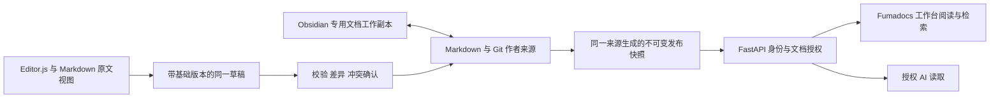

# workspace 成熟方案调研

资料核验日：2026-10-06。使用 GitHub 连接器核对仓库、源码、许可证与发布记录，使用 Firecrawl 阅读官方产品和技术资料，使用 Context7 交叉核对 Nextra、Keystatic、Decap、Fumadocs、Editor.js 与 Notion 的接口及工作流。本文是选型建议；正式需求仍以[专项 PRD](../product/prd/02-PRD-workspace项目知识库.md)为准，执行状态仍以[BACKLOG](../../BACKLOG.md)为准。

## 当前选择（2026-10-06 更新）

本人明确保留 Nextra，不迁移 Fumadocs，且仅需本机启动。以下比较保留为调研依据，其中此前推荐 Fumadocs 的结论已被本次选择替代。当前实施复用 Nextra、Markdown、Git 和 Obsidian，优先补齐应用入口、访问控制、同版本 AI 读取、网页编辑与冲突恢复；不增加服务器部署。

## 历史调研结论（Fumadocs 采用建议已撤销）

有成熟实现可以复用。“普通 Markdown + Git + Obsidian + 应用内网页入口”适合当前开发用途，主要缺口是应用接入、权限与双端写入流程，换一个静态文档站不能消除这些缺口。

按产品负责人明确的开发用途、框架复用与网页编辑偏好，方案采用现有 Ripplesight frontend 内的 Fumadocs Core 与必要 UI，采用 Editor.js 编辑视图并保留 Markdown 原文视图；退出 Nextra 独立站，不采用 GitBook。普通 Markdown、Git 和 Obsidian 继续承载作者内容，FastAPI 统一负责身份、文档授权、同版本读取、草稿与发布。Notion 已有可用的 Markdown API，是可选替代路线，但尚未采用，不同时维护两个主来源。

Keystatic、Decap 是成熟的 Git 编辑工具，但其默认 GitHub 登录和仓库写权限并不等于 Ripplesight 的读取、修改、发布权限。SilverBullet 是完整的文件型网页知识库；接入当前工作台的样式与权限仍需要适配。本次评估的产品中，未发现无需适配就同时满足普通文件双端编辑、现有页面样式、现有权限和全部 AI 出口控制的方案；独立产品保留为市场资料，不纳入本期实现。

选型先通过 4–8 个净工作小时的接入验证，再确定新增依赖。本次没有安装这些候选依赖、修改业务接口或完成双端编辑验收。

## 当前实现与缺口

| 已核对的来源 | 当前行为 | 还需要做什么 |
|---|---|---|
| workspace 的 next.config.mjs 与页面实现 | Nextra 静态导出；普通 Markdown 编译；公开页面清单决定发布范围 | 内部权限不能依赖静态页面门禁 |
| workspace 的 content/check/export 脚本 | frontmatter、命名、相对链接和索引校验；公开 raw、llms.txt、全文包；当前公开清单有 28 页 | 受保护快照、统一版本标识与内部 AI 读取 |
| frontend 的 workspace/page.tsx | 工作台已经存在，尚无项目知识库入口 | /workspace/docs、文档详情、目录、阅读和编辑状态 |
| frontend 的 editor/content.ts | 业务 Markdown 会转换为 Editor.js 块，存在格式损失 | 阅读直接渲染 Markdown；富文本编辑另建保留来源的块映射，不能直接使用现有转换重写文件 |
| backend 的 knowledge/services.py | 当前负责日报业务导出 | 在该领域下增加项目文档切片，保持业务与项目资料的边界 |
| [PROJECT §11](../../PROJECT.md#11-项目文档知识库接入方案待审查) | 读写发布允许清单、不可变快照、专用工作副本等已经写入待审查方案 | 这些接口、权限与草稿能力尚未实现 |

本次推送的 Workspace site 工作流，其构建与 Pages 部署任务已成功，见[运行记录](https://github.com/StephenQiu30/Ripplesight/actions/runs/37417404223)。这证明公开预览发布任务成功，不证明内部授权、AI 回答或双端编辑已经可用。README 已区分当前工程结果与目标路线，VERIFICATION 的较早描述保留为历史；Nextra 代码、依赖及发布工作流尚未实际退出。

## 成熟方案比较

下表的适配判断针对本项目需求，不是产品的通用排名。文件兼容表示能够使用 Markdown，不代表任意文档经过富文本编辑后都能无损往返。

| 方案 | 已核实能力 | 与当前需求的差距 | 建议 |
|---|---|---|---|
| [Nextra](https://nextra.site/docs/advanced/remote) | Next.js 文档框架，支持远程内容、自定义组件和主题 | 通用文档框架；Git 编辑、应用授权、发布流程仍需接入 | 原生入口验收后退出，保留文档工具 |
| [Fumadocs Core](https://www.fumadocs.dev/docs/headless) | 可脱离 Fumadocs UI 使用；导航、目录、插件与内容接口可组合 | 不代替 Ripplesight 的文档访问策略；服务器 Loader 不是浏览器 API | 纳入方案，按需组合 UI，在现有应用内接入 |
| [Keystatic](https://keystatic.com/docs/github-mode) | 文件型 CMS，GitHub 分支选择与网页编辑；支持配置 .md 扩展名 | GitHub 模式要求仓库 write 权限；本地模式没有现成应用鉴权；保存会序列化元数据 | 可做编辑后台备选，暂不作为正式入口 |
| [Decap CMS](https://decapcms.org/docs/editorial-workflows/) | Markdown、Git 后端、草稿分支与 PR 审阅发布 | 默认使用 GitHub 登录与 push 权限；接入 Ripplesight 需要后端与认证适配 | 复用其 Git 工作流思路，保留独立编辑备选 |
| [SilverBullet](https://github.com/silverbulletmd/silverbullet/blob/main/README.md) | 自托管浏览器 Markdown 编辑器；文件型 Space；CodeMirror 6 | 自带前端、服务端、身份与扩展体系；统一界面和权限需要改造 | 希望快速获得独立文件型知识库时可选 |
| [Quartz](https://github.com/jackyzha0/quartz) | 发布笔记与数字花园，适合文件作者与网站读者的组合 | 网页作者工作流与 Ripplesight 权限不是它的核心能力；现有内容没有大量 Obsidian 特有语法 | 当前没有迁移收益 |
| [Wiki.js](https://docs.requarks.io/storage/git) | 完整 Wiki，Git 存储模块支持双向同步 | 官方模块要求专用仓库，不能只同步子目录；另有数据库、界面与授权体系 | 多人独立 Wiki 的备选 |
| [Outline](https://github.com/outline/outline) | 成熟的独立协作知识库产品 | 本次未找到针对现有 vault 的原生 Git 双向编辑链路；数据库内容与 Markdown 往返需要额外验证 | 多人协作产品参考，当前不优先 |
| [GitBook](https://gitbook.com/docs/docs-as-code/git-sync) | 网页与 Git 双向同步；托管文档与 AI 出口 | 单独的产品界面和内容模型；满足认证访问的套餐有费用 | 排除采用，保留市场能力资料 |

### 编辑工具的具体边界

Keystatic 的官方 [MDX 字段](https://keystatic.com/docs/fields/mdx)允许 `extension: 'md'`，因此不能简单说它只支持 MDX。Context7 指向的 required-files 源码显示，它会解析并重新序列化 frontmatter；自定义字段、HTML 注释、Mermaid、中文路径与根文件指针仍需用现有样本验证。GitHub 模式有自己的 OAuth 路由与会话；“外层页面已登录”不等于它的所有数据接口已经受 Ripplesight 保护。[接口来源](https://github.com/Thinkmill/keystatic/blob/main/_autodocs/endpoints.md)

Decap 默认保存会提交到发布分支；启用 editorial_workflow 后，保存草稿变为分支和 PR，发布变为合并。GitHub 后端要求用户具有仓库 push 权限，并需要认证服务。[GitHub 后端](https://decapcms.org/docs/github-backend/)、[编辑工作流](https://decapcms.org/docs/editorial-workflows/)。这些机制成熟，但将其嵌入工作台后仍要解决三种应用权限、字节保留与发布失败恢复，不是配置一个 URL 就完成。

SilverBullet 的当前 README 显示客户端使用 CodeMirror 6，服务端已使用 Rust；不能沿用旧文章中的 Deno 部署描述。它说明“浏览器编辑同一组 Markdown 文件”是现成产品路线，但不是可直接替换 Ripplesight 前端的无样式组件。[当前源码说明](https://github.com/silverbulletmd/silverbullet/blob/main/README.md)

### 成熟度与许可证快照

GitHub 数据采集于核验日，最近 push 是仓库活动指标，可能来自文档、机器人或开发分支；Star 和 push 都不能证明部署质量。下面仅用于观察维护规模与许可，不作为唯一选型依据。

| 仓库 | Star | 最近 push，UTC 日期 | 仓库许可 |
|---|---:|---|---|
| [shuding/nextra](https://github.com/shuding/nextra) | 13,934 | 2026-07-31 | MIT |
| [fuma-nama/fumadocs](https://github.com/fuma-nama/fumadocs) | 13,299 | 2026-10-05 | MIT |
| [Thinkmill/keystatic](https://github.com/Thinkmill/keystatic) | 2,435 | 2026-10-01 | MIT |
| [decaporg/decap-cms](https://github.com/decaporg/decap-cms) | 19,415 | 2026-10-02 | MIT |
| [silverbulletmd/silverbullet](https://github.com/silverbulletmd/silverbullet) | 6,226 | 2026-10-05 | MIT |
| [jackyzha0/quartz](https://github.com/jackyzha0/quartz) | 13,328 | 2026-10-04 | MIT |
| [requarks/wiki](https://github.com/requarks/wiki) | 29,010 | 2026-10-05 | AGPL-3.0 |
| [outline/outline](https://github.com/outline/outline) | 40,817 | 2026-10-06 | Business Source License 1.1 |
| [Vinzent03/obsidian-git](https://github.com/Vinzent03/obsidian-git) | 12,069 | 2026-10-04 | MIT |

Outline 的 GitHub 元数据返回 NOASSERTION，实际 [LICENSE](https://github.com/outline/outline/blob/main/LICENSE)是 BSL 1.1，不能按无许可证或 MIT 项目处理。按现有[开源复用决策](../decisions/08-优先复用开源项目.md)，AGPL 只参考或作为独立服务；候选依赖的具体包与传递依赖仍要在锁定版本后检查并署名。

本次读到 Fumadocs [16.16.2 稳定发布](https://github.com/fuma-nama/fumadocs/releases/tag/fumadocs%4016.16.2)与 Decap [3.16.3 稳定发布](https://github.com/decaporg/decap-cms/releases/tag/decap-cms%403.16.3)。Keystatic 的 GitHub Releases 查询为空，不能据此推断其没有 npm 发布。CodeMirror 的旧 GitHub 开发仓库已经归档，README 明确说明迁站；官方仍提供 [MIT 编辑器与 Markdown 支持](https://codemirror.net/)，不能把归档误判为停止维护。

### 费用与托管选择

GitBook 免费计划确实包含 Git Sync、Markdown/llms 导出与 MCP，并非所有 AI 读取能力都收费。但官方价格页将 Authenticated access 列在 Ultimate，年付折算每站每月 249 美元，另列每用户每月 12 美元；免费 Git 同步不能推出“内部认证知识库也免费”。[官方价格页，核验日实时读取](https://www.gitbook.com/pricing)

推荐的现有应用与开源组件路线不增加 SaaS 许可订阅，也不需要付费模型；继续使用本机 Codex。Fumadocs 为 MIT，Editor.js 核心为 [Apache-2.0](https://github.com/codex-team/editor.js/blob/next/LICENSE)，不能把全部编辑组件统称 MIT；插件与锁定版本仍需核对许可和署名。主机、备份、存储与维护仍占资源。GitBook 不进入本期选型，以上费用只作为市场调研快照。

## 历史候选架构（当前按上文 Nextra 本机方案实施）

### 内容与部署

普通 Markdown 继续是唯一作者格式。现有公开资料留在原仓库；新增私密资料使用受保护目录或私有文档仓库，迁移期间旧站公开清单与内部应用清单分别校验。目录结构、编号与 frontmatter 不为 CMS 改写。BACKLOG、PROJECT、AGENTS 保持现有根文件唯一来源，指针映射只在读取层展开。workspace 最终保留作者资料与校验、索引、快照工具，不运行独立网站。

作者工作副本、持久草稿、发布快照是三个不同的存储角色。backend 只读已经验证的完整快照；后续 Git 写入流程在明确的宿主位置执行，只处理登记的文档路径。快照包含文档清单、作者源路径、来源 revision、正文 hash、附件和同版本索引。先完整构建再切换读取版本，服务重启不丢草稿，失败仍能读上一版本。

不在 frontend 的 public、构建产物或公共搜索索引中放受保护正文。初期文档正文不必进入业务数据库；草稿与操作状态是否使用现有 PostgreSQL，在编辑设计中确定，不能只保存在浏览器或临时容器层。

### 前端阅读与编辑

唯一网页路径为 /workspace/docs，在 BasicLayout 内接入 Fumadocs Core 与必要 UI，复用主题、会话和 shadcn/Radix 语义组件。导航、目录、搜索和阅读交互使用框架，正文与预览可复用现有 marked、sanitize-html；授权 API 的目录适配为 PageTree，搜索仍走生成客户端。Fumadocs 不单独部署，框架主题与全局布局的组合在样本中验证。[Core](https://www.fumadocs.dev/docs/headless)、[UI](https://www.fumadocs.dev/docs/ui)

本轮读取的 Core 与 Radix UI 包均声明版本 16.16.2，peer 范围含 Next 16、React ^19.2，涵盖当前应用的主版本；这不代表完整依赖或运行验收。当前官方 UI 默认 Base UI，也支持直接安装 Radix 版 `fumadocs-ui`；本项目优先保留现有 Radix 体系，接入前锁定对应发布包并验证 CSP、主题与无障碍。[Core 包声明](https://github.com/fuma-nama/fumadocs/blob/dev/packages/core/package.json)、[Radix UI 包声明](https://github.com/fuma-nama/fumadocs/blob/dev/packages/radix-ui/package.json)、[组件库选择](https://www.fumadocs.dev/docs/ui/component-library)

网页编辑优先采用已安装的 Editor.js 核心，封装在 components/ui；它输出块 JSON，不是 Markdown 原文编辑器。项目需建立保留来源的适配层，富文本与原文视图共用草稿、source hash 和预览策略，未改区域保持原样，支持块的修改回写 Markdown；frontmatter、注释、Mermaid、代码语言及未知语法保留原文，不支持的内容转到原文视图编辑。现有 `markdownToDocument()` 未保留代码语言和表格对齐等信息，不能直接承担这个往返流程。[官方保存格式](https://editorjs.io/saving-data/)

Fumadocs Loader 是服务器 API，不能直接放进浏览器；默认搜索客户端也不能绕过 src/api 与 request.ts 规则。PageTree 可按类型由授权数据生成，不承载正文或私密大字段；目录、正文与搜索仍来自同一快照。不另建 Next.js 文档数据后端。[Loader API](https://www.fumadocs.dev/docs/headless/source-api)、[PageTree](https://www.fumadocs.dev/docs/headless/page-tree)

### 权限与 AI 出口

保留 PROJECT 中的读取、修改、发布三类允许清单，默认不授权。页面、目录、摘要、搜索片段、原文、附件和 AI 工具使用同一文档访问策略。登录只证明身份，不自动授予项目资料读取权。写入继续校验同源与 CSRF，受保护响应使用 private, no-store。

AI 最小能力是目录发现、搜索和逐页原文读取。Fumadocs 的官方 MCP 工具正是 list_pages、get_page、search，可作为接口形状参考；其工具注册器不提供本项目的授权规则。本项目优先复用 backend 的同版本读取服务，远程 MCP 再按真实客户端需要接入独立的项目文档命名空间。[MCP 工具说明](https://www.fumadocs.dev/docs/headless/utils/mcp)

每次实质性引用携带文档路径、章节、来源 revision 和快照标识。默认排除草稿与废弃规则；回答目标、实现和验收时分别核对 PRD、代码与记录。llms.txt 是发现入口，不能替代认证、检索或真实 AI 使用验收。优先本机 Codex，远程客户端的身份方式单独验证，不将业务公开 MCP 变成内部文档入口。

### Obsidian 与版本汇合

使用专用文档工作副本，避免自动提交主开发目录中的业务代码。现有内容在该工作副本中保持原路径；若需要离线编辑根文件，可把专用 checkout 根目录作为 Obsidian vault，并在本机配置中排除 backend、frontend 与构建目录的索引。仍使用 content 作为 vault 时，根文件的生成副本必须标明只读来源；修改回到实际根文件，不编辑副本。

Obsidian Git 可提供桌面拉取、提交、推送和差异查看，但其默认 commit-and-sync 会提交全部改动。首期采用人工确认与明确的路径暂存；不能将该插件默认自动同步直接用于含业务代码的工作副本。官方 README 同时明确手机端不稳定，移动端不纳入首期保证。[插件说明](https://github.com/Vinzent03/obsidian-git/blob/master/README.md)

网页保存携带基础 revision 与源文件 hash。保存到持久草稿后，发布再检查版本；若 Obsidian 已提交新版本，比较基础、本地与远端三份内容。同一文件同一区域的修改展示冲突并保留双方草稿，由本人确认后发布；不按最后写入时间覆盖。

有网页权限不意味着用户有整个 Git 仓库的写权限。Git 凭据由受保护的宿主流程管理，浏览器只提交文档修改请求。已同步到本人设备的资料属于本地文件权限边界，网页撤销访问不会自动删除离线副本。

### 检索的选择

28 页规模先做章节、标题、摘要、正文与状态的关键词检索，不引入向量数据库。中文效果以 PRD 的 20 条固定查询为准；标题与生效状态参与排序，原文和结果来自同一快照。

Fumadocs 有 FlexSearch、Orama 等搜索适配器。其 FlexSearch 官方示例支持 CJK 编码，但静态模式会把整个索引下载到客户端，不适合未授权访问的资料。当前 FastAPI 边界下，先在 backend 内实现小规模、可重建的章节检索；如验收不达标，再评估将成熟搜索引擎作为 backend 内部依赖或服务，并单独核验运行环境、许可证和中文样本。不能为了接入默认示例而新增一套公开 Next 搜索出口。[搜索适配器](https://www.fumadocs.dev/docs/headless/search)、[FlexSearch 与静态索引说明](https://www.fumadocs.dev/docs/headless/search/flexsearch)

## 网页编辑、文档管理与 Notion

### Fumadocs 与 Editor.js 的组合

Fumadocs 的内容处理层支持 `.md` 和 `.mdx`，官方明确它不是完整 CMS。项目保留 `.md` 作者文件，在现有工作台内组合框架的目录、阅读和搜索交互；持久编辑、权限、版本与发布由应用负责。[内容层说明](https://www.fumadocs.dev/docs/mdx)

官方另有 `fumadocs-obsidian` 内容适配，可直接读取 Vault 并渲染双链、嵌入、Callout、块 ID 和注释，不需要生成中间 MDX。它提供读取和渲染能力，不代替网页编辑、Git 汇合或本项目权限。当前文档规则仍要求标准 Markdown 链接；是否复用适配器由样本决定，不能照搬 `public/vault` 示例公开内部资料。[Obsidian 内容适配](https://www.fumadocs.dev/docs/integrations/content/obsidian)

页面提供富文本、原文、预览、差异与版本历史。Editor.js 是块编辑器，`save()` 返回包含 blocks 的 JSON，不能将“富文本编辑器”直接等同“无损 Markdown 编辑器”。本项目已经有核心依赖和 Viewer，但尚无适用于项目文档的编辑回写链路。YAML 未知字段、HTML 注释、代码语言、Mermaid、表格对齐和链接定义都要加入样本；仅修改支持的块，未支持内容保留原文块，两个视图不能各自保存一份独立正文。[保存格式](https://editorjs.io/saving-data/)

项目文档按职责组织：PRD 定目标与验收，决策记背景、候选、选择和影响，PROJECT/AGENTS 记技术及工程约定，PLAN 拆任务，BACKLOG 记实际状态，records 记真实结果。页面展示相互关联和源版本；保存草稿不自动让规则生效。决策替代保留旧记录，由本人同意后变更状态并建立新记录，AI 默认读取发布快照中的生效规则。

### Notion 能否直接采用

可以直接把 Notion 作为产品文档工作区，用页面和数据库属性组织 PRD、决策、计划与状态，网页编辑已有现成产品体验。当前官方 API 同时提供 Markdown 读取与更新，不需要把每次读取都手工转换为块请求；因此不能沿用“Notion API 只能读块 JSON”的旧结论。[读取接口](https://developers.notion.com/reference/retrieve-page-markdown)、[更新接口](https://developers.notion.com/reference/update-page-markdown)

Fumadocs 也有官方 `@fumadocs/notion` 集成，读取 Notion 数据源并在服务器渲染块，因此选择 Fumadocs 不妨碍以后选择 Notion 来源。该集成不是嵌入完整 Notion 编辑器，也不提供本项目的写入和授权流程；若采用，应由 backend 汇入授权快照并适配现有 API，而非直接照搬 Next 服务端与文件路由。[Notion 内容适配](https://www.fumadocs.dev/docs/integrations/content/notion)

| 路线 | 作者主来源与网页编辑 | Obsidian 与应用接入 | 取舍 |
|---|---|---|---|
| Fumadocs + Editor.js + Git | 原 Markdown；应用内富文本和原文视图 | 保留文件双端编辑，Ripplesight 授权与版本流程 | 满足当前目标，但要开发适配、草稿和发布 |
| 直接使用 Notion | Notion 页面和数据库；在 Notion 编辑 | 初期导出为 Obsidian 阅读副本，AI 经授权 API/MCP 读取 | 最快获得成熟文档产品；改变普通文件作为主来源及统一网页入口的要求 |
| Notion 作为 Ripplesight 的内容后端 | Notion 主写；Ripplesight 自建编辑界面，经 API 写回 | backend 维护 page ID 映射、授权与快照，再给 frontend | Fumadocs 可继续显示，但仍需编辑、版本及同步适配，不能等同直接嵌入完整 Notion 编辑器 |

官方 Markdown 是 enhanced Markdown，部分块有扩展表达；读取可能出现 `truncated` 和 `unknown_block_ids`，既可能是页太大，也可能是连接没有子内容权限。不能把截断或未知块当空内容保存回去。官方导出也会将部分内容转为 HTML，并把数据库导出为 CSV 与子页 Markdown；可导出不证明 YAML、关系和普通 Markdown 可以无损往返。[Markdown 内容指南](https://developers.notion.com/guides/data-apis/working-with-markdown-content)、[导出说明](https://www.notion.com/help/export-your-content)

Notion Free 适合个人试用，个人页面与块不限量，但单附件 5 MB、页面历史 7 天；内置 AI 能力含试用限制，不能把免费文档套餐解释成免费无限 AI。[实时价格核验](https://www.notion.com/pricing) 若采用来源后端，连接必须被授予页面访问权，Ripplesight 用户权限仍由应用自己校验，不能把服务连接可见范围自动授予所有登录用户。[连接授权](https://developers.notion.com/guides/get-started/authorization)

建议先保持当前文件主来源路线。若优先级转为“立刻使用成熟网页编辑”，可改为 Notion 主来源、Obsidian 只读镜像；若仍要求两端主写，需要额外验证页 ID、目录映射、关系、附件、版本冲突和恢复，不能同时让 Notion 与 Git 不受约束地主写。当前尚未连接 Notion 或迁移任何内容。

## 程序员七七的 workspace 公开资料

核对了本人提供的两个抖音链接和公开社区。第二条可读到作者、描述与发布日期，确认“一项目一 workspace”内容；第一条短链解析到具体视频，但抓取返回视频加载页和验证码，未读取播放内容。以下区分公开实读、本人提供的说明及尚未取得的资料，不推断不可见技术栈。

| 资料 | 核对结果 | 能证明什么 |
|---|---|---|
| [一项目一 workspace](https://www.douyin.com/note/7687094034225928891) | 作者为程序员七七，公开描述，发布于 2026-09-19 | 强调项目知识工作区及 AI 研发交付范式；未披露完整框架或编辑器 |
| [语音播报提效视频](https://www.douyin.com/video/7688056263297627577) | 本人分享说明包含 AI2CC、MiniMax 声音复刻、Codex 接入 TTS、切片及前端时序跟随；播放内容未实读 | 说明所分享的体验目标与语音组件，不能据此确定文档存储、权限或前端框架 |
| [AiCoding 公开社区](https://www.chat4j.com/aicoding) | 列出署名程序员七七的 workspace 文章、方案和搭建教程 | 可发现相关资料与作者；标题并非实现证据 |
| [workspace 文章](https://www.chat4j.com/star/exp/225)、[搭建教程](https://www.chat4j.com/star/video/330) | 页面提示未订阅，正文及视频未取得 | 资料存在，不能声称已读到源码或技术栈 |
| [AI2CC 项目入口](https://www.chat4j.com/aicoding/project) | 提示登录并验证文档权限 | 有项目文档权限入口；实际权限实现未核对 |

GitHub 按 AI2CC 搜索未找到可确认属于该作者的公开仓库；这不证明源码不存在。Chat4j 首页的 Spring Cloud 等其他课程技术栈不作为 workspace 的实现依据，也没有证据证明作者使用了 Fumadocs、Editor.js 或 Notion。

适合借鉴的产品做法是：一个项目维护自己的资料来源和版本；人和 AI 阅读同一份已确认知识；AI 产出的 PRD 与方案先进入草稿，审查后生效；界面提供分类、关联、章节定位和编辑。语音播报可作为后续阅读体验参考，本期不追加 TTS 或声音复刻实现。

## 历史估算与验证门槛

建议沿用现有[执行计划](../product/plan/01-PLAN-workspace项目知识库.md)的阅读、AI、编辑三阶段，不因为组件成熟就删除权限、冲突与真实验收工作。下面细化选型验证，不是重新承诺 Sprint 容量。

| 顺序 | 交付 | 必须验证 |
|---|---|---|
| 接入验证，初估 4–8 净工作小时 | Fumadocs Core/UI 文档样本、Editor.js 与原文视图往返、文档类型及关联 | 依赖、严格 CSP、主题、桌面与 390px 窄屏、键盘、中文输入法、未知语法及未改区域保留 |
| 阅读阶段 | 来源清单、不可变快照、授权 API、工作台阅读、Obsidian 离线原文；退出 Nextra 并迁移文档 CI | 所有登记页面、根文件、相对链接、锚点与附件；所有未授权出口拒绝；不依赖独立文档站 |
| AI 阶段 | 同版本搜索、逐页 Markdown、版本引用、本机 Codex 读取 | 前五结果 20 题至少 18 题命中；真实答案 20 题至少 18 题正确，不能用搜索成绩替代答案成绩 |
| 编辑阶段 | 持久草稿、Git 版本汇合、冲突确认、发布和恢复 | 5 类文件双向往返；冲突、重复保存、失败和结果未知均可恢复，静默覆盖为零 |

接入验证样本至少覆盖 PRD、能力、决策、调研与根文件，包含额外 YAML 字段、注释、表格、Mermaid、中文链接与重复章节名。原文未修改时字节不变；发生修改时，未编辑区域不被非预期改写，内容与元数据无丢失。只有通过样本才锁依赖版本并开始正式接入。

首期实现顺序仍是来源快照和授权 API 在前，Fumadocs 阅读 UI 在后；UI 与 AI 不直接扫描源仓库。Editor.js 先做格式往返样本，再开放草稿、回写与发布；格式失败时保留原文视图，不降低完整性要求。当前不引入 SilverBullet 或 Keystatic 独立后台，Notion 来源路线尚待取舍。

## 历史 PRD 与计划建议（不再作为当前框架选择）

PRD 的普通 Markdown、统一入口与权限、分阶段交付和 Git 汇合方向保持；已同步 Fumadocs、Editor.js、原文视图及 PRD、决策、PLAN 管理规则。Notion 的采用条件保留为可审查替代路线，尚未改变当前作者来源。依赖与插件在格式、CSP、中文输入和恢复样本后确定，不降低 KR。

Nextra 代码与依赖目前保留为待退出实现；原生阅读入口复核后删除独立页面、框架依赖、补丁与站点专属链路，将 Pages 工作流改为文档校验和快照检查。保留 Markdown、模板、文档测试及可复用脚本，无需迁移到 Quartz 或将文件改成 MDX、CMS 块、数据库作者记录。构建和索引是可重建产物，草稿与发布版本须有持久、可核对的来源；迁移工作量在方案任务中核对并调整排期。

本报告包含官方资料、局部源码和作者公开页面，未取得订阅内容或完整实现。尚未验证完整传递许可、真实身份、中文检索、Fumadocs/Editor.js 在当前 CSP 下的行为、格式往返、Notion 数据接入、真实双端同步和目标环境恢复；这些归入对应接入与阶段验收。

## 资料获取与交叉核对

Context7 前序查询 Nextra、Keystatic、Decap，本轮追加 /websites/fumadocs_dev、/websites/editorjs_io 和 /websites/developers_notion，核对框架、块保存格式与 Markdown API；关键结论再读原始官方页面或源码，摘要不作为产品验收证据。

Firecrawl 主要获取官方文档、GitBook 与 Notion 实时价格、作者公开页面及内容配置；GitHub 直接检查仓库元数据、关键 README、许可证、Fumadocs 包声明、稳定发布与当前 Pages 工作流。搜索中出现的第三方文章用于发现线索，没有用它们证明关键能力。未显式要求实时读取的网页抓取可能命中近期缓存；以上均是核验日资料快照，部署前应核对所选具体版本。
