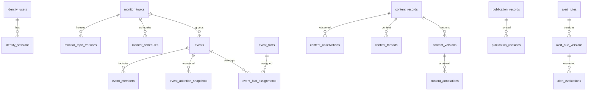

# 全站页面数据库设计

本设计支持[全站页面需求](../prd/03-PRD-全站页面需求.md)，继承[关键词监控数据库设计](07-关键词监控数据库设计.md)及 [PROJECT](../../../../PROJECT.md)。现有 123 张表的字段、主外键、CHECK 与索引见[完整字典](13-现有数据库字典.md)。**唯一可执行建表源仍是 `backend/database/schema.sql`；本轮只设计，不修改 DDL/ORM、不连接业务库写入、不建立第二份 migration。**

## 领域分工与读取关系

| 页面族 | 现有持久化源 | 不应该另存什么 |
|---|---|---|
| 登录、账户 | identity_users / identity_sessions，个人通知配置 | 明文密码、会话 Cookie、第三方令牌 |
| 主题、来源、任务 | monitor_topics / versions / schedules；source_connections / versions；jobs / attempts / stages；due/coverage windows | 页面副本主题、靠浏览器定时器代替调度、只记录成功任务 |
| 内容、评论 | content_records 身份，versions 正文，observations 观测，threads 父链，visibility 状态，annotations 分析 | 每个主题重复一份正文、拿抓取时间覆盖发布时间 |
| 事件 | events / members / facts / attention_snapshots / story_links | 热度图像文件当原始数据、没有输入版本的情感百分比 |
| 公开阅读 | publication_records / revisions / policy_versions / selected_changes | 从 content_records 直接匿名读取本人资料 |
| 刊物与报告 | report_editions / reports / exports / notifications | “最新一期”另存一份不含修订的正文 |
| 模型榜 | leaderboard_models / aliases / snapshots / scores / rankings / prices / source_states | 不含来源和轮次的单一分数或跨币种裸加总 |
| 运营 | audit、feedback、site configurations、budget、AI calls | 运营令牌和来源凭据明文 |
| 项目文档 | Markdown、Git、文档草稿/操作文件、不可变快照 | PostgreSQL 第二份需求正文与第二套进度表 |
| 当前收藏 | 浏览器 localStorage 的 ID、时间和阅读位置 | 未经选择的云端浏览历史、原始全文 |

此图只展示选定已存在关系，不是全部 123 表 ER 图；owner 到 identity_users 并非所有旧表都有物理外键，不在图中虚构。完整约束以字典和 schema 为准。每页有单独的数据表映射；主题规则版本没有 owner 字段时，必须先校验主题归属再读取。

## 数据口径

| 数据 | 主键／唯一性与更新策略 | 使用边界 |
|---|---|---|
| 平台内容身份 | owner + source + object_type + native_scope + external_id，NULLS NOT DISTINCT | 同平台同对象去重；不同平台相似文本不合并作者或评论 |
| 正文版本 | owner + content_id + fingerprint 唯一，不可变 | 重抓相同正文不增加新正文；编辑产生新版本 |
| 观测 | owner + content_id + source_operation_id 唯一 | 互动计数可空，抓取、接收与发布各有含义 |
| 评论父链 | owner/content_id 主键；原帖、根、父和 reply target 独立关联 | 数据库禁止直接自父，但多跳环、平台/原帖一致性还需服务校验 |
| 主题版本 | topic_id/version 主键，当前版本单独引用 | 旧 Job 保留旧规则；不能重新套用当前词表修改历史结果 |
| Job | owner/kind/operation_id 幂等；租约、attempt、checkpoint 分开 | 网络结果未知仍占保守预算，不能宣称外部请求 exactly-once |
| 公开投影 | owner/content_id 主键，revision 单调增加 | publisher owner 与阅读用户是不同概念；读取始终复核许可 |
| 情感 | 现有 annotations 的布尔 relevant 与 sentiment 约束耦合 | 四档相关性需要契约升级；不能直接由 null 推断中性或无关 |
| 热度 | event/revision/window/formula/input fingerprint 唯一 | 可比输入及覆盖改变时不可直接拼接百分点变化 |
| 刊期 | 自然日/周/月 + 固定修订，完整区间结束后编选 | 最近目录是查询视图，不是恒定刊期 ID |

## 最小增量设计（均未建表）

只为页面缺失的持久行为加结构，先以现有表和查询视图完成公开概览、趋势、私有热度和运行状态；不为每张卡片建表。以下数值是工程提案，需要按独立库和基准验证。

### 云收藏：reading_bookmarks

仅在用户选择云收藏后启用。本机收藏继续工作；同步不是默认迁移。

| 拟字段 | 类型／约束 | 含义 |
|---|---|---|
| reader_id | UUID NOT NULL，FK identity_users(id) ON DELETE CASCADE | 归属阅读用户，不接受客户端指定 |
| publisher_scope_id | UUID NOT NULL | 服务器解析固定公开发布范围，不暴露给匿名客户端 |
| content_id | UUID NOT NULL | 稳定公开材料编号 |
| revision | BIGINT ≥1 | 乐观锁；重复相同请求不递增 |
| note | TEXT NOT NULL DEFAULT ''，字符数≤2000 | 本人备注，不是来源正文，不自动送模型 |
| saved_at,updated_at | TIMESTAMPTZ NOT NULL，updated_at≥saved_at | 收藏和最近修改；服务端时间为准 |
| deleted_at | TIMESTAMPTZ NULL | 同步删除墓碑，不代表源内容被删 |

主键 `(reader_id,publisher_scope_id,content_id)`；活跃列表索引 `(reader_id,updated_at DESC,content_id)` WHERE deleted_at IS NULL。目标不设置指向私有 content_records 的跨域 FK：公开材料许可撤回或清理后可保留用户的 opaque ID 和本人备注；读标题/来源必须重新授权，不能保存被撤回的正文快照。目标有效性由公开发布服务校验，不使用这个设计掩盖遗漏的 owner 校验。硬删除账户时级联删除本人备注；普通取消保留精简墓碑，不因为30天无访问就恢复成从未存在的记录。

本机导入只传 ID、原收藏时间与本人备注。服务器报告逐项冲突；默认合并 ID，不覆盖云端新备注。跨设备时间不能决定覆盖顺序，使用 expected_revision。同步墓碑在云保存有效期间保留 ID/修订/删除时间，去掉备注；只有显式清除账号云数据才硬删。同步读返回墓碑，旧 expected_revision 写入409，不会在30天后复活；重新开启云保存必须明确执行全量核对，不自动上传离线队列。

### 关注事件：reading_event_follows

拟字段：`reader_id UUID`、`resource_kind VARCHAR(16)`（public_story/private_event）、`scope_id UUID`、`event_id UUID`、`revision BIGINT`、`created_at/updated_at TIMESTAMPTZ`、`deleted_at TIMESTAMPTZ NULL`。主键为 reader/resource_kind/scope/event；reader FK 级联，列表索引 reader/updated_at/event。公开目标通过发布范围解析，私有目标须等于本人合法 owner。服务统一验证合并/撤回事件的后继关系，不自动关注其他用户事件。这里只保存关注状态，不意味着启用通知或创建采集主题。

### 个人阅读写入回执：reading_operations

拟字段：`reader_id UUID`、`operation_id UUID`、`kind VARCHAR(32)`、`request_hash BYTEA（CHECK 长度32）`、`status VARCHAR(16)`、`response JSONB NULL`、`created_at TIMESTAMPTZ NOT NULL`、`completed_at TIMESTAMPTZ NULL`。PK `(reader_id,operation_id)`，kind 在有限白名单中，status 为 accepted/succeeded/partially_succeeded/failed/expired；reader FK 级联，job_id UUID 可空；hash 长度检查；response 为最小回执，不含全文、令牌或完整备注。同步写与回执同事务；导入任务复用 jobs/outbox，回执通过 job_id 与 (reader_id,job_id)→jobs(owner_id,id) 复合 FK 绑定；非异步写 job_id 为空。同 ID 不同 kind/输入也冲突。

完整回执提议保留30天；之后只清空 response、将 status 置 expired，保留 reader/operation/kind/hash 和时间至账号数据清除。旧操作键返回410需重新同步，不当从未发生；这样服务器确实能够识别过期键，而非删除后空谈禁止重放。大批量导入先受理，逐项结果可分页，限制一次 500 条。

### 主题运行批次：monitor_run_batches 与 monitor_run_batch_sources

现有 jobs 可以追踪每个来源任务，但页面还需要保存“全部来源跳过”的一次点击。拟新增批次回执，而不是再建第二套 Job 状态机。

| 表 | 关键字段 | 键、索引、约束 |
|---|---|---|
| monitor_run_batches | id/owner_id/topic_id/operation_id UUID NOT NULL；topic_version INTEGER≥1；request_hash BYTEA（CHECK octet_length=32）；trigger VARCHAR(16) manual/scheduled；window_start/end TIMESTAMPTZ 同空或 start<end；created_at TIMESTAMPTZ NOT NULL；result_ready_at TIMESTAMPTZ NULL | PK id；UNIQUE(owner_id,id)；UNIQUE(owner_id,operation_id)；FK(owner_id,topic_id)→主题；FK(topic_id,topic_version)→版本；索引(owner_id,topic_id,created_at DESC,id) |
| monitor_run_batch_sources | owner_id/batch_id UUID NOT NULL；source_key VARCHAR(64)；capability VARCHAR(64)；connection_version INTEGER≥1 可空；ordinal INTEGER≥0；job_id UUID 可空；skip_reason VARCHAR(64) 可空；created_at TIMESTAMPTZ | PK(owner_id,batch_id,source_key,capability,ordinal)；FK owner/batch；job 关联使用 owner/id 复合 FK（核对既有 jobs 唯一键后实施）；job_id 与 skip_reason 恰有一个 |

批次受理时冻结来源列表/配置和查询范围，在同一事务写 batch、来源行、jobs 和 outbox；全部 skipped 也返回可重读回执。不要保存可漂移的聚合“成功”列：聚合状态从子 Job 终态和 skip 原因计算，结果可读时间表示固定投影真正完成。定时批次从现有到期窗口建立，不能另建与 monitor_schedules 竞争的计时器。查询计数来自本批次证据，不扫描当前主题全部历史冒充本轮增量。

### 情感聚合：event_sentiment_snapshots

先保留现有 content_annotations 原始分析，不改成仅百分比。新表只在分析合同和样本验证通过后启用。

| 拟字段 | 类型与约束 |
|---|---|
| id,owner_id,topic_id,event_id | UUID；事件 owner/topic/event 复合 FK |
| event_revision,topic_rule_version | INTEGER ≥1；冻结事件和主题语义 |
| audience | private/public；public 仅受服务器发布策略控制 |
| window_start,window_end | TIMESTAMPTZ，start < end |
| contract_version,sample_method | VARCHAR；固定分类与采样说明，不自由填“准确率” |
| input_hash,policy_fingerprint | BYTEA（CHECK octet_length=32）；private 的策略指纹也不得为空或混用公开快照 |
| eligible_count,analyzed_count,positive_count,neutral_count,negative_count,unknown_count | 非负 INTEGER；analyzed=positive+neutral+negative；eligible=analyzed+unknown |
| input_manifest | JSONB 对象，引用每个 content/version/annotation 与许可修订；不复制全文 |
| complete,computed_at | BOOLEAN、TIMESTAMPTZ；complete 不意味着全平台全量 |

主键 `id`；topic_id/topic_rule_version 复合 FK 引用 monitor_topic_versions；所有字段除明确可空者均 NOT NULL，event_revision 必须与服务冻结快照一致。唯一键 `(owner_id,event_id,event_revision,audience,window_end,contract_version,input_hash,policy_fingerprint)`；读取索引 `(owner_id,event_id,audience,window_end DESC,computed_at DESC)`。同一评论只按身份计一次，重复采集不是新增样本；无法解释的时间或分析失败计 unknown，是否纳入 eligible 要由口径固定。代表观点引用必须来自同一冻结输入，有来源定位与上下文。

公开快照必须只含逐项可公开的输入；如果私有样本不允许公开，其存在和计数也不能泄露。许可收紧后旧 public 快照立即失效；先拒绝旧快照，再异步重算，不能先返回旧百分比。优先由当前服务做许可指纹校验，不把 audience 当唯一授权检查。现有 annotations v1 与拟议 v2 四档相关性不能静默合并，沿用[原增量设计](07-关键词监控数据库设计.md#四档相关性与情感解耦)。

### 告警已读：alert_read_states

拟字段：`owner_id UUID`、`evaluation_id UUID`、`read_at TIMESTAMPTZ NULL`、`revision BIGINT≥1`、`updated_at TIMESTAMPTZ`。PK(owner_id,evaluation_id)，FK(owner_id,evaluation_id)→alert_evaluations(owner_id,id) ON DELETE CASCADE。索引 owner/read_at/evaluation。无行默认未读，只统计本人当前可读且状态 triggered 的评估；withdrawn、无权限或已清理评估不保留红点。

配套拟表 `alert_read_operations`：`owner_id UUID NOT NULL`、`operation_id UUID NOT NULL`、`evaluation_id UUID NOT NULL`、`request_hash BYTEA NOT NULL`（长度32）、`status VARCHAR(16)`（succeeded/expired）、`response JSONB NULL`、`created_at TIMESTAMPTZ NOT NULL`。PK(owner_id,operation_id)；owner→identity_users级联；索引(owner_id,created_at)。不对 evaluation_id 设级联，评估清理后仍保留防重键，但原结果返回前须重验评估可读性；不返回已撤回标题。已读状态与成功回执同事务，30天后清空 response 保留精简防重键；旧键410不重放。不能借用其他领域 reading_operations。

### 不需要新增表的设计稿模块

| 模块 | 复用方案 | 必须补齐的条件 |
|---|---|---|
| 首页真实概览 | publication_records、公开事件/专题目录查询视图 | 同一时间窗、当前许可、来源独立性；容量不够再引入有版本的投影 |
| 热度历史 | event_attention_snapshots | 公私范围分开、可比公式、许可验证、缺口值 |
| X/平台趋势 | hotlist_snapshots / entries | 平台能力和许可真的通过；来源时间不当发布日期 |
| 模型名次变化 | 同一规则下历史 leaderboard_runs / rankings | 两轮可比且模型版本相同，否则 unknown |
| 主题命中趋势 | content_discoveries / topic_matches / due_windows 聚合 | 相关性规则、时间可信度、去重与未知桶 |
| 项目需求 | 现有 Markdown/Git 文档链 | 索引、路径、版本与文档允许清单更新 |

## 事务、索引与容量

1. 新写接口事务内执行身份/目标校验、比较版本、写入业务行和操作回执；异步追加 outbox 后提交。数据库重试不得重放已发送外部请求。
2. 聚合按 owner + 固定范围先缩小数据，再关联版本和许可；前端不拉全库做统计。游标用确定的复合排序，不能边翻页边换模型或窗口。
3. 概览、收藏、运行历史、评论父链、告警未读分别执行 EXPLAIN ANALYZE（独立库、代表性数据）；基线建议 100 万观测、10 万内容、1000 主题，数量为容量提案。只为确实出现的慢查询新增索引，不提前引入分区、向量库或新缓存服务。
4. JSONB 用于可复核 manifest 和配置，不替代需要筛选/唯一性/外键的核心 ID；关键布尔、时间、修订和数值须有 typed 字段。大正文继续保存在版本/证据或对象文件，不塞聚合响应。

## 留存、删除、迁移与恢复

- 现有资料受来源许可和 evidence retention 控制；去标识、撤回公开和物理清理是不同操作。删除前处理反向引用；不能把失败采集当来源删除。
- 云收藏备注随账号归属；明确取消与硬删除区别。仅存 opaque 目标 ID 也需按隐私策略清理；导出和日志不得包含其他用户备注。
- 新字段首先允许兼容的未知状态，旧布尔相关性不回填成 direct；没有输入证据的历史热度不伪造补点。回填保留批次、版本与可复算计数。
- 按现有工程规范：停写并备份 → 在独立库实际恢复 → 新空库执行唯一 schema → 导入并校验 → 切换 → 保留旧库回退。不能把新 schema 在现有业务库上直接执行。
- 验证各表行数、FK、唯一键、空值/时间/状态 CHECK，重放相同操作、模拟事务中断、租约过期、发布许可收紧、跨用户访问、墓碑过期客户端恢复。
- 回滚先停新写和 worker；检查新旧模型兼容后切换旧库/版本；不能仅回滚前端掩盖数据库已经接受的新结构。

详细功能追踪以每个[页面需求](../prd/03-PRD-全站页面需求.md#页面总表)及[验收场景](11-全站验收场景.md)为准。本设计完成不等于迁移执行或数据恢复通过。
