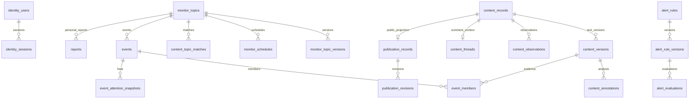

# 全站页面数据库设计

按Figma展示和操作设计最小存储；旧页面缺控件不是删需求的依据。本轮未新增业务表、未对业务库删表或迁移，唯一可执行DDL仍为[backend/database/schema.sql](../../../../backend/database/schema.sql)。以下目标设计与既有字典明确分开；聚合优先查现有事实，测量证明必要才物化。

## 原稿缺口的数据模型

| 需求/写入方 | 最小数据及键/约束 | 读取/索引与删除策略 | 是否需新表 |
|---|---|---|---|
| 收藏备注：当前浏览器用户 | UUID content_id → TEXT note，<=2000字符，最多500；关联仍在savedIDs；saved_at保留原收藏时间 | 20条按ID公开回读；本机按收藏顺序正/倒序；损坏拒绝覆盖；清空明确清notes | 当前localStorage，不建云表；类型扩展用kind+id并提供旧键迁移 |
| 事件关注：认证用户 | `(user_id,event_id)`唯一；created_at TIMESTAMPTZ；last_seen_revision与实际事件版本同型；version正整数 | `(user_id,created_at DESC,event_id)`；与事件修订关联计算新进展，删除关注删该关系，不删事件 | 需要最小关系表，拟名reading_event_follows；用户FK/事件owner边界在迁移时核验 |
| 告警已读：认证用户 | `(user_id,evaluation_id)`唯一；read_at TIMESTAMPTZ NOT NULL；不存告警正文 | `(user_id,read_at DESC,evaluation_id)`；必须验证evaluation属于用户，删评估级联删标记 | 可增加alert_read_states；无需操作账本，天然唯一键幂等 |
| 公开情感：已有分析流水线 | analysis引用的content_version、label、rule/model version、observed_at；聚合返回positive/neutral/negative/unknown counts和分母 | 去重按公开content identity；只统计同一window和版本；聚合版本必须可解释，撤权重算 | 优先content_annotations+公开投影查询；测量后才加物化快照，不能复制评论正文 |
| 24h热度：已有事件任务 | event_id、bucket_start TIMESTAMPTZ、window/model口径、heat、coverage | 复用event_attention_snapshots；明确其当前48h语义，必要新增口径列/版本而非重命名数值 | 先查历史能否满足；不要另建每页曲线表 |
| 24h命中：主题采集/匹配任务 | topic_id/rule_version/content_id/matched_at/source_key | 现有匹配去重；按主题+时间聚合24桶；加索引前EXPLAIN真实查询 | 查询content_topic_matches/observations，优先复用；不新建运行batch |
| 社媒趋势：准入来源快照 | source/snapshot_at、rank、native_topic、post_count、关联content/event IDs | 复用热榜快照及条目；不把缺数据置0，日报冻结对应snapshot引用 | 先复用hotlist存储；缺乏来源授权时不可启动新采集 |
| 日报讨论和舆情：编选服务 | 在现有固定revision结构引用观点/情感/趋势快照；全部带来源及统计窗口 | 读同一刊期revision；重新发布生成新修订；许可变化仅调整公开投影 | 扩现有刊期投影/修订载荷，不为每章节建表 |
| 榜单变化：榜单发布任务 | 当前/前期run_id、方法版本、model_id、rank | 在相同方法/筛选下连接两期；首次入榜需历史证据；不比较不同口径 | 复用已有run与rank结果；不复制模型或新增变化日志表 |

关注/已读表属于明确用户动作的最小设计，不是已部署结构。实施前验证实际标识类型、现有复合owner外键及保留策略；独立库验证唯一性、越权、并发、删除和恢复。NULL与0保持不同；时间UTC存储，窗口左闭右开。清理旧视觉不授权直接删业务数据。

## 先决定哪些数据需要保存

| 页面需求 | 保存地点 | 不应新增的存储 |
|---|---|---|
| 关键词/来源/频率、账号、告警阈值 | 现有PostgreSQL业务实体及配置版本 | 每页配置副本、通用键值配置平台 |
| 原始内容、观察、评论关系、固定引用 | 内容身份/版本/观察及关系表 | 每主题正文副本、单独评论正文表 |
| 首页4项全站统计、公开情感/24h趋势 | 受许可与窗口约束的聚合查询；缺合同为null | 每卡片数字表、用本页长度冒充总量 |
| 探索条件、页签、翻页 | URL；游标由服务端签发或验证 | 搜索会话、过滤组合、分页记录表 |
| 收藏ID/时间/备注、已读ID、阅读位置/主题偏好 | 当前localStorage；多类型需版本迁移 | 默认云同步、同步墓碑、阅读操作账本 |
| 选择导出、表单未提交草稿 | 组件状态；已存在的文档草稿单独沿用本地文件 | 全局草稿平台、每个导出都新增Job |
| 需求正文、说明、历史变更 | Markdown/Git；文档发布快照 | 第二套PostgreSQL正文与进度表 |

## 核心实体关系

这是逻辑阅读关系图；具体复合外键、可空关系和删除约束以schema为准，不借图虚构owner到用户的物理外键。公开许可与私有原始数据不得合并成同一授权查询。

## 页面字段到核心存储

以下字段从当前schema核对，列出页面及其运行依赖实际需要的部分；不是另一份可执行建表脚本。NULL代表未知/不适用时必须在API和UI保留，不能默认填0或空字符串。所有owner来自会话/固定发布配置。

### 身份与账户

使用页面：登录、账户和所有个人页面。一个用户可有多会话；会话撤销与凭据版本要保留。邮箱/GitHub绑定属于同一用户，不另建用户画像或组织。

| 现有表 | 必要字段与当前类型 | 写入/读取职责 |
|---|---|---|
| [identity_users](13-现有数据库字典.md#identity_users) | `id` UUID PRIMARY KEY；`username` VARCHAR(64) NOT NULL UNIQUE；`email` VARCHAR(254) UNIQUE；`github_user_id` VARCHAR(32) UNIQUE；`password_hash` TEXT；`credential_version` INTEGER NOT NULL；`avatar_data` BYTEA；`created_at` TIMESTAMPTZ NOT NULL；`updated_at` TIMESTAMPTZ NOT NULL | 当前领域服务写入，页面通过生成API读取；不得直接跨owner查询 |
| [identity_sessions](13-现有数据库字典.md#identity_sessions) | `id` UUID PRIMARY KEY；`user_id` UUID NOT NULL；`expires_at` TIMESTAMPTZ NOT NULL | 当前领域服务写入，页面通过生成API读取；不得直接跨owner查询 |

### 主题与调度

使用页面：主题列表、新建、设置、立即运行。主题1:N版本/日程；当前版本用于编辑比较，任务冻结版本用于历史解释。三条页面入口共用同一主题，不存UI页签/草稿。

| 现有表 | 必要字段与当前类型 | 写入/读取职责 |
|---|---|---|
| [monitor_topics](13-现有数据库字典.md#monitor_topics) | `id` UUID PRIMARY KEY；`owner_id` UUID NOT NULL；`name` VARCHAR(80) NOT NULL；`status` VARCHAR(16) NOT NULL；`readiness_status` VARCHAR(32) NOT NULL；`current_version` INTEGER NOT NULL；`collection_interval_seconds` INTEGER NOT NULL；`report_time` TIME WITHOUT TIME ZONE NOT NULL；`report_timezone` VARCHAR(64) NOT NULL；`weekly_report_enabled` BOOLEAN NOT NULL；`notification_target_names` JSONB NOT NULL | 当前领域服务写入，页面通过生成API读取；不得直接跨owner查询 |
| [monitor_topic_versions](13-现有数据库字典.md#monitor_topic_versions) | `topic_id` UUID NOT NULL；`version` INTEGER NOT NULL；`match_any` JSONB NOT NULL；`match_all` JSONB NOT NULL；`exclude` JSONB NOT NULL；`source_keys` JSONB NOT NULL；`editorial_profile_ids` JSONB NOT NULL；`collection_interval_seconds` INTEGER NOT NULL | 当前领域服务写入，页面通过生成API读取；不得直接跨owner查询 |
| [monitor_schedules](13-现有数据库字典.md#monitor_schedules) | `owner_id` UUID NOT NULL；`topic_id` UUID NOT NULL；`source_key` VARCHAR(64) NOT NULL；`capability` VARCHAR(32) NOT NULL；`interval_seconds` INTEGER NOT NULL；`next_run_at` TIMESTAMPTZ NOT NULL；`enabled` BOOLEAN NOT NULL；`last_job_id` UUID | 当前领域服务写入，页面通过生成API读取；不得直接跨owner查询 |

### 来源准入

使用页面：来源连接、来源选择、失败原因。配置版本与准入分开。页面可见“候选”不代表能执行；凭据引用不等于在表里保存Cookie明文。

| 现有表 | 必要字段与当前类型 | 写入/读取职责 |
|---|---|---|
| [source_connections](13-现有数据库字典.md#source_connections) | `id` UUID PRIMARY KEY；`owner_id` UUID NOT NULL；`source_key` VARCHAR(64) NOT NULL；`status` VARCHAR(16) NOT NULL；`current_version` INTEGER NOT NULL；`safety_stop_reason` VARCHAR(32)；`safety_stopped_at` TIMESTAMPTZ | 当前领域服务写入，页面通过生成API读取；不得直接跨owner查询 |
| [source_connection_versions](13-现有数据库字典.md#source_connection_versions) | `connection_id` UUID NOT NULL；`version` INTEGER NOT NULL | 当前领域服务写入，页面通过生成API读取；不得直接跨owner查询 |

### 任务与恢复

使用页面：立即运行回执、任务列表/详情、来源覆盖。页面只显示任务投影，租约、checkpoint、attempt/outbox保证恢复。保留(owner,kind,operation)幂等键语义，不再建立并行batch状态机。

| 现有表 | 必要字段与当前类型 | 写入/读取职责 |
|---|---|---|
| [jobs](13-现有数据库字典.md#jobs) | `id` UUID PRIMARY KEY；`owner_id` UUID NOT NULL；`operation_id` UUID NOT NULL；`kind` VARCHAR(64) NOT NULL；`configuration_ref` VARCHAR(128) NOT NULL；`configuration_version` BIGINT NOT NULL；`source_key` VARCHAR(64)；`source_capability` VARCHAR(32)；`scope` JSONB NOT NULL；`request_fingerprint` BYTEA NOT NULL；`status` VARCHAR(32) NOT NULL；`lease_epoch` BIGINT NOT NULL；`lease_expires_at` TIMESTAMPTZ；`checkpoint` JSONB NOT NULL；`progress_stage` VARCHAR(32)；`requests_sent` BIGINT NOT NULL；`items_saved` BIGINT NOT NULL；`cancel_requested_at` TIMESTAMPTZ；`scheduled_for_at` TIMESTAMPTZ；`started_at` TIMESTAMPTZ；`completed_at` TIMESTAMPTZ；`last_error_code` VARCHAR(128)；`next_action` VARCHAR(512)；`manual_retry_allowed` BOOLEAN NOT NULL | 当前领域服务写入，页面通过生成API读取；不得直接跨owner查询 |

### 内容身份和正文

使用页面：公开/私有资讯、主题结果、评论、报告引用。一个来源对象一个身份，正文变化才产生版本。标题、摘要、正文不能在每个页面或主题各存一份。评论复用内容身份与正文。

| 现有表 | 必要字段与当前类型 | 写入/读取职责 |
|---|---|---|
| [content_records](13-现有数据库字典.md#content_records) | `id` UUID PRIMARY KEY；`owner_id` UUID NOT NULL；`source_key` VARCHAR(64) NOT NULL；`object_type` VARCHAR(16) NOT NULL；`native_scope` VARCHAR(512)；`external_id` VARCHAR(512) NOT NULL；`identity_basis` VARCHAR(16)；`created_at` TIMESTAMPTZ NOT NULL | 当前领域服务写入，页面通过生成API读取；不得直接跨owner查询 |
| [content_versions](13-现有数据库字典.md#content_versions) | `id` UUID PRIMARY KEY；`owner_id` UUID NOT NULL；`content_id` UUID NOT NULL；`fingerprint` BYTEA NOT NULL；`text_scope` VARCHAR(16) NOT NULL；`text_origin` VARCHAR(32) NOT NULL；`text_origin_ref` VARCHAR(512)；`title` VARCHAR(2000)；`body` TEXT；`truncation_reason` VARCHAR(32)；`created_at` TIMESTAMPTZ NOT NULL | 当前领域服务写入，页面通过生成API读取；不得直接跨owner查询 |

### 观察与主题命中

使用页面：发布时间、抓取时间、作者、互动、主题结果。互动随观察变化，不覆盖正文或来源发布时间。主题匹配引用冻结正文/观察及规则；现有匹配结构有来源管线约束，不能直接当成所有平台通用候选表。

| 现有表 | 必要字段与当前类型 | 写入/读取职责 |
|---|---|---|
| [content_observations](13-现有数据库字典.md#content_observations) | `id` UUID NOT NULL；`owner_id` UUID NOT NULL；`content_id` UUID NOT NULL；`job_id` UUID NOT NULL；`source_operation_id` UUID NOT NULL；`content_version_id` UUID；`observed_at` TIMESTAMP WITH TIME ZONE NOT NULL；`received_at` TIMESTAMP WITH TIME ZONE NOT NULL；`published_at` TIMESTAMP WITH TIME ZONE；`canonical_url` VARCHAR(2048)；`author_external_id` VARCHAR(512)；`author_name` VARCHAR(256)；`like_count` BIGINT；`comment_count` BIGINT；`repost_count` BIGINT；`view_count` BIGINT | 当前领域服务写入，页面通过生成API读取；不得直接跨owner查询 |
| [content_topic_matches](13-现有数据库字典.md#content_topic_matches) | `id` UUID PRIMARY KEY；`owner_id` UUID NOT NULL；`topic_id` UUID NOT NULL；`topic_rule_version` INTEGER NOT NULL；`content_id` UUID NOT NULL；`content_version_id` UUID NOT NULL；`observation_id` UUID NOT NULL；`job_id` UUID NOT NULL；`matched_at` TIMESTAMPTZ NOT NULL | 当前领域服务写入，页面通过生成API读取；不得直接跨owner查询 |

### 评论关系与分析

使用页面：评论树、分析面板。一条评论有一条父链信息；父节点可以缺失但关系状态要明确。分析绑定输入/规则/提示词；relevant空值不是中性，不自动升级四档。

| 现有表 | 必要字段与当前类型 | 写入/读取职责 |
|---|---|---|
| [content_threads](13-现有数据库字典.md#content_threads) | `owner_id` UUID NOT NULL；`content_id` UUID NOT NULL；`post_content_id` UUID NOT NULL；`root_content_id` UUID；`parent_content_id` UUID；`reply_target_content_id` UUID；`parent_relation_status` VARCHAR(16) NOT NULL | 当前领域服务写入，页面通过生成API读取；不得直接跨owner查询 |
| [content_annotations](13-现有数据库字典.md#content_annotations) | `id` UUID NOT NULL；`owner_id` UUID NOT NULL；`content_id` UUID NOT NULL；`content_version_id` UUID NOT NULL；`topic_id` UUID NOT NULL；`topic_rule_version` INTEGER NOT NULL；`prompt_version` VARCHAR(128) NOT NULL；`relevant` BOOLEAN；`relevance_reason` VARCHAR(500)；`sentiment` VARCHAR(16)；`summary` VARCHAR(60)；`status` VARCHAR(16) NOT NULL；`result_state` VARCHAR(16) NOT NULL；`error_code` VARCHAR(64) | 当前领域服务写入，页面通过生成API读取；不得直接跨owner查询 |

### 事件与热度

使用页面：事件目录/详情、固定成员、趋势。事件N:M内容通过成员关联，成员固定版本并保留加入/移除修订。热度历史复用已有快照；不再增加情感快照、页面曲线表。

| 现有表 | 必要字段与当前类型 | 写入/读取职责 |
|---|---|---|
| [events](13-现有数据库字典.md#events) | `id` UUID PRIMARY KEY；`owner_id` UUID NOT NULL；`topic_id` UUID NOT NULL；`revision` INTEGER NOT NULL；`title` VARCHAR(200) NOT NULL；`summary` TEXT NOT NULL；`first_seen_at` TIMESTAMPTZ NOT NULL；`first_seen_basis` VARCHAR(16) NOT NULL；`status` VARCHAR(16) NOT NULL；`merged_into_id` UUID | 当前领域服务写入，页面通过生成API读取；不得直接跨owner查询 |
| [event_members](13-现有数据库字典.md#event_members) | `id` UUID NOT NULL；`owner_id` UUID NOT NULL；`topic_id` UUID NOT NULL；`event_id` UUID NOT NULL；`content_id` UUID NOT NULL；`content_version_id` UUID NOT NULL；`observation_id` UUID；`added_revision` INTEGER NOT NULL；`removed_revision` INTEGER | 当前领域服务写入，页面通过生成API读取；不得直接跨owner查询 |
| [event_attention_snapshots](13-现有数据库字典.md#event_attention_snapshots) | `id` UUID NOT NULL；`owner_id` UUID NOT NULL；`topic_id` UUID NOT NULL；`event_id` UUID NOT NULL；`event_revision` INTEGER NOT NULL；`window_end` TIMESTAMPTZ NOT NULL；`formula_version` VARCHAR(128) NOT NULL；`input_fingerprint` BYTEA NOT NULL；`input_manifest` JSONB NOT NULL；`result` JSONB NOT NULL；`complete` BOOLEAN NOT NULL；`computed_at` TIMESTAMPTZ NOT NULL | 当前领域服务写入，页面通过生成API读取；不得直接跨owner查询 |

### 公开投影与许可

使用页面：首页、探索、专题、公开文章/事件。公开记录指向私有材料的获准投影；发布owner是服务器固定范围，不是匿名读者提交的owner。许可版本必须重新校验；不能改成匿名直查content。

| 现有表 | 必要字段与当前类型 | 写入/读取职责 |
|---|---|---|
| [publication_records](13-现有数据库字典.md#publication_records) | `owner_id` UUID NOT NULL；`content_id` UUID NOT NULL；`content_version_id` UUID NOT NULL；`source_key` VARCHAR(64) NOT NULL；`revision` INTEGER NOT NULL；`visibility` VARCHAR(20) NOT NULL；`eligible` BOOLEAN NOT NULL；`selected` BOOLEAN NOT NULL；`visible_after` TIMESTAMPTZ；`timeline_at` TIMESTAMPTZ NOT NULL；`sort_at` TIMESTAMPTZ NOT NULL；`input_fingerprint` VARCHAR(64) NOT NULL；`projection` JSONB NOT NULL；`updated_at` TIMESTAMPTZ NOT NULL | 当前领域服务写入，页面通过生成API读取；不得直接跨owner查询 |
| [publication_revisions](13-现有数据库字典.md#publication_revisions) | `owner_id` UUID NOT NULL；`content_id` UUID NOT NULL；`revision` INTEGER NOT NULL；`operation_id` UUID NOT NULL；`input_fingerprint` VARCHAR(64) NOT NULL；`projection` JSONB NOT NULL；`reason` TEXT NOT NULL；`created_at` TIMESTAMPTZ NOT NULL | 当前领域服务写入，页面通过生成API读取；不得直接跨owner查询 |

### 报告与固定刊期

使用页面：个人报告、公开日报、归档、内部修订。个人报告与公开刊期不同资源边界；公开最新只是按kind查最新合法期，不存latest正文。归档/日历是查询；刊期引用冻结输入，修订追加。

| 现有表 | 必要字段与当前类型 | 写入/读取职责 |
|---|---|---|
| [reports](13-现有数据库字典.md#reports) | `id` UUID PRIMARY KEY；`owner_id` UUID NOT NULL；`topic_id` UUID NOT NULL；`kind` VARCHAR(16) NOT NULL；`window_start` TIMESTAMPTZ NOT NULL；`window_end` TIMESTAMPTZ NOT NULL；`cutoff_at` TIMESTAMPTZ NOT NULL；`version` INTEGER NOT NULL；`status` VARCHAR(16) NOT NULL；`input_manifest` JSONB NOT NULL；`body_markdown` TEXT NOT NULL；`created_at` TIMESTAMPTZ NOT NULL | 当前领域服务写入，页面通过生成API读取；不得直接跨owner查询 |
| [report_editions](13-现有数据库字典.md#report_editions) | `id` UUID PRIMARY KEY；`owner_id` UUID NOT NULL；`kind` VARCHAR(16) NOT NULL；`period_key` VARCHAR(10) NOT NULL；`revision` INTEGER NOT NULL；`window_start` TIMESTAMPTZ NOT NULL；`window_end` TIMESTAMPTZ NOT NULL；`cutoff_at` TIMESTAMPTZ NOT NULL；`job_id` UUID；`input_snapshot` JSONB NOT NULL；`status` VARCHAR(16) NOT NULL；`content` JSONB；`body_markdown` TEXT；`created_at` TIMESTAMPTZ NOT NULL | 当前领域服务写入，页面通过生成API读取；不得直接跨owner查询 |

### 告警规则与评估

使用页面：告警配置、评估历史和发送结果。规则1:N版本/评估；通知投递独立追踪。没有已读控件，因此不增加已读状态/回执表。阈值范围与metric联动，以服务合同校验。

| 现有表 | 必要字段与当前类型 | 写入/读取职责 |
|---|---|---|
| [alert_rules](13-现有数据库字典.md#alert_rules) | `id` UUID NOT NULL；`owner_id` UUID NOT NULL；`name` VARCHAR(80) NOT NULL；`revision` INTEGER NOT NULL；`enabled` BOOLEAN；`last_trigger_at` TIMESTAMP WITH TIME ZONE | 当前领域服务写入，页面通过生成API读取；不得直接跨owner查询 |
| [alert_rule_versions](13-现有数据库字典.md#alert_rule_versions) | `rule_id` UUID NOT NULL；`version` INTEGER NOT NULL；`owner_id` UUID NOT NULL；`operation_id` UUID NOT NULL；`topic_id` UUID NOT NULL；`topic_rule_version` INTEGER NOT NULL；`event_id` UUID；`metric` VARCHAR(32) NOT NULL；`threshold` FLOAT NOT NULL；`cooldown_seconds` INTEGER NOT NULL；`target_id` UUID NOT NULL；`target_revision` INTEGER NOT NULL；`enabled` BOOLEAN NOT NULL | 当前领域服务写入，页面通过生成API读取；不得直接跨owner查询 |
| [alert_evaluations](13-现有数据库字典.md#alert_evaluations) | `id` UUID NOT NULL；`owner_id` UUID NOT NULL；`rule_id` UUID NOT NULL；`rule_version` INTEGER NOT NULL；`window_start` TIMESTAMP WITH TIME ZONE NOT NULL；`window_end` TIMESTAMP WITH TIME ZONE NOT NULL | 当前领域服务写入，页面通过生成API读取；不得直接跨owner查询 |

## 为什么保留这些拆分

| 关系/约束 | 页面与运行中的必要性 | 不能用什么替换 |
|---|---|---|
| 内容身份：owner/source/object_type/native_scope/external_id去重 | 同一帖子重复采集、多个主题命中不产生多份正文 | URL或标题当唯一身份；跨平台同文直接合并 |
| 正文：owner/content/fingerprint唯一 | 详情可读版本、报告和事件证据可复核 | 每次抓取都覆盖body |
| 观察：owner/content/source_operation去重 | 互动变化、抓取与发布时间不同；重试不得重复计数 | 单列updated_at兼任所有时间 |
| 评论：post/root/parent/reply_target关系 | 回复、嵌套回复、父缺失各有界面含义 | 将全部评论平铺到JSON数组并抹掉身份 |
| 主题规则版本与Job配置版本 | 旧任务和历史分析必须解释使用了哪套关键词 | 重新用当前规则解释旧结果 |
| owner复合键/外键与服务授权 | 防止跨账号ID连接、计数和导出泄露 | 前端隐藏按钮或只验证UUID存在 |
| publication许可/修订 | 匿名页不能穿透私人内容；撤回后的下一次读取要生效 | 匿名读content或永久缓存HTML |
| event成员固定版本与修订 | 合并/拆分前后的证据和事实可追踪 | 最新成员覆盖所有历史 |
| report固定输入与版次 | 同一刊期链接可追溯，引用不漂移 | 动态拼最新正文冒充历史日报 |
| alert规则版本/评估与delivery分开 | 触发、冷却、发送、确认送达含义不同 | 一列success同时代表全部状态 |

现有CHECK、唯一键和外键已经覆盖的规则不重建一套应用配置。业务范围规则如来源准入、许可、跨跳评论环、指标阈值仍由领域服务校验，并用独立库测试其约束。

## 辅助页面和运行依赖的存储取舍

| 页面/链路 | 现有存储 | 决定与原因 |
|---|---|---|
| 专题/探索 | 既有专题定义、publication查询，event_facts/assignments/members | 保留查询，不建专题正文表、搜索历史表 |
| 热榜快照 | hotlist_snapshots/entries | 已有快照选择与分页，保留固定榜单，不把它改成搜索结果表 |
| 模型榜/模型/来源/规则 | leaderboard_models/aliases/snapshots/scores/runs/rankings/prices/fx_rates/source_states | 当前页面需要身份、来源、轮次、稳定性和价格日期；规则继续代码/配置，不加在线编辑表 |
| 编辑来源/材料/预览 | editorial_source_profiles/versions/runs/icons/material_receipts、source_access_policies | 现有管理会读写，保留；停止扩建通用采集管理平台 |
| 内容出处/可读性 | native_identities、version_relations、observation_inputs、version_inputs、visibility_observations、rendered_materials、provenance/evidence相关表 | 页面不全显示，但解释出处/许可、受控清理与正文需要；不能仅据UI字段删掉 |
| 事件分组/修订后台 | event_candidates/facts/assignments/members/grouping_overrides/revision_operations/derived_contents/grouping_assessments/attention_sources/signals/story_links/content_embeddings | 保留现有消费者；语义分组/嵌入是否退役要先核查实际管线，不由当前文档自动扩展 |
| 编辑分析后台 | editorial_sources/versions/runs/stages/overrides/content_states、translation_runs/batches、prompt_activations/runtime_sessions | 当前公开内容生产或审计有依赖；提示词为运行资源，不随旧需求删除 |
| 任务/覆盖/预算 | jobs/attempts/stage_attempts、outbox/processed_messages、due/coverage windows、resource_budget/component/usage相关表 | 租约恢复、去重和零费用准入需要；不再加第二套调度和操作账本 |
| 告警/报告投递与导出 | notification_targets/deliveries、report_edition_schedules、report_exports/content_export_requests、knowledge_exports | 当前有受理/恢复流程，保留；不能因是后台任务就删掉可靠性记录 |
| 发布维护 | publication policies/versions/records/revisions/sync/selected_changes/republish/media相关表 | 许可和撤回保留；外部分发扩展继续冻结，冻结不等于现在删运行表 |
| Codex公告 | followed_accounts/aliases及codex_reset_* | 有现存辅助入口；暂缓扩展，后续退役需处理账户、扫描、事件和审核依赖 |
| 运营与反馈 | operations_feedback/cooldowns/attachments/audit/process_heartbeats/dictionary_versions/site_configurations、ai_calls/capability_configurations、analysis_selectbench_* | 维护/反馈/预算依赖保留；不新增CRM、工单、计费或评测门户 |
| 文档与静态说明 | Markdown、Git、本地草稿和快照；联系复用site_configurations | 不增加PostgreSQL正文、站点静态页或进度表 |

这张表是兼容审查，不是要求实现所有后台能力。后续删表依据是消费者和迁移证据，详见[收敛方案](14-页面驱动的收敛方案.md)。

## 查询、索引与数据量

| 真实查询 | 当前边界 | 索引/优化审查 |
|---|---|---|
| 首页/探索公开资讯 | 20/30条，搜索40条；scope+过滤+稳定排序+cursor | 先复用公开投影排序/筛选索引，逐条许可校验；不得全拉到浏览器筛选 |
| 主题结果 | topic+owner，最近5条 | 复用主题命中/发现到内容查询；不要为了5条再建结果表 |
| 内容列表/评论 | 内容20条；根评论/回复各20条 | 按owner、topic/parent、时间和ID缩小范围；避免逐行读取重复正文 |
| 任务/覆盖 | 当前owner、来源/能力/窗口，20条分页 | 复用状态/时间/复合排序索引；失败和跳过保留在查询中 |
| 事件成员/热度 | 固定revision成员20条；历史最多48点 | event+revision/时间索引；不同公式或缺口不补造历史点 |
| 刊期归档 | kind+before_key，20期 | 复用owner/kind/period_key/revision索引，许可撤回不回退旧修订 |
| 本机收藏 | 每页20个ID逐项授权回读 | 先测有界多请求；慢时优先加最多20ID批读，不先引入云收藏库 |
| 告警与运营选择 | 某些列表尚未分页，告警选项循环最多100页 | 标为规模风险；按真实数据量改按需检索，不提前设百万行平台基线 |

上表是审查方向，不冒充已执行EXPLAIN或已证明命中某索引。实际优化在独立`hotkey_test_<后缀>`库用脱敏/固定样本与真实查询计划验证，记录行数、循环数、耗时和索引。没有慢查询证据时不新增分区、向量库、Redis缓存层或物化统计表。

## 写入事务和状态

主题保存：验证身份/来源/输入 → 比较current_version → 同事务写新版本和当前指针 → 更新既有调度配置 → 返回主题。立即运行：冻结规则/来源和请求指纹 → 复用现有job/outbox受理 → 返回job_ids和每个skip原因。所有来源跳过不是成功采集；跨刷新回执需求未解决时先列缺口，不虚构已经有历史批次表。

内容写入：来源身份去重 → 正文按fingerprint复用/新增 → 观察和父关系 → 对应主题命中/分析。某一步失败不能把未完成的正文/分析标为complete。分析结果保留实际合同版本，不用旧bool回填四档。

撤回：先修改当前许可/投影，使新读取拒绝，随后清理派生/媒体；新刊期或公开统计不得泄露被撤回资料。回执、操作键、版本锁沿用对应领域，不新增一个包办所有写操作的operations表。

## 留存、删除和迁移

- 本机取消收藏只移除本机ID/日期，不删除源内容；当前无云墓碑或服务器阅读档案。
- 主题归档保留可追溯内容/任务；暂停停止新受理，不能宣称撤销已发请求。实际内容留存仍服从已配置来源策略，不在此自创统一30天。
- 公开撤回、来源删除、采集失败、证据过期是不同状态；失败不等于删除，nullable互动不是0。
- 如后续合并或删除既有表：先明确替代读写和消费者 → 停该功能新写 → 备份并在独立库实际恢复 → 新空库执行唯一schema、导入和核对约束/行数 → 切换 → 保留旧版本/数据回退。禁止在业务库直接试跑schema或DROP。
- 验收覆盖重复运行、响应丢失、旧版本写入、跨owner、评论缺父、刊期撤回、任务中断和恢复；未做数据库恢复就明确写未做。
